# Comparação visual padronizada

Viewports: desktop 1280 × 720 e mobile 390 × 844. Todas as imagens abaixo são
capturas de página completa, com movimento reduzido e servidor isolado por
célula.

## Sessão · Codex

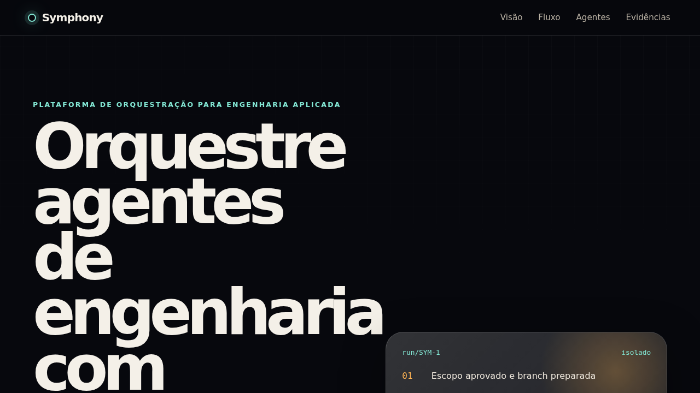

[Vídeo E2E MP4](videos/session-codex-e2e.mp4)

## Sessão · Cursor

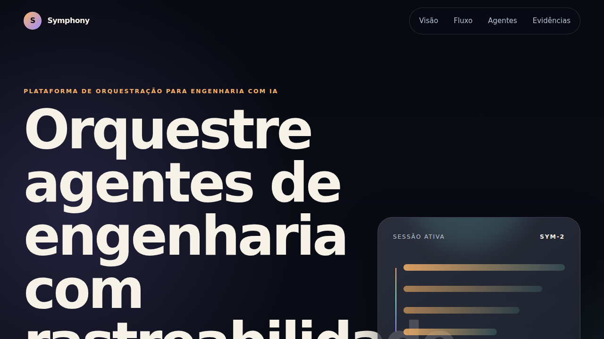

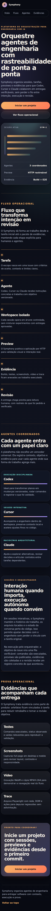

[Vídeo E2E MP4](videos/session-cursor-e2e.mp4)

## Sessão · Claude

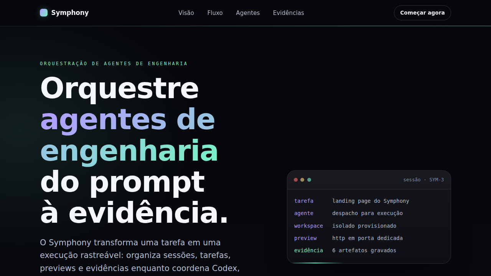

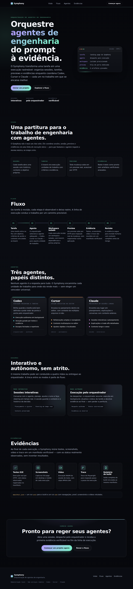

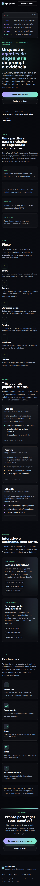

[Vídeo E2E MP4](videos/session-claude-e2e.mp4)

## Orquestrador · Codex

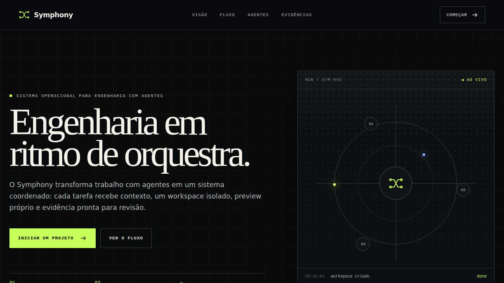

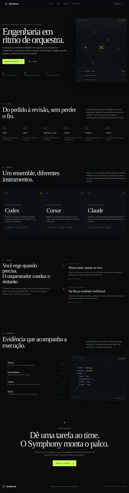

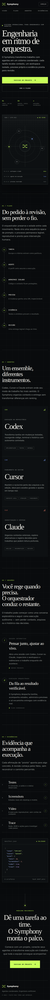

[Vídeo E2E MP4](videos/orchestrator-codex-e2e.mp4)

## Orquestrador · Cursor

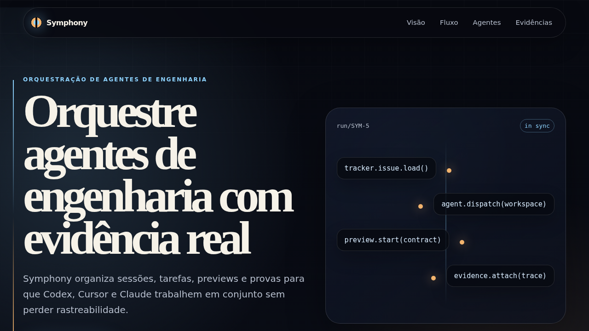

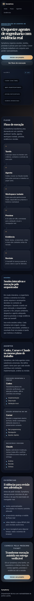

[Vídeo E2E MP4](videos/orchestrator-cursor-e2e.mp4)

## Orquestrador · Claude

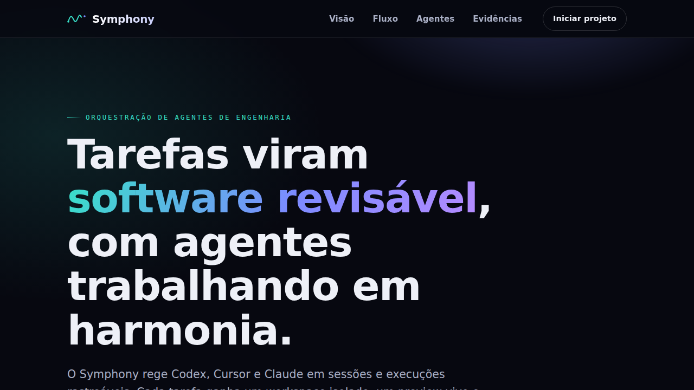

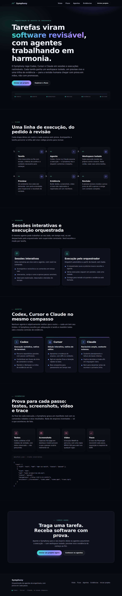

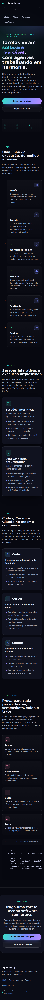

[Vídeo E2E MP4](videos/orchestrator-claude-e2e.mp4)
