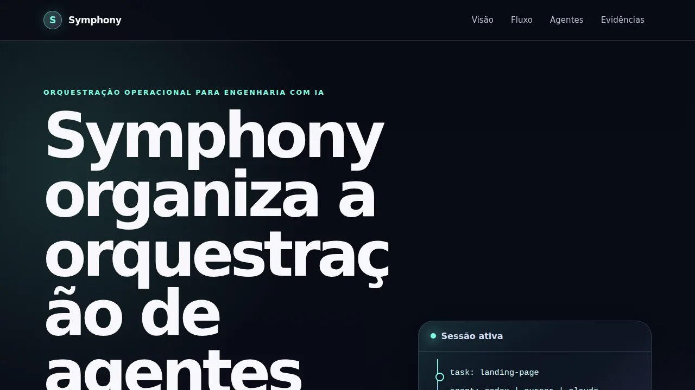
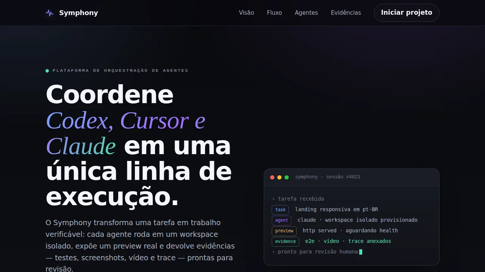
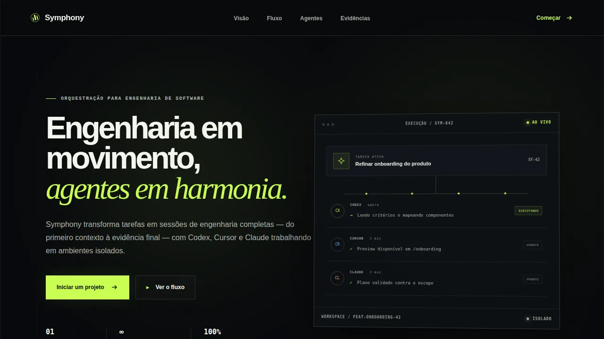

# Comparação visual padronizada

Capturas em viewport 1280 × 720, com movimento reduzido. A sessão Cursor não
possui captura de landing porque o provedor falhou antes da geração.

## Sessão · Codex

## Sessão · Claude

## Orquestrador · Codex

## Orquestrador · Cursor

## Orquestrador · Claude

