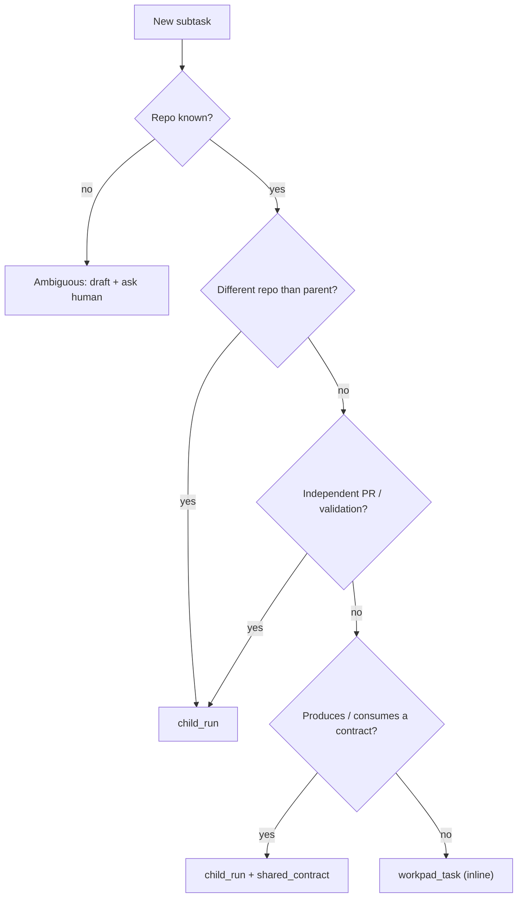
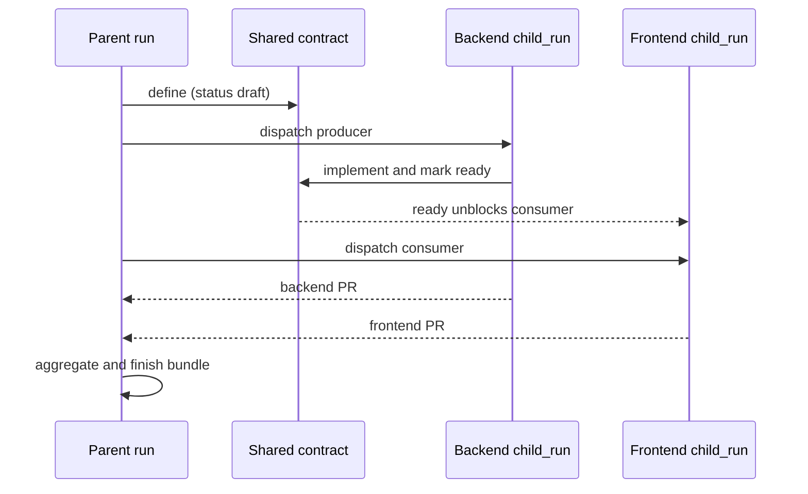
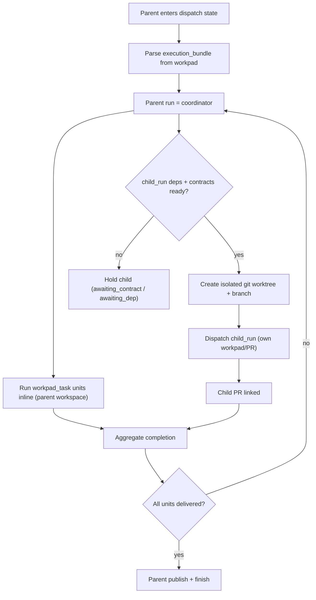
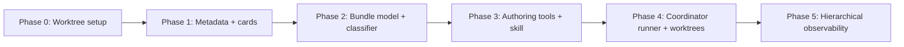

# Subtask Orchestration & Execution Bundles Implementation Plan

**Goal:** Let a parent task fan out into subtasks classified deterministically as `workpad_task` (inline) or `child_run` (own run/worktree/PR), coordinated by shared contracts, with hierarchical visibility and authoring tools to build the tree.

**Architecture:** Authoring emits a preclassified `execution_bundle` on the parent issue (workpad section + structured parse). A pure classifier decides each unit's shape. The orchestrator runs the parent as a coordinator: inline `workpad_task`s run in the parent workspace; each `child_run` dispatches as its own run in an isolated git worktree, gated by dependencies/contract readiness. Observability and the parent drawer render the parent → child tree.

**Tech Stack:** Elixir/Phoenix (orchestrator, tracker adapters, assistant tools), Ecto/SQLite (local tracker), GitHub GraphQL (Projects v2 sub-issues), React/TypeScript + Vitest (tracker UI), ExUnit (backend tests).

**Spec:** `docs/superpowers/specs/2026-06-23-subtask-orchestration-design.md`

---

## Execution environment (read first)

All implementation for this plan runs in a **dedicated git worktree on a feature branch, never on `main` and never in the primary checkout**. This both isolates the work and dogfoods the `child_run` worktree model the feature itself introduces.

- Branch: `feat/subtask-orchestration`
- Worktree dir: `.worktrees/subtask-orchestration` (project-local, must be git-ignored)
- All `git add` / `git commit` steps below happen inside that worktree.

## Scope check

The spec has 5 independently shippable phases. This document is ordered so each phase produces working, tested software on its own and can be committed/merged independently:

- Phase 0: worktree setup
- Phase 1: issue metadata + cards (read-only, no execution change)
- Phase 2: bundle model + pure classifier + workpad parsing (backend-only)
- Phase 3: authoring tools + prompt/skill
- Phase 4: coordinator runner + isolated worktrees
- Phase 5: hierarchical observability + parent control center

Execute phase-by-phase. Do not start Phase N+1 until Phase N's tests pass and are committed.

---

## Flowcharts

These diagrams orient the implementer before the task-by-task steps. They are the same models used in the design spec.

### Deterministic classification (authoring time)

The unit shape is decided by rules at authoring time, so the executor never re-derives structure from prose.



Implemented by `Workpad.ExecutionBundle.Classifier.classify/2` (Task 2.1).

### Cross-repo shared contract (backend + frontend)



Gating implemented by `Orchestrator.BundleDispatch.dispatchable_children/3` (Task 4.2).

### Parent coordinator runtime (worktrees + gating)



Wired in Task 4.3 (`orchestrator.ex`, `agent_runner.ex`, `prompt_builder.ex`) using the worktree helper from Task 4.1.

### Phase execution order



---

## Task 0: Create the isolated worktree

**Files:**
- Modify: `.gitignore` (only if `.worktrees/` is not already ignored)

- [ ] **Step 1: Confirm repo root and branch state**

Run: `git -C /home/raphaelcangucu/symphony rev-parse --show-toplevel && git -C /home/raphaelcangucu/symphony status --porcelain=v1 --branch | head -1`
Expected: prints the repo toplevel path and the current branch line (e.g. `## main...origin/main`).

- [ ] **Step 2: Ensure `.worktrees/` is git-ignored**

Run: `git -C /home/raphaelcangucu/symphony check-ignore -q .worktrees && echo IGNORED || echo NOT_IGNORED`
Expected: `IGNORED`.

If `NOT_IGNORED`, append the ignore rule and commit it on `main` first:

```bash
cd /home/raphaelcangucu/symphony
printf '\n# Git worktrees for isolated agent runs\n.worktrees/\n' >> .gitignore
git add .gitignore
git commit -m "chore: ignore .worktrees for isolated runs"
```

- [ ] **Step 3: Create the worktree on a new branch**

```bash
cd /home/raphaelcangucu/symphony
git worktree add .worktrees/subtask-orchestration -b feat/subtask-orchestration
cd .worktrees/subtask-orchestration
```

Expected: `Preparing worktree (new branch 'feat/subtask-orchestration')` and a checked-out tree.

- [ ] **Step 4: Install deps and verify a clean baseline**

```bash
# Elixir
cd elixir && mix deps.get && mix test --max-failures 1 && cd ..
# Frontend
cd tracker && npm install && npm run test -- --run && cd ..
```

Expected: both suites pass (0 failures). If the baseline fails, stop and report before writing any feature code.

- [ ] **Step 5: Record worktree location**

Confirm: `git -C /home/raphaelcangucu/symphony worktree list` shows `.worktrees/subtask-orchestration  <sha> [feat/subtask-orchestration]`.

All subsequent tasks run inside `/home/raphaelcangucu/symphony/.worktrees/subtask-orchestration`.

---

## Phase 1 — Issue metadata + cards (read-only)

Surfaces `repository_full_name`, `parent_identifier`, and `sub_issue_summary` end-to-end and renders a repo badge + sub-issue progress pill on the board. No execution behavior changes.

### Task 1.1: Add metadata fields to `IssueDTO`

**Files:**
- Modify: `elixir/lib/symphony_elixir/tracker/issue_dto.ex`
- Test: `elixir/test/symphony_elixir/tracker/issue_dto_test.exs`

- [ ] **Step 1: Write the failing test**

Create `elixir/test/symphony_elixir/tracker/issue_dto_test.exs`:

```elixir
defmodule SymphonyElixir.Tracker.IssueDTOTest do
  use ExUnit.Case, async: true

  alias SymphonyElixir.Tracker.IssueDTO

  test "build/1 carries repository, parent, and sub-issue summary" do
    dto =
      IssueDTO.build(%{
        identifier: "2",
        title: "Aplicativo IOS",
        repository_full_name: "xipcash/ios",
        parent_identifier: nil,
        sub_issue_summary: %{total: 4, completed: 4, percent_completed: 100}
      })

    assert dto.repository_full_name == "xipcash/ios"
    assert dto.parent_identifier == nil
    assert dto.sub_issue_summary == %{total: 4, completed: 4, percent_completed: 100}
  end

  test "build/1 defaults the new fields" do
    dto = IssueDTO.build(%{identifier: "9", title: "No metadata"})
    assert dto.repository_full_name == nil
    assert dto.parent_identifier == nil
    assert dto.sub_issue_summary == nil
  end
end
```

- [ ] **Step 2: Run test to verify it fails**

Run: `cd elixir && mix test test/symphony_elixir/tracker/issue_dto_test.exs`
Expected: FAIL — `key :repository_full_name not found` / struct does not define the keys.

- [ ] **Step 3: Add the fields to the struct and type**

In `elixir/lib/symphony_elixir/tracker/issue_dto.ex`, extend `defstruct` and `@type t`:

```elixir
            group_lead_identifier: nil,
            group_member_identifiers: [],
            repository_full_name: nil,
            parent_identifier: nil,
            sub_issue_summary: nil
```

```elixir
          group_lead_identifier: String.t() | nil,
          group_member_identifiers: [String.t()],
          repository_full_name: String.t() | nil,
          parent_identifier: String.t() | nil,
          sub_issue_summary: %{total: integer(), completed: integer(), percent_completed: integer()} | nil
        }
```

- [ ] **Step 4: Run test to verify it passes**

Run: `cd elixir && mix test test/symphony_elixir/tracker/issue_dto_test.exs`
Expected: PASS (2 tests).

- [ ] **Step 5: Commit**

```bash
git add elixir/lib/symphony_elixir/tracker/issue_dto.ex elixir/test/symphony_elixir/tracker/issue_dto_test.exs
git commit -m "feat(tracker): add repository, parent, sub-issue summary to IssueDTO"
```

### Task 1.2: Fetch + normalize GitHub repository, parent, and sub-issue summary

**Files:**
- Modify: `elixir/lib/symphony_elixir/github/issue_adapter/query.ex:6-37` (`@list_items`) and `:302-320` (`normalize_item/3`)
- Test: `elixir/test/symphony_elixir/github/issue_adapter_query_test.exs` (add cases; file already exists)

- [ ] **Step 1: Write the failing test**

Add to `elixir/test/symphony_elixir/github/issue_adapter_query_test.exs`:

```elixir
  test "normalize_item/3 maps repository, parent, and sub-issue summary" do
    item = %{
      "content" => %{
        "__typename" => "Issue",
        "id" => "I_1",
        "number" => 2,
        "title" => "Aplicativo IOS",
        "body" => "",
        "url" => "https://github.com/xipcash/ios/issues/2",
        "repository" => %{"nameWithOwner" => "xipcash/ios"},
        "parent" => nil,
        "subIssuesSummary" => %{"total" => 4, "completed" => 4, "percentCompleted" => 100}
      },
      "fieldValues" => %{"nodes" => []}
    }

    dto = SymphonyElixir.GitHub.IssueAdapter.Query.normalize_item(item, "Status", "xipcash")

    assert dto.repository_full_name == "xipcash/ios"
    assert dto.parent_identifier == nil
    assert dto.sub_issue_summary == %{total: 4, completed: 4, percent_completed: 100}
  end
```

- [ ] **Step 2: Run test to verify it fails**

Run: `cd elixir && mix test test/symphony_elixir/github/issue_adapter_query_test.exs -k "sub-issue summary"`
Expected: FAIL — `repository_full_name` is `nil`.

- [ ] **Step 3: Extend the GraphQL `@list_items` content selection**

In `@list_items`, inside the `... on Issue { ... }` block, add:

```graphql
                repository { nameWithOwner }
                parent { number repository { nameWithOwner } }
                subIssuesSummary { total completed percentCompleted }
```

- [ ] **Step 4: Map the new fields in `normalize_item/3`**

Extend the `IssueDTO.build(%{...})` call and add private helpers:

```elixir
      created_at: content["createdAt"],
      updated_at: content["updatedAt"],
      repository_full_name: get_in(content, ["repository", "nameWithOwner"]),
      parent_identifier: parent_identifier(content["parent"]),
      sub_issue_summary: sub_issue_summary(content["subIssuesSummary"])
    })
  end

  def normalize_item(_item, _status_field, _project_slug), do: nil

  defp parent_identifier(%{"number" => number}) when is_integer(number), do: to_string(number)
  defp parent_identifier(_), do: nil

  defp sub_issue_summary(%{"total" => total, "completed" => completed, "percentCompleted" => percent})
       when is_integer(total) and total > 0 do
    %{total: total, completed: completed, percent_completed: percent}
  end

  defp sub_issue_summary(_), do: nil
```

- [ ] **Step 5: Run test to verify it passes**

Run: `cd elixir && mix test test/symphony_elixir/github/issue_adapter_query_test.exs`
Expected: PASS.

- [ ] **Step 6: Commit**

```bash
git add elixir/lib/symphony_elixir/github/issue_adapter/query.ex elixir/test/symphony_elixir/github/issue_adapter_query_test.exs
git commit -m "feat(github): fetch repository, parent, sub-issue summary for board items"
```

### Task 1.3: Emit metadata from the presenter

**Files:**
- Modify: `elixir/lib/symphony_elixir_web/presenters/tracker_presenter.ex:105-134` (`issue(%IssueDTO{})`)
- Test: `elixir/test/symphony_elixir_web/presenters/tracker_presenter_test.exs` (add a case; create file if absent)

- [ ] **Step 1: Write the failing test**

Add (or create the file with) this test:

```elixir
defmodule SymphonyElixirWeb.TrackerPresenterTest do
  use ExUnit.Case, async: true

  alias SymphonyElixir.Tracker.IssueDTO
  alias SymphonyElixirWeb.TrackerPresenter

  test "issue/1 serializes repository, parent, and sub-issue summary" do
    dto =
      IssueDTO.build(%{
        identifier: "2",
        title: "Aplicativo IOS",
        repository_full_name: "xipcash/ios",
        parent_identifier: "1",
        sub_issue_summary: %{total: 4, completed: 4, percent_completed: 100}
      })

    payload = TrackerPresenter.issue(dto)

    assert payload.repository_full_name == "xipcash/ios"
    assert payload.parent_identifier == "1"
    assert payload.sub_issue_summary == %{total: 4, completed: 4, percent_completed: 100}
  end
end
```

- [ ] **Step 2: Run test to verify it fails**

Run: `cd elixir && mix test test/symphony_elixir_web/presenters/tracker_presenter_test.exs`
Expected: FAIL — key not present in payload.

- [ ] **Step 3: Add the keys to the `IssueDTO` presenter clause**

In `issue(%IssueDTO{} = dto)`, add to the returned map:

```elixir
      group_lead_identifier: dto.group_lead_identifier,
      group_member_identifiers: dto.group_member_identifiers,
      repository_full_name: dto.repository_full_name,
      parent_identifier: dto.parent_identifier,
      sub_issue_summary: dto.sub_issue_summary
    }
```

- [ ] **Step 4: Run test to verify it passes**

Run: `cd elixir && mix test test/symphony_elixir_web/presenters/tracker_presenter_test.exs`
Expected: PASS.

- [ ] **Step 5: Commit**

```bash
git add elixir/lib/symphony_elixir_web/presenters/tracker_presenter.ex elixir/test/symphony_elixir_web/presenters/tracker_presenter_test.exs
git commit -m "feat(tracker): expose repository, parent, sub-issue summary in issue payload"
```

### Task 1.4: Frontend type + normalizer

**Files:**
- Modify: `tracker/src/types/issue.ts:64-86` (`Issue` interface)
- Modify: `tracker/src/services/mappers.ts:163-196` (`BackendIssueDto`) and `:262-290` (`normalizeIssue`)
- Test: `tracker/src/services/__tests__/mappers.test.ts` (create if absent)

- [ ] **Step 1: Write the failing test**

Create `tracker/src/services/__tests__/mappers.test.ts`:

```ts
import { describe, expect, it } from "vitest";
import { normalizeIssue } from "@/services/mappers";

describe("normalizeIssue subtask metadata", () => {
  it("maps repository, parent, and sub-issue summary", () => {
    const issue = normalizeIssue({
      id: 2,
      identifier: "2",
      title: "Aplicativo IOS",
      repository_full_name: "xipcash/ios",
      parent_identifier: "1",
      sub_issue_summary: { total: 4, completed: 4, percent_completed: 100 },
    });

    expect(issue.repositoryFullName).toBe("xipcash/ios");
    expect(issue.parentIdentifier).toBe("1");
    expect(issue.subIssueSummary).toEqual({ total: 4, completed: 4, percentCompleted: 100 });
  });

  it("defaults missing metadata to null", () => {
    const issue = normalizeIssue({ id: 9, identifier: "9", title: "No metadata" });
    expect(issue.repositoryFullName).toBeNull();
    expect(issue.parentIdentifier).toBeNull();
    expect(issue.subIssueSummary).toBeNull();
  });
});
```

- [ ] **Step 2: Run test to verify it fails**

Run: `cd tracker && npm run test -- --run src/services/__tests__/mappers.test.ts`
Expected: FAIL — `repositoryFullName` undefined.

- [ ] **Step 3: Extend the `Issue` type**

In `tracker/src/types/issue.ts`, add to `interface Issue` (after `groupMemberIdentifiers`):

```ts
  repositoryFullName: string | null;
  parentIdentifier: string | null;
  subIssueSummary: { total: number; completed: number; percentCompleted: number } | null;
```

- [ ] **Step 4: Extend `BackendIssueDto` + `normalizeIssue`**

In `tracker/src/services/mappers.ts`, add to `BackendIssueDto`:

```ts
  repository_full_name?: string | null;
  repositoryFullName?: string | null;
  parent_identifier?: string | null;
  parentIdentifier?: string | null;
  sub_issue_summary?: { total: number; completed: number; percent_completed: number } | null;
  subIssueSummary?: { total: number; completed: number; percentCompleted: number } | null;
```

In `normalizeIssue`, add to the returned object (before `createdAt`):

```ts
    repositoryFullName: dto.repositoryFullName ?? dto.repository_full_name ?? null,
    parentIdentifier: dto.parentIdentifier ?? dto.parent_identifier ?? null,
    subIssueSummary: normalizeSubIssueSummary(dto),
```

And add the helper at the bottom of the file:

```ts
function normalizeSubIssueSummary(dto: BackendIssueDto): Issue["subIssueSummary"] {
  const camel = dto.subIssueSummary;
  if (camel) return camel;
  const snake = dto.sub_issue_summary;
  if (!snake) return null;
  return { total: snake.total, completed: snake.completed, percentCompleted: snake.percent_completed };
}
```

- [ ] **Step 5: Run test to verify it passes**

Run: `cd tracker && npm run test -- --run src/services/__tests__/mappers.test.ts`
Expected: PASS (2 tests).

- [ ] **Step 6: Commit**

```bash
git add tracker/src/types/issue.ts tracker/src/services/mappers.ts tracker/src/services/__tests__/mappers.test.ts
git commit -m "feat(tracker-ui): normalize repository, parent, sub-issue summary on Issue"
```

### Task 1.5: Render repo badge + sub-issue progress pill on the card

**Files:**
- Modify: `tracker/src/components/board/IssueCard.tsx:80-145`
- Test: `tracker/src/components/board/__tests__/IssueCard.test.tsx` (create if absent)

- [ ] **Step 1: Write the failing test**

Create `tracker/src/components/board/__tests__/IssueCard.test.tsx`:

```tsx
import { render, screen } from "@testing-library/react";
import { describe, expect, it } from "vitest";
import { I18nextProvider } from "react-i18next";
import i18n from "@/i18n";
import { IssueCard } from "@/components/board/IssueCard";
import type { Issue } from "@/types/issue";

const baseIssue: Issue = {
  id: "2",
  identifier: "2",
  projectSlug: "xip",
  status: "Done",
  title: "Aplicativo IOS",
  description: null,
  priority: null,
  position: 0,
  labels: [],
  blockedBy: [],
  assignee: null,
  creator: null,
  url: "https://github.com/xipcash/ios/issues/2",
  branchName: null,
  createdAt: "",
  updatedAt: "",
  attachments: [],
  groupLeadIdentifier: null,
  groupMemberIdentifiers: [],
  repositoryFullName: "xipcash/ios",
  parentIdentifier: null,
  subIssueSummary: { total: 4, completed: 4, percentCompleted: 100 },
};

function renderCard(issue: Issue) {
  return render(
    <I18nextProvider i18n={i18n}>
      <IssueCard issue={issue} onSelect={() => {}} />
    </I18nextProvider>,
  );
}

describe("IssueCard subtask metadata", () => {
  it("shows the repository identifier", () => {
    renderCard(baseIssue);
    expect(screen.getByText("xipcash/ios")).toBeInTheDocument();
  });

  it("shows the sub-issue progress", () => {
    renderCard(baseIssue);
    expect(screen.getByText("4 / 4")).toBeInTheDocument();
  });

  it("omits the progress pill when there are no sub-issues", () => {
    renderCard({ ...baseIssue, subIssueSummary: null });
    expect(screen.queryByText(/\//)).not.toBeInTheDocument();
  });
});
```

- [ ] **Step 2: Run test to verify it fails**

Run: `cd tracker && npm run test -- --run src/components/board/__tests__/IssueCard.test.tsx`
Expected: FAIL — text `xipcash/ios` not found.

- [ ] **Step 3: Render the badge + pill**

In `tracker/src/components/board/IssueCard.tsx`, import an icon and add a metadata row under the title block (after the `branchName` block, before the labels block). Add `GitFork` and `Layers` to the existing `lucide-react` import:

```tsx
import { AlertTriangle, ExternalLink, GitBranch, GitFork, Layers, MessageSquare } from "lucide-react";
```

```tsx
      {issue.repositoryFullName || issue.subIssueSummary ? (
        <div className="mt-2.5 flex flex-wrap items-center gap-1.5">
          {issue.repositoryFullName ? (
            <span
              title={issue.repositoryFullName}
              className="inline-flex max-w-full items-center gap-1 truncate rounded-md border border-border/60 bg-muted/40 px-1.5 py-0.5 font-mono text-[10px] text-muted-foreground"
            >
              <GitFork className="h-3 w-3 shrink-0" />
              <span className="truncate">{issue.repositoryFullName}</span>
            </span>
          ) : null}
          {issue.subIssueSummary ? (
            <span
              title={`${issue.subIssueSummary.completed} / ${issue.subIssueSummary.total}`}
              className="inline-flex items-center gap-1 rounded-md border border-border/60 px-1.5 py-0.5 text-[10px] font-medium text-muted-foreground"
            >
              <Layers className="h-3 w-3 shrink-0" />
              {issue.subIssueSummary.completed} / {issue.subIssueSummary.total}
            </span>
          ) : null}
        </div>
      ) : null}
```

- [ ] **Step 4: Run test to verify it passes**

Run: `cd tracker && npm run test -- --run src/components/board/__tests__/IssueCard.test.tsx`
Expected: PASS (3 tests).

- [ ] **Step 5: Commit**

```bash
git add tracker/src/components/board/IssueCard.tsx tracker/src/components/board/__tests__/IssueCard.test.tsx
git commit -m "feat(tracker-ui): show repository badge and sub-issue progress on cards"
```

### Task 1.6: Expandable parent/subtask card on the board

Mirrors the grouped-card UX (`GroupCard`) for parent/subtask, but **additive, not absorbing**: a parent issue with sub-issues renders an expandable subtask list, while subtasks keep their own cards in their own columns/repos. Subtasks are matched among already-loaded board issues by `parentIdentifier` (same approach `groupIssuesIntoUnits` uses for group members), so no extra fetch is needed.

**Files:**
- Create: `tracker/src/components/board/SubtaskParentCard.tsx`
- Modify: `tracker/src/components/board/board-utils.ts:222-250` (`BoardUnit` union + `groupIssuesIntoUnits`)
- Modify: `tracker/src/components/board/BoardColumn.tsx:216-240` (render the `parent` unit kind)
- Modify: i18n locale files that define `board.group.*` (add `board.subtasks.*`)
- Test: `tracker/src/components/board/__tests__/SubtaskParentCard.test.tsx`, and extend `tracker/src/components/board/__tests__/board-utils.test.ts` if present

- [ ] **Step 1: Write the failing board-utils test**

Add to (or create) `tracker/src/components/board/__tests__/board-utils.test.ts`:

```ts
import { describe, expect, it } from "vitest";
import { groupIssuesIntoUnits } from "@/components/board/board-utils";
import type { Issue } from "@/types/issue";

function issue(overrides: Partial<Issue>): Issue {
  return {
    id: overrides.identifier ?? "x",
    identifier: overrides.identifier ?? "x",
    projectSlug: "xip",
    status: "Todo",
    title: overrides.title ?? "t",
    description: null,
    priority: null,
    position: overrides.position ?? 0,
    labels: [],
    blockedBy: [],
    assignee: null,
    creator: null,
    url: null,
    branchName: null,
    createdAt: "",
    updatedAt: "",
    attachments: [],
    groupLeadIdentifier: null,
    groupMemberIdentifiers: [],
    repositoryFullName: null,
    parentIdentifier: null,
    subIssueSummary: null,
    ...overrides,
  };
}

describe("groupIssuesIntoUnits parent/subtask", () => {
  it("emits a parent unit and keeps subtasks as their own issue units", () => {
    const parent = issue({ identifier: "2", subIssueSummary: { total: 2, completed: 1, percentCompleted: 50 } });
    const childA = issue({ identifier: "3", parentIdentifier: "2" });
    const childB = issue({ identifier: "4", parentIdentifier: "2" });

    const units = groupIssuesIntoUnits([parent, childA, childB]);

    const parentUnit = units.find((u) => u.kind === "parent");
    expect(parentUnit).toBeTruthy();
    if (parentUnit?.kind === "parent") {
      expect(parentUnit.issue.identifier).toBe("2");
      expect(parentUnit.subtasks.map((s) => s.identifier)).toEqual(["3", "4"]);
    }
    // Subtasks are NOT absorbed: they still render as their own issue units.
    expect(units.filter((u) => u.kind === "issue").map((u) => (u.kind === "issue" ? u.issue.identifier : "")))
      .toEqual(["3", "4"]);
  });

  it("emits a plain issue unit when there are no subtasks", () => {
    const units = groupIssuesIntoUnits([issue({ identifier: "9" })]);
    expect(units).toHaveLength(1);
    expect(units[0].kind).toBe("issue");
  });
});
```

- [ ] **Step 2: Run test to verify it fails**

Run: `cd tracker && npm run test -- --run src/components/board/__tests__/board-utils.test.ts`
Expected: FAIL — no `parent` unit kind emitted.

- [ ] **Step 3: Extend the `BoardUnit` union and `groupIssuesIntoUnits`**

In `tracker/src/components/board/board-utils.ts`, extend the union:

```ts
export type BoardUnit =
  | { kind: "issue"; id: string; issue: Issue }
  | { kind: "group"; id: string; lead: Issue; members: Issue[] }
  | { kind: "parent"; id: string; issue: Issue; subtasks: Issue[] };
```

Then update `groupIssuesIntoUnits` to index subtasks by parent and emit a `parent` unit (without absorbing the subtasks):

```ts
export function groupIssuesIntoUnits(issues: readonly Issue[]): BoardUnit[] {
  const byIdentifier = new Map(issues.map((issue) => [issue.identifier, issue]));
  const absorbed = new Set<string>();
  for (const issue of issues) {
    if (issue.groupMemberIdentifiers.length > 0) {
      for (const memberId of issue.groupMemberIdentifiers) absorbed.add(memberId);
    }
  }

  const subtasksByParent = new Map<string, Issue[]>();
  for (const issue of issues) {
    if (issue.parentIdentifier) {
      const list = subtasksByParent.get(issue.parentIdentifier) ?? [];
      list.push(issue);
      subtasksByParent.set(issue.parentIdentifier, list);
    }
  }

  const units: BoardUnit[] = [];
  for (const issue of issues) {
    if (issue.groupLeadIdentifier && absorbed.has(issue.identifier)) continue;

    if (issue.groupMemberIdentifiers.length > 0) {
      const members = issue.groupMemberIdentifiers
        .map((id) => byIdentifier.get(id))
        .filter((member): member is Issue => Boolean(member));
      units.push({ kind: "group", id: `${GROUP_DRAG_PREFIX}${issue.identifier}`, lead: issue, members });
      continue;
    }

    const subtasks = subtasksByParent.get(issue.identifier) ?? [];
    const hasSubtasks = subtasks.length > 0 || (issue.subIssueSummary?.total ?? 0) > 0;

    if (hasSubtasks) {
      // Additive (not absorbing): the parent renders an expandable subtask list,
      // but each subtask still gets its own issue unit below (it may live in a
      // different column/repo). The drag id stays the plain issue id so the
      // parent reorders/moves like a normal card.
      units.push({ kind: "parent", id: issueDragId(issue.identifier), issue, subtasks });
    } else {
      units.push({ kind: "issue", id: issueDragId(issue.identifier), issue });
    }
  }

  return units;
}
```

- [ ] **Step 4: Run test to verify it passes**

Run: `cd tracker && npm run test -- --run src/components/board/__tests__/board-utils.test.ts`
Expected: PASS (2 tests).

- [ ] **Step 5: Write the failing `SubtaskParentCard` test**

Create `tracker/src/components/board/__tests__/SubtaskParentCard.test.tsx`:

```tsx
import { render, screen } from "@testing-library/react";
import userEvent from "@testing-library/user-event";
import { describe, expect, it } from "vitest";
import { I18nextProvider } from "react-i18next";
import i18n from "@/i18n";
import { SubtaskParentCard } from "@/components/board/SubtaskParentCard";
import type { Issue } from "@/types/issue";

function issue(overrides: Partial<Issue>): Issue {
  return {
    id: overrides.identifier ?? "x",
    identifier: overrides.identifier ?? "x",
    projectSlug: "xip",
    status: "Todo",
    title: overrides.title ?? "t",
    description: null,
    priority: null,
    position: 0,
    labels: [],
    blockedBy: [],
    assignee: null,
    creator: null,
    url: null,
    branchName: null,
    createdAt: "",
    updatedAt: "",
    attachments: [],
    groupLeadIdentifier: null,
    groupMemberIdentifiers: [],
    repositoryFullName: null,
    parentIdentifier: null,
    subIssueSummary: null,
    ...overrides,
  };
}

function renderCard(node: React.ReactNode) {
  return render(<I18nextProvider i18n={i18n}>{node}</I18nextProvider>);
}

describe("SubtaskParentCard", () => {
  const parent = issue({ identifier: "2", title: "Aplicativo IOS", subIssueSummary: { total: 2, completed: 1, percentCompleted: 50 } });
  const subtasks = [
    issue({ identifier: "3", title: "NFC", repositoryFullName: "xipcash/ios" }),
    issue({ identifier: "4", title: "BLE", repositoryFullName: "xipcash/android" }),
  ];

  it("shows the subtask count and expands to list subtasks", async () => {
    renderCard(<SubtaskParentCard issue={parent} subtasks={subtasks} onSelectIssue={() => {}} />);
    expect(screen.getByText("1 / 2")).toBeInTheDocument();
    await userEvent.click(screen.getByRole("button", { name: /sub/i }));
    expect(screen.getByText("NFC")).toBeInTheDocument();
    expect(screen.getByText("BLE")).toBeInTheDocument();
  });
});
```

- [ ] **Step 6: Run test to verify it fails**

Run: `cd tracker && npm run test -- --run src/components/board/__tests__/SubtaskParentCard.test.tsx`
Expected: FAIL — component missing.

- [ ] **Step 7: Implement `SubtaskParentCard`**

Create `tracker/src/components/board/SubtaskParentCard.tsx`:

```tsx
import { ChevronDown, ChevronRight, GitFork, Layers } from "lucide-react";
import { useState } from "react";
import { useTranslation } from "react-i18next";

import type { AgentExecution } from "@/types/agent-execution";
import type { Issue } from "@/types/issue";

import { IssueCard } from "./IssueCard";

interface SubtaskParentCardProps {
  issue: Issue;
  subtasks: Issue[];
  onSelectIssue: (issue: Issue) => void;
  agent?: AgentExecution;
  mergeActive?: boolean;
  dropEdge?: "top" | "bottom" | null;
}

export function SubtaskParentCard({
  issue,
  subtasks,
  onSelectIssue,
  agent,
  mergeActive = false,
  dropEdge = null,
}: SubtaskParentCardProps) {
  const { t } = useTranslation();
  const [expanded, setExpanded] = useState(false);
  const summary = issue.subIssueSummary;
  const count = summary?.total ?? subtasks.length;

  return (
    <div className="space-y-1">
      <IssueCard issue={issue} onSelect={onSelectIssue} agent={agent} mergeActive={mergeActive} dropEdge={dropEdge} />

      {count > 0 ? (
        <div className="rounded-lg border border-border/60 bg-muted/30 px-1.5 py-1">
          <button
            type="button"
            onClick={(event) => {
              event.stopPropagation();
              setExpanded((value) => !value);
            }}
            className="inline-flex w-full items-center gap-1 text-[10px] font-semibold uppercase tracking-wide text-muted-foreground hover:text-foreground"
            title={expanded ? t("board.subtasks.collapse") : t("board.subtasks.expand")}
          >
            {expanded ? <ChevronDown className="h-3 w-3" /> : <ChevronRight className="h-3 w-3" />}
            <Layers className="h-3 w-3" />
            {t("board.subtasks.count", { count })}
            {summary ? (
              <span className="ml-auto font-mono">
                {summary.completed} / {summary.total}
              </span>
            ) : null}
          </button>

          {expanded ? (
            <div className="mt-1 space-y-1 border-l-2 border-border/60 pl-2">
              {subtasks.length === 0 ? (
                <p className="px-2 py-1 text-[10px] text-muted-foreground">{t("board.subtasks.empty")}</p>
              ) : (
                subtasks.map((subtask) => (
                  <button
                    key={subtask.identifier}
                    type="button"
                    className="flex w-full items-center gap-1.5 rounded-md bg-card px-2 py-1 text-left text-xs"
                    onClick={() => onSelectIssue(subtask)}
                  >
                    <span className="font-mono text-[10px] text-muted-foreground">{subtask.identifier}</span>
                    <span className="min-w-0 flex-1 truncate">{subtask.title}</span>
                    {subtask.repositoryFullName ? (
                      <span className="inline-flex items-center gap-0.5 font-mono text-[9px] text-muted-foreground">
                        <GitFork className="h-2.5 w-2.5" />
                        {subtask.repositoryFullName.split("/").pop()}
                      </span>
                    ) : null}
                  </button>
                ))
              )}
            </div>
          ) : null}
        </div>
      ) : null}
    </div>
  );
}
```

- [ ] **Step 8: Add the i18n keys**

Find the file defining `board.group.count` (run `rg -l "board.group" tracker/src`) and add, next to the `board.group` block, in each locale:

```json
"subtasks": {
  "count_one": "{{count}} subtask",
  "count_other": "{{count}} subtasks",
  "expand": "Expand subtasks",
  "collapse": "Collapse subtasks",
  "empty": "Open the parent to view its subtasks"
}
```

(Match the existing pluralization convention used by `board.group.count`; if it uses a single `count` key, mirror that instead.)

- [ ] **Step 9: Render the `parent` unit in `BoardColumn`**

In `tracker/src/components/board/BoardColumn.tsx`, import the component and add a branch in the units map (between the `group` and the `issue` branches):

```tsx
import { SubtaskParentCard } from "./SubtaskParentCard";
```

```tsx
              unit.kind === "group" ? (
                <GroupCard
                  key={unit.id}
                  id={unit.id}
                  lead={unit.lead}
                  members={unit.members}
                  onSelectIssue={onSelectIssue}
                  onRemoveMember={onRemoveMember}
                  onDisband={onDisband}
                  agentExecutions={agentExecutions}
                  mergeActive={mergeTargetId === unit.id}
                  dropEdge={dropIndicator?.unitId === unit.id ? dropIndicator.edge : null}
                />
              ) : unit.kind === "parent" ? (
                <SubtaskParentCard
                  key={unit.id}
                  issue={unit.issue}
                  subtasks={unit.subtasks}
                  onSelectIssue={onSelectIssue}
                  agent={agentExecutions?.get(unit.issue.identifier)}
                  mergeActive={mergeTargetId === unit.id}
                  dropEdge={dropIndicator?.unitId === unit.id ? dropIndicator.edge : null}
                />
              ) : (
                <IssueCard
                  key={unit.id}
                  issue={unit.issue}
                  onSelect={onSelectIssue}
                  agent={agentExecutions?.get(unit.issue.identifier)}
                  mergeActive={mergeTargetId === unit.id}
                  dropEdge={dropIndicator?.unitId === unit.id ? dropIndicator.edge : null}
                />
              ),
```

- [ ] **Step 10: Run the tests to verify they pass**

Run: `cd tracker && npm run test -- --run src/components/board/__tests__/SubtaskParentCard.test.tsx src/components/board/__tests__/board-utils.test.ts`
Expected: PASS.

- [ ] **Step 11: Commit**

```bash
git add tracker/src/components/board/SubtaskParentCard.tsx tracker/src/components/board/board-utils.ts tracker/src/components/board/BoardColumn.tsx tracker/src/components/board/__tests__/ tracker/src/i18n
git commit -m "feat(tracker-ui): expandable parent/subtask card on the board"
```

---

## Phase 2 — Bundle model + classifier + workpad parsing (backend-only)

Defines the `execution_bundle` structure, a pure deterministic classifier, and parsing of the workpad `### Execution bundle` section. No execution behavior changes yet — this is the data layer the runner and tools build on.

### Task 2.1: Pure classifier

**Files:**
- Create: `elixir/lib/symphony_elixir/workpad/execution_bundle/classifier.ex`
- Test: `elixir/test/symphony_elixir/workpad/execution_bundle/classifier_test.exs`

- [ ] **Step 1: Write the failing test**

```elixir
defmodule SymphonyElixir.Workpad.ExecutionBundle.ClassifierTest do
  use ExUnit.Case, async: true

  alias SymphonyElixir.Workpad.ExecutionBundle.Classifier

  @parent_repo "macro-markets/frontend"

  test "different repo => child_run (rule :different_repo)" do
    assert {:ok, :child_run, :different_repo} =
             Classifier.classify(%{repo: "macro-markets/backend"}, parent_repo: @parent_repo)
  end

  test "independent deliverable => child_run (rule :independent_deliverable)" do
    assert {:ok, :child_run, :independent_deliverable} =
             Classifier.classify(%{repo: @parent_repo, deliverable: "pr"}, parent_repo: @parent_repo)
  end

  test "produces/consumes contract => child_run (rule :shared_contract)" do
    assert {:ok, :child_run, :shared_contract} =
             Classifier.classify(%{repo: @parent_repo, consumes: ["api"]}, parent_repo: @parent_repo)
  end

  test "same repo, no isolation => workpad_task (rule :same_repo_inline)" do
    assert {:ok, :workpad_task, :same_repo_inline} =
             Classifier.classify(%{repo: @parent_repo}, parent_repo: @parent_repo)
  end

  test "unknown repo => ambiguous" do
    assert {:ambiguous, :unknown_repo} =
             Classifier.classify(%{}, parent_repo: @parent_repo)
  end
end
```

- [ ] **Step 2: Run test to verify it fails**

Run: `cd elixir && mix test test/symphony_elixir/workpad/execution_bundle/classifier_test.exs`
Expected: FAIL — module does not exist.

- [ ] **Step 3: Implement the classifier**

```elixir
defmodule SymphonyElixir.Workpad.ExecutionBundle.Classifier do
  @moduledoc """
  Pure, deterministic classification of an execution-bundle unit into either
  `:workpad_task` (inline, same run) or `:child_run` (own run/worktree/PR).

  The executor never re-decides: the authoring assistant calls this and persists
  the result on the bundle. Returns `{:ambiguous, reason}` when a human must
  confirm classification.
  """

  @type unit :: %{optional(:repo) => String.t() | nil, optional(:deliverable) => String.t() | nil, optional(:produces) => [String.t()], optional(:consumes) => [String.t()], optional(:depends_on) => [String.t()]}
  @type rule :: :different_repo | :independent_deliverable | :shared_contract | :same_repo_inline
  @type result :: {:ok, :workpad_task | :child_run, rule()} | {:ambiguous, atom()}

  @spec classify(unit(), keyword()) :: result()
  def classify(unit, opts) when is_map(unit) do
    parent_repo = Keyword.get(opts, :parent_repo)
    repo = present(Map.get(unit, :repo))

    cond do
      is_nil(repo) and is_nil(parent_repo) -> {:ambiguous, :unknown_repo}
      is_nil(repo) -> {:ambiguous, :unknown_repo}
      not is_nil(parent_repo) and repo != parent_repo -> {:ok, :child_run, :different_repo}
      independent?(unit) -> {:ok, :child_run, :independent_deliverable}
      contract_coupled?(unit) -> {:ok, :child_run, :shared_contract}
      true -> {:ok, :workpad_task, :same_repo_inline}
    end
  end

  defp independent?(unit), do: present(Map.get(unit, :deliverable)) == "pr"

  defp contract_coupled?(unit) do
    list(Map.get(unit, :produces)) != [] or
      list(Map.get(unit, :consumes)) != [] or
      list(Map.get(unit, :depends_on)) != []
  end

  defp present(value) when is_binary(value), do: if(String.trim(value) == "", do: nil, else: value)
  defp present(_), do: nil

  defp list(value) when is_list(value), do: value
  defp list(_), do: []
end
```

- [ ] **Step 4: Run test to verify it passes**

Run: `cd elixir && mix test test/symphony_elixir/workpad/execution_bundle/classifier_test.exs`
Expected: PASS (5 tests).

- [ ] **Step 5: Commit**

```bash
git add elixir/lib/symphony_elixir/workpad/execution_bundle/classifier.ex elixir/test/symphony_elixir/workpad/execution_bundle/classifier_test.exs
git commit -m "feat(bundle): add deterministic execution-unit classifier"
```

### Task 2.2: Execution bundle struct + workpad section parser

**Files:**
- Create: `elixir/lib/symphony_elixir/workpad/execution_bundle.ex`
- Test: `elixir/test/symphony_elixir/workpad/execution_bundle_test.exs`

The parser reads a fenced `yaml` block inside the workpad `### Execution bundle` section. It reuses the section-extraction approach from `Workpad.ExecutionContract.section/2`.

- [ ] **Step 1: Write the failing test**

```elixir
defmodule SymphonyElixir.Workpad.ExecutionBundleTest do
  use ExUnit.Case, async: true

  alias SymphonyElixir.Workpad.ExecutionBundle

  @workpad """
  ## Codex Workpad

  ### Execution bundle

  ```yaml
  version: 1
  mode: bundle
  parent: macro-markets#42
  shared_contracts:
    - id: lottery-wheel-api
      kind: graphql_mutation
      owner_unit: backend-wheel-api
      consumers: [frontend-landing-wheel]
      status: draft
  units:
    - id: backend-wheel-api
      type: child_run
      issue: macro-markets/backend#101
      repo: macro-markets/backend
      produces: [lottery-wheel-api]
      deliverable: pr
    - id: frontend-landing-wheel
      type: child_run
      issue: macro-markets/frontend#77
      repo: macro-markets/frontend
      consumes: [lottery-wheel-api]
      depends_on: [backend-wheel-api]
      deliverable: pr
  ```
  """

  test "parse/1 returns the bundle with units and contracts" do
    assert {:ok, bundle} = ExecutionBundle.parse(@workpad)
    assert bundle.mode == "bundle"
    assert length(bundle.units) == 2
    backend = Enum.find(bundle.units, &(&1.id == "backend-wheel-api"))
    assert backend.type == :child_run
    assert backend.repo == "macro-markets/backend"
    assert backend.produces == ["lottery-wheel-api"]
    [contract] = bundle.shared_contracts
    assert contract.id == "lottery-wheel-api"
    assert contract.owner_unit == "backend-wheel-api"
    assert contract.consumers == ["frontend-landing-wheel"]
    assert contract.status == :draft
  end

  test "parse/1 is :absent when there is no bundle section" do
    assert :absent = ExecutionBundle.parse("## Codex Workpad\n\n### Plan\n- [ ] x\n")
  end

  test "child_run? detects child units" do
    {:ok, bundle} = ExecutionBundle.parse(@workpad)
    assert ExecutionBundle.child_units(bundle) |> length() == 2
    assert ExecutionBundle.workpad_units(bundle) == []
  end
end
```

- [ ] **Step 2: Run test to verify it fails**

Run: `cd elixir && mix test test/symphony_elixir/workpad/execution_bundle_test.exs`
Expected: FAIL — module does not exist.

- [ ] **Step 3: Implement the bundle struct + parser**

```elixir
defmodule SymphonyElixir.Workpad.ExecutionBundle do
  @moduledoc """
  Parses the `### Execution bundle` section of a `## Codex Workpad`.

  The bundle is the authoring-time, preclassified execution plan for a parent
  issue: ordered units (`:workpad_task` | `:child_run`), shared contracts, and
  dependency edges. The runner consumes it; it never re-derives structure.
  """

  @type unit :: %{
          id: String.t(),
          type: :workpad_task | :child_run,
          issue: String.t() | nil,
          repo: String.t() | nil,
          produces: [String.t()],
          consumes: [String.t()],
          depends_on: [String.t()],
          deliverable: String.t() | nil
        }

  @type contract :: %{
          id: String.t(),
          kind: String.t() | nil,
          owner_unit: String.t() | nil,
          consumers: [String.t()],
          artifact: String.t() | nil,
          status: :draft | :ready | :changing
        }

  @type t :: %__MODULE__{
          version: integer() | nil,
          mode: String.t() | nil,
          parent: String.t() | nil,
          units: [unit()],
          shared_contracts: [contract()]
        }

  defstruct version: nil, mode: nil, parent: nil, units: [], shared_contracts: []

  @spec parse(String.t() | nil) :: {:ok, t()} | :absent
  def parse(body) when is_binary(body) do
    with {:ok, section} <- section(body, "Execution bundle"),
         {:ok, yaml} <- yaml_block(section),
         {:ok, map} <- YamlElixir.read_from_string(yaml) do
      {:ok, build(map)}
    else
      _ -> :absent
    end
  end

  def parse(_body), do: :absent

  @spec child_units(t()) :: [unit()]
  def child_units(%__MODULE__{units: units}), do: Enum.filter(units, &(&1.type == :child_run))

  @spec workpad_units(t()) :: [unit()]
  def workpad_units(%__MODULE__{units: units}), do: Enum.filter(units, &(&1.type == :workpad_task))

  defp build(map) do
    %__MODULE__{
      version: map["version"],
      mode: map["mode"],
      parent: map["parent"],
      units: Enum.map(list(map["units"]), &build_unit/1),
      shared_contracts: Enum.map(list(map["shared_contracts"]), &build_contract/1)
    }
  end

  defp build_unit(u) do
    %{
      id: u["id"],
      type: unit_type(u["type"]),
      issue: u["issue"],
      repo: u["repo"],
      produces: list(u["produces"]),
      consumes: list(u["consumes"]),
      depends_on: list(u["depends_on"]),
      deliverable: u["deliverable"]
    }
  end

  defp build_contract(c) do
    %{
      id: c["id"],
      kind: c["kind"],
      owner_unit: c["owner_unit"],
      consumers: list(c["consumers"]),
      artifact: c["artifact"],
      status: contract_status(c["status"])
    }
  end

  defp unit_type("child_run"), do: :child_run
  defp unit_type(_), do: :workpad_task

  defp contract_status("ready"), do: :ready
  defp contract_status("changing"), do: :changing
  defp contract_status(_), do: :draft

  defp list(value) when is_list(value), do: value
  defp list(_), do: []

  # Reuses the heading-scoped extraction approach from ExecutionContract.
  defp section(body, title) do
    lines = String.split(body, ~r/\R/)
    downcased = String.downcase(title)

    {section_lines, _state} =
      Enum.reduce(lines, {[], :before}, fn line, {acc, state} ->
        cond do
          heading?(line, downcased) -> {acc, :inside}
          state == :inside and Regex.match?(~r/^\s*\#{1,6}\s+/, line) -> {acc, :after}
          state == :inside -> {[line | acc], :inside}
          true -> {acc, state}
        end
      end)

    case Enum.reverse(section_lines) do
      [] -> :error
      collected -> {:ok, Enum.join(collected, "\n")}
    end
  end

  defp heading?(line, expected) do
    line |> String.trim() |> String.trim_leading("#") |> String.trim() |> String.downcase() == expected
  end

  defp yaml_block(section) do
    case Regex.run(~r/```ya?ml\s*\n(?<body>.*?)\n```/s, section, capture: ["body"]) do
      [body] -> {:ok, body}
      _ -> :error
    end
  end
end
```

- [ ] **Step 4: Confirm the YAML dependency exists**

Run: `cd elixir && grep -R "yaml_elixir" mix.exs mix.lock`
Expected: `yaml_elixir` appears (it backs `project_yaml.ex`). If absent, add `{:yaml_elixir, "~> 2.9"}` to `mix.exs` deps and run `mix deps.get` before Step 5.

- [ ] **Step 5: Run test to verify it passes**

Run: `cd elixir && mix test test/symphony_elixir/workpad/execution_bundle_test.exs`
Expected: PASS (3 tests).

- [ ] **Step 6: Commit**

```bash
git add elixir/lib/symphony_elixir/workpad/execution_bundle.ex elixir/test/symphony_elixir/workpad/execution_bundle_test.exs
git commit -m "feat(bundle): parse execution bundle from workpad section"
```

### Task 2.3: Bundle validation (cycles, dangling contracts, cross-repo workpad_task)

**Files:**
- Create: `elixir/lib/symphony_elixir/workpad/execution_bundle/validator.ex`
- Test: `elixir/test/symphony_elixir/workpad/execution_bundle/validator_test.exs`

- [ ] **Step 1: Write the failing test**

```elixir
defmodule SymphonyElixir.Workpad.ExecutionBundle.ValidatorTest do
  use ExUnit.Case, async: true

  alias SymphonyElixir.Workpad.ExecutionBundle
  alias SymphonyElixir.Workpad.ExecutionBundle.Validator

  defp bundle(units, contracts \\ []) do
    %ExecutionBundle{mode: "bundle", units: units, shared_contracts: contracts}
  end

  defp unit(id, attrs \\ %{}) do
    Map.merge(
      %{id: id, type: :child_run, issue: nil, repo: "r", produces: [], consumes: [], depends_on: [], deliverable: "pr"},
      attrs
    )
  end

  test "ok bundle has no warnings" do
    b = bundle([unit("a"), unit("b", %{depends_on: ["a"]})])
    assert Validator.validate(b, parent_repo: "r") == :ok
  end

  test "detects dependency cycle" do
    b = bundle([unit("a", %{depends_on: ["b"]}), unit("b", %{depends_on: ["a"]})])
    assert {:error, warnings} = Validator.validate(b, parent_repo: "r")
    assert Enum.any?(warnings, &(&1.code == :dependency_cycle))
  end

  test "detects consumer without producer" do
    b = bundle([unit("a", %{consumes: ["c"]})])
    assert {:error, warnings} = Validator.validate(b, parent_repo: "r")
    assert Enum.any?(warnings, &(&1.code == :missing_contract_producer))
  end

  test "flags cross-repo workpad_task" do
    b = bundle([unit("a", %{type: :workpad_task, repo: "other"})])
    assert {:error, warnings} = Validator.validate(b, parent_repo: "r")
    assert Enum.any?(warnings, &(&1.code == :cross_repo_inline))
  end
end
```

- [ ] **Step 2: Run test to verify it fails**

Run: `cd elixir && mix test test/symphony_elixir/workpad/execution_bundle/validator_test.exs`
Expected: FAIL — module does not exist.

- [ ] **Step 3: Implement the validator**

```elixir
defmodule SymphonyElixir.Workpad.ExecutionBundle.Validator do
  @moduledoc "Static checks over a parsed execution bundle before it is published."

  alias SymphonyElixir.Workpad.ExecutionBundle

  @type warning :: %{code: atom(), message: String.t()}

  @spec validate(ExecutionBundle.t(), keyword()) :: :ok | {:error, [warning()]}
  def validate(%ExecutionBundle{} = bundle, opts) do
    parent_repo = Keyword.get(opts, :parent_repo)

    warnings =
      cycle_warnings(bundle.units) ++
        producer_warnings(bundle.units) ++
        cross_repo_warnings(bundle.units, parent_repo)

    if warnings == [], do: :ok, else: {:error, warnings}
  end

  defp cycle_warnings(units) do
    graph = Map.new(units, &{&1.id, &1.depends_on})

    if Enum.any?(units, &cyclic?(&1.id, graph, MapSet.new())) do
      [%{code: :dependency_cycle, message: "execution bundle has a dependency cycle"}]
    else
      []
    end
  end

  defp cyclic?(id, graph, seen) do
    cond do
      MapSet.member?(seen, id) -> true
      true ->
        seen = MapSet.put(seen, id)
        graph |> Map.get(id, []) |> Enum.any?(&cyclic?(&1, graph, seen))
    end
  end

  defp producer_warnings(units) do
    produced = units |> Enum.flat_map(& &1.produces) |> MapSet.new()

    units
    |> Enum.flat_map(& &1.consumes)
    |> Enum.uniq()
    |> Enum.reject(&MapSet.member?(produced, &1))
    |> Enum.map(fn id ->
      %{code: :missing_contract_producer, message: "contract #{id} is consumed but never produced"}
    end)
  end

  defp cross_repo_warnings(units, parent_repo) when is_binary(parent_repo) do
    units
    |> Enum.filter(&(&1.type == :workpad_task and is_binary(&1.repo) and &1.repo != parent_repo))
    |> Enum.map(fn u ->
      %{code: :cross_repo_inline, message: "workpad_task #{u.id} targets a different repo than the parent"}
    end)
  end

  defp cross_repo_warnings(_units, _parent_repo), do: []
end
```

- [ ] **Step 4: Run test to verify it passes**

Run: `cd elixir && mix test test/symphony_elixir/workpad/execution_bundle/validator_test.exs`
Expected: PASS (4 tests).

- [ ] **Step 5: Commit**

```bash
git add elixir/lib/symphony_elixir/workpad/execution_bundle/validator.ex elixir/test/symphony_elixir/workpad/execution_bundle/validator_test.exs
git commit -m "feat(bundle): validate cycles, contract producers, cross-repo inline units"
```

---

## Phase 3 — Authoring tools + prompt/skill

Adds the assistant tools that build/repair the bundle and teaches the authoring agent the model. Tool specs live in `ToolExecutor.build_tool_specs/0` and are exposed to the project chat via `ProjectBoardTools`.

> Read first (do not skip): `elixir/lib/symphony_elixir/assistant/tool_executor.ex` (the `build_tool_specs/0` list at `:92` and the `do_execute/4` clauses around `:464`), and `elixir/lib/symphony_elixir/assistant/project_board_tools.ex:6-36` (`@scoped_tools`). New tools follow the exact `tool_spec/3` + `do_execute/4` pattern shown for `create_issue`.

### Task 3.1: `classify_execution_unit` (pure preview tool)

**Files:**
- Modify: `elixir/lib/symphony_elixir/assistant/tool_executor.ex` (add spec in `build_tool_specs/0`; add `do_execute/4` clause)
- Modify: `elixir/lib/symphony_elixir/assistant/project_board_tools.ex:6-36` (add `classify_execution_unit` to `@scoped_tools`)
- Test: `elixir/test/symphony_elixir/assistant/execution_bundle_tools_test.exs`

- [ ] **Step 1: Write the failing test**

```elixir
defmodule SymphonyElixir.Assistant.ExecutionBundleToolsTest do
  use ExUnit.Case, async: true

  alias SymphonyElixir.Assistant.ToolExecutor

  test "classify_execution_unit returns child_run for a different repo" do
    {:ok, result} =
      ToolExecutor.execute("macro-markets", "classify_execution_unit", %{
        "repo" => "macro-markets/backend",
        "parent_repo" => "macro-markets/frontend"
      })

    assert result.classification == "child_run"
    assert result.rule == "different_repo"
  end

  test "classify_execution_unit returns ambiguous without a repo" do
    {:ok, result} =
      ToolExecutor.execute("macro-markets", "classify_execution_unit", %{
        "parent_repo" => "macro-markets/frontend"
      })

    assert result.classification == "ambiguous"
    assert result.rule == "unknown_repo"
  end
end
```

- [ ] **Step 2: Run test to verify it fails**

Run: `cd elixir && mix test test/symphony_elixir/assistant/execution_bundle_tools_test.exs`
Expected: FAIL — `{:unsupported_tool, "classify_execution_unit"}`.

- [ ] **Step 3: Add the tool spec**

In `build_tool_specs/0`, add to the list:

```elixir
      tool_spec(
        "classify_execution_unit",
        "Preview how a subtask would be classified for execution (workpad_task inline vs child_run with its own PR/worktree). Pure preview, no writes. Use before create_subtask when unsure.",
        %{
          "type" => "object",
          "additionalProperties" => false,
          "required" => ["repo"],
          "properties" => %{
            "repo" => string_schema("Target repository full name, e.g. macro-markets/backend."),
            "parent_repo" => string_schema("Parent issue primary repository full name."),
            "deliverable" => string_schema("Optional: 'pr' if the unit ships its own PR."),
            "produces" => string_list_schema("Optional shared-contract ids this unit produces."),
            "consumes" => string_list_schema("Optional shared-contract ids this unit consumes."),
            "depends_on" => string_list_schema("Optional unit ids this unit depends on.")
          }
        }
      ),
```

- [ ] **Step 4: Add the `do_execute/4` clause**

Place near the other `do_execute(project, ...)` clauses. It does not touch the project, so it ignores it:

```elixir
  defp do_execute(_project, "classify_execution_unit", arguments, _opts) do
    alias SymphonyElixir.Workpad.ExecutionBundle.Classifier

    unit = %{
      repo: arguments["repo"],
      deliverable: arguments["deliverable"],
      produces: List.wrap(arguments["produces"]),
      consumes: List.wrap(arguments["consumes"]),
      depends_on: List.wrap(arguments["depends_on"])
    }

    case Classifier.classify(unit, parent_repo: arguments["parent_repo"]) do
      {:ok, type, rule} ->
        {:ok, %{tool: "classify_execution_unit", classification: to_string(type), rule: to_string(rule)}}

      {:ambiguous, reason} ->
        {:ok, %{tool: "classify_execution_unit", classification: "ambiguous", rule: to_string(reason)}}
    end
  end
```

- [ ] **Step 5: Expose to project chat**

In `project_board_tools.ex`, add `classify_execution_unit` to `@scoped_tools`.

- [ ] **Step 6: Run test to verify it passes**

Run: `cd elixir && mix test test/symphony_elixir/assistant/execution_bundle_tools_test.exs`
Expected: PASS (2 tests).

- [ ] **Step 7: Commit**

```bash
git add elixir/lib/symphony_elixir/assistant/tool_executor.ex elixir/lib/symphony_elixir/assistant/project_board_tools.ex elixir/test/symphony_elixir/assistant/execution_bundle_tools_test.exs
git commit -m "feat(assistant): add classify_execution_unit preview tool"
```

### Task 3.2: `create_subtask`

**Files:**
- Modify: `elixir/lib/symphony_elixir/assistant/tool_executor.ex` (spec + `do_execute/4`)
- Modify: `elixir/lib/symphony_elixir/assistant/project_board_tools.ex` (`@scoped_tools`)
- Create: `elixir/lib/symphony_elixir/workpad/execution_bundle/store.ex` (read/upsert the bundle section on the parent workpad comment)
- Test: extend `elixir/test/symphony_elixir/assistant/execution_bundle_tools_test.exs`

`create_subtask` creates a child issue, links it under the parent (GitHub: `addSubIssue`; local: parent relation — reuse `LocalTracker.Context` group/relation patterns), classifies the unit when `unit_type` is omitted, and upserts it into the parent workpad bundle via `Store.upsert_unit/3`.

- [ ] **Step 1: Write the failing test for the bundle store (pure string transform)**

```elixir
  test "Store.upsert_unit adds a unit block to an existing bundle section" do
    alias SymphonyElixir.Workpad.ExecutionBundle.Store

    workpad = """
    ## Codex Workpad

    ### Execution bundle

    ```yaml
    version: 1
    mode: bundle
    parent: macro-markets#42
    units: []
    ```
    """

    {:ok, updated} =
      Store.upsert_unit(workpad, %{
        id: "backend-wheel-api",
        type: :child_run,
        issue: "macro-markets/backend#101",
        repo: "macro-markets/backend"
      })

    assert updated =~ "backend-wheel-api"
    {:ok, bundle} = SymphonyElixir.Workpad.ExecutionBundle.parse(updated)
    assert Enum.any?(bundle.units, &(&1.id == "backend-wheel-api"))
  end
```

- [ ] **Step 2: Run test to verify it fails**

Run: `cd elixir && mix test test/symphony_elixir/assistant/execution_bundle_tools_test.exs -k upsert_unit`
Expected: FAIL — `Store` does not exist.

- [ ] **Step 3: Implement `Store` (parse → modify → re-render YAML inside the section)**

```elixir
defmodule SymphonyElixir.Workpad.ExecutionBundle.Store do
  @moduledoc "Reads and upserts the `### Execution bundle` YAML block on a workpad body."

  alias SymphonyElixir.Workpad.ExecutionBundle

  @spec upsert_unit(String.t(), map()) :: {:ok, String.t()} | {:error, term()}
  def upsert_unit(workpad, unit) when is_binary(workpad) and is_map(unit) do
    with {:ok, bundle} <- existing_or_empty(workpad) do
      units = put_unit(bundle.units, normalize_unit(unit))
      render(workpad, %{bundle | units: units})
    end
  end

  @spec upsert_contract(String.t(), map()) :: {:ok, String.t()} | {:error, term()}
  def upsert_contract(workpad, contract) when is_binary(workpad) and is_map(contract) do
    with {:ok, bundle} <- existing_or_empty(workpad) do
      contracts = put_by_id(bundle.shared_contracts, normalize_contract(contract))
      render(workpad, %{bundle | shared_contracts: contracts})
    end
  end

  defp existing_or_empty(workpad) do
    case ExecutionBundle.parse(workpad) do
      {:ok, bundle} -> {:ok, bundle}
      :absent -> {:ok, %ExecutionBundle{version: 1, mode: "bundle", units: [], shared_contracts: []}}
    end
  end

  defp normalize_unit(unit) do
    %{
      "id" => unit[:id] || unit["id"],
      "type" => to_string(unit[:type] || unit["type"] || "workpad_task"),
      "issue" => unit[:issue] || unit["issue"],
      "repo" => unit[:repo] || unit["repo"],
      "produces" => List.wrap(unit[:produces] || unit["produces"]),
      "consumes" => List.wrap(unit[:consumes] || unit["consumes"]),
      "depends_on" => List.wrap(unit[:depends_on] || unit["depends_on"]),
      "deliverable" => unit[:deliverable] || unit["deliverable"]
    }
  end

  defp normalize_contract(c) do
    %{
      "id" => c[:id] || c["id"],
      "kind" => c[:kind] || c["kind"],
      "owner_unit" => c[:owner_unit] || c["owner_unit"],
      "consumers" => List.wrap(c[:consumers] || c["consumers"]),
      "artifact" => c[:artifact] || c["artifact"],
      "status" => to_string(c[:status] || c["status"] || "draft")
    }
  end

  defp put_unit(units, unit), do: put_by_id(serialize_units(units), unit)
  defp serialize_units(units), do: Enum.map(units, &Map.new(&1, fn {k, v} -> {to_string(k), serialize(v)} end))
  defp serialize(v) when is_atom(v) and not is_boolean(v) and not is_nil(v), do: to_string(v)
  defp serialize(v), do: v

  defp put_by_id(list, item) do
    case Enum.split_with(list, &(&1["id"] == item["id"])) do
      {[], rest} -> rest ++ [item]
      {_match, rest} -> rest ++ [item]
    end
  end

  defp render(workpad, %ExecutionBundle{} = bundle) do
    yaml = to_yaml(bundle)
    block = "### Execution bundle\n\n```yaml\n#{yaml}```\n"

    cond do
      String.contains?(workpad, "### Execution bundle") ->
        {:ok, Regex.replace(~r/###\s+Execution bundle.*?```ya?ml.*?```\n?/s, workpad, block)}

      true ->
        {:ok, String.trim_trailing(workpad) <> "\n\n" <> block}
    end
  end

  defp to_yaml(%ExecutionBundle{} = bundle) do
    map = %{
      "version" => bundle.version || 1,
      "mode" => bundle.mode || "bundle",
      "parent" => bundle.parent,
      "shared_contracts" => bundle.shared_contracts,
      "units" => bundle.units
    }

    # Ymlr renders Elixir maps/lists to YAML; add `{:ymlr, "~> 5.0"}` if not present.
    Ymlr.document!(map) |> String.trim_leading("---\n")
  end
end
```

- [ ] **Step 4: Ensure a YAML writer is available**

Run: `cd elixir && grep -R "ymlr" mix.exs mix.lock || echo MISSING`
Expected: prints a `ymlr` line. If `MISSING`, add `{:ymlr, "~> 5.0"}` to `mix.exs`, run `mix deps.get`.

- [ ] **Step 5: Run test to verify it passes**

Run: `cd elixir && mix test test/symphony_elixir/assistant/execution_bundle_tools_test.exs -k upsert_unit`
Expected: PASS.

- [ ] **Step 6: Add the `create_subtask` tool spec + executor**

Spec in `build_tool_specs/0`:

```elixir
      tool_spec(
        "create_subtask",
        "Create a child issue under a parent and attach it to the parent's execution bundle. Omit unit_type to auto-classify (workpad_task inline vs child_run with its own PR/worktree). Use for breaking a task into subtasks.",
        %{
          "type" => "object",
          "additionalProperties" => false,
          "required" => ["parent_identifier", "title"],
          "properties" => %{
            "parent_identifier" => string_schema("Parent issue identifier, e.g. MAC-42."),
            "title" => string_schema("Subtask title."),
            "description" => string_schema("Optional subtask description."),
            "repo" => string_schema("Target repository full name; defaults to the parent's primary repo."),
            "unit_type" => string_schema("Optional: 'workpad_task' or 'child_run'. Omit to auto-classify."),
            "produces" => string_list_schema("Optional shared-contract ids this subtask produces."),
            "consumes" => string_list_schema("Optional shared-contract ids this subtask consumes."),
            "depends_on" => string_list_schema("Optional unit ids this subtask depends on."),
            "deliverable" => string_schema("Optional: 'pr' or 'none'.")
          }
        }
      ),
```

Executor clause (creates the issue via the existing adapter dispatch used by `create_issue`, classifies, then upserts into the parent workpad through the issue-bound comment tools):

```elixir
  defp do_execute(project, "create_subtask", arguments, opts) do
    alias SymphonyElixir.Workpad.ExecutionBundle.{Classifier, Store}

    with {:ok, parent_id} <- fetch_required(arguments, "parent_identifier"),
         {:ok, title} <- fetch_required(arguments, "title"),
         {:ok, parent} <- IssueAdapter.dispatch(project, :get_issue, [parent_id]),
         repo <- arguments["repo"] || parent.repository_full_name,
         {:ok, type} <- resolve_unit_type(arguments, repo, parent.repository_full_name),
         attrs <- %{"title" => title, "description" => arguments["description"]},
         {:ok, child} <- IssueAdapter.dispatch(project, :create_issue, [attrs]),
         :ok <- link_parent(project, parent, child),
         {:ok, _} <- upsert_bundle_unit(project, parent, child, repo, type, arguments) do
      {:ok,
       %{
         tool: "create_subtask",
         parent: parent_id,
         subtask: child.identifier,
         unit_type: to_string(type),
         repo: repo
       }}
    end
  end

  defp resolve_unit_type(%{"unit_type" => t}, _repo, _parent_repo) when t in ["workpad_task", "child_run"],
    do: {:ok, String.to_existing_atom(t)}

  defp resolve_unit_type(arguments, repo, parent_repo) do
    unit = %{
      repo: repo,
      deliverable: arguments["deliverable"],
      produces: List.wrap(arguments["produces"]),
      consumes: List.wrap(arguments["consumes"]),
      depends_on: List.wrap(arguments["depends_on"])
    }

    case Classifier.classify(unit, parent_repo: parent_repo) do
      {:ok, type, _rule} -> {:ok, type}
      {:ambiguous, reason} -> {:error, {:ambiguous_classification, reason}}
    end
  end
```

Implement `link_parent/3` and `upsert_bundle_unit/6` as private helpers: `link_parent` uses GitHub `addSubIssue` for GitHub projects (else a local parent relation), and `upsert_bundle_unit` reads the parent workpad comment via the existing `list_comments`/`update_comment` path, applies `Store.upsert_unit/2`, and writes it back. Reuse the comment helpers already used by `add_comment`/`update_comment` in this module.

- [ ] **Step 7: Add `create_subtask` to `@scoped_tools`**

In `project_board_tools.ex`, add `create_subtask` to the list.

- [ ] **Step 8: Write + run an executor test**

Add a test that stubs the adapter (follow existing `ToolExecutor` test patterns in `elixir/test/symphony_elixir/assistant/`) asserting `create_subtask` returns `unit_type: "child_run"` for a different-repo child and `"workpad_task"` for a same-repo child.

Run: `cd elixir && mix test test/symphony_elixir/assistant/execution_bundle_tools_test.exs`
Expected: PASS.

- [ ] **Step 9: Commit**

```bash
git add elixir/lib/symphony_elixir/assistant/tool_executor.ex elixir/lib/symphony_elixir/assistant/project_board_tools.ex elixir/lib/symphony_elixir/workpad/execution_bundle/store.ex elixir/test/symphony_elixir/assistant/execution_bundle_tools_test.exs
git commit -m "feat(assistant): add create_subtask with auto-classification and bundle upsert"
```

### Task 3.3: `set_issue_parent` (reparent)

**Files:**
- Modify: `elixir/lib/symphony_elixir/assistant/tool_executor.ex` (spec + executor)
- Modify: `elixir/lib/symphony_elixir/assistant/project_board_tools.ex` (`@scoped_tools`)
- Test: extend `elixir/test/symphony_elixir/assistant/execution_bundle_tools_test.exs`

- [ ] **Step 1: Write the failing test**

Assert that reparenting rejects a cycle (a parent cannot become a child of its own descendant) and, on success, removes the unit from the old parent bundle and adds it to the new parent bundle. Stub the adapter `get_issue`/`update_issue` calls.

```elixir
  test "set_issue_parent rejects creating a cycle" do
    # parent A has child B; attempting to set A's parent to B must fail.
    assert {:error, {:reparent_cycle, _}} =
             ToolExecutor.execute("macro-markets", "set_issue_parent", %{
               "identifier" => "A",
               "parent_identifier" => "B"
             })
  end
```

- [ ] **Step 2: Run test to verify it fails**

Run: `cd elixir && mix test test/symphony_elixir/assistant/execution_bundle_tools_test.exs -k set_issue_parent`
Expected: FAIL — `{:unsupported_tool, "set_issue_parent"}`.

- [ ] **Step 3: Add the tool spec**

```elixir
      tool_spec(
        "set_issue_parent",
        "Change or clear a subtask's parent. Omit parent_identifier to detach to standalone. Rejects cycles and >1 level of nesting; moves the unit between parent execution bundles and rewrites shared-contract references.",
        %{
          "type" => "object",
          "additionalProperties" => false,
          "required" => ["identifier"],
          "properties" => %{
            "identifier" => string_schema("Subtask issue identifier, e.g. MAC-101."),
            "parent_identifier" => %{"type" => ["string", "null"], "description" => "New parent identifier, or null to detach."}
          }
        }
      ),
```

- [ ] **Step 4: Implement the executor**

The clause: resolves both issues, runs a cycle check (`new_parent` must not be a descendant of `identifier`), enforces single-level nesting (a unit that has its own children cannot become a child), then: removes the unit from the old parent's bundle, adds it to the new parent's bundle (reusing `Store`), and rewrites any `owner_unit`/`consumers` references. GitHub: `removeSubIssue` + `addSubIssue`; local: update the parent relation.

```elixir
  defp do_execute(project, "set_issue_parent", arguments, _opts) do
    with {:ok, identifier} <- fetch_required(arguments, "identifier"),
         new_parent <- normalize_nil(arguments["parent_identifier"]),
         :ok <- reject_reparent_cycle(project, identifier, new_parent) do
      reparent(project, identifier, new_parent)
    end
  end
```

Implement `reject_reparent_cycle/3` (walk the descendant tree of `identifier` via the bundle/relations; if `new_parent` is found, return `{:error, {:reparent_cycle, new_parent}}`) and `reparent/3` (the moves above; returns `{:ok, %{tool: "set_issue_parent", subtask: identifier, parent: new_parent}}`).

- [ ] **Step 5: Add to `@scoped_tools` and run the test**

Run: `cd elixir && mix test test/symphony_elixir/assistant/execution_bundle_tools_test.exs`
Expected: PASS.

- [ ] **Step 6: Commit**

```bash
git add elixir/lib/symphony_elixir/assistant/tool_executor.ex elixir/lib/symphony_elixir/assistant/project_board_tools.ex elixir/test/symphony_elixir/assistant/execution_bundle_tools_test.exs
git commit -m "feat(assistant): add set_issue_parent reparent tool with cycle protection"
```

### Task 3.4: Contract + bundle inspection tools

**Files:**
- Modify: `elixir/lib/symphony_elixir/assistant/tool_executor.ex` (specs + executors)
- Modify: `elixir/lib/symphony_elixir/assistant/project_board_tools.ex` (`@scoped_tools`)
- Test: extend `elixir/test/symphony_elixir/assistant/execution_bundle_tools_test.exs`

Add four tools, each as a `tool_spec/3` + `do_execute/4` clause + `@scoped_tools` entry, with one test apiece:

- `get_execution_bundle` — required `parent_identifier`; returns the parsed bundle (units, contracts, dependencies) from the parent workpad. Read-only.
- `preview_execution_plan` — required `parent_identifier`; parses the bundle, runs `Validator.validate/2` with the parent repo, returns `{ ok: boolean, warnings: [...] }`.
- `define_shared_contract` — required `parent_identifier`, `id`, `owner_unit`, `kind`; optional `consumers`, `body`, `artifact_path`. Writes the contract into the bundle via `Store.upsert_contract/2` (status `draft`) and appends the contract body to the parent workpad.
- `update_shared_contract` — required `parent_identifier`, `id`; optional `body`, `status` (`draft`|`ready`|`changing`). Updating an already-`ready` contract to a new body sets `status: changing`.

- [ ] **Step 1: Write failing tests**

```elixir
  test "preview_execution_plan reports a consumer without a producer" do
    # Seed a parent workpad bundle with a consumer-only unit (stub list_comments).
    {:ok, result} =
      ToolExecutor.execute("macro-markets", "preview_execution_plan", %{"parent_identifier" => "MAC-42"})

    assert result.ok == false
    assert Enum.any?(result.warnings, &(&1.code == "missing_contract_producer"))
  end
```

- [ ] **Step 2: Run to verify failure, implement specs + executors, add to `@scoped_tools`, re-run**

Run: `cd elixir && mix test test/symphony_elixir/assistant/execution_bundle_tools_test.exs`
Expected: PASS.

- [ ] **Step 3: Commit**

```bash
git add elixir/lib/symphony_elixir/assistant/tool_executor.ex elixir/lib/symphony_elixir/assistant/project_board_tools.ex elixir/test/symphony_elixir/assistant/execution_bundle_tools_test.exs
git commit -m "feat(assistant): add bundle/contract inspection and authoring tools"
```

### Task 3.5: Authoring prompt + subtask-authoring skill

**Files:**
- Create: `.claude/skills/subtask-orchestration/SKILL.md`
- Modify: the issue authoring prompt assembly (search: `rg -n "create_draft_issue|authoring" elixir/lib/symphony_elixir/assistant/`)
- Test: `elixir/test/symphony_elixir/assistant/authoring_prompt_test.exs` (assert the prompt mentions the bundle model + tools)

- [ ] **Step 1: Write the failing test**

```elixir
defmodule SymphonyElixir.Assistant.AuthoringPromptTest do
  use ExUnit.Case, async: true

  test "authoring guidance explains the two execution shapes and tools" do
    text = SymphonyElixir.Assistant.<AuthoringPromptModule>.guidance()
    assert text =~ "workpad_task"
    assert text =~ "child_run"
    assert text =~ "create_subtask"
    assert text =~ "set_issue_parent"
    assert text =~ "shared contract"
  end
end
```

(Replace `<AuthoringPromptModule>` with the module that assembles authoring guidance, found in Step's `rg`.)

- [ ] **Step 2: Run to verify failure**

Run: `cd elixir && mix test test/symphony_elixir/assistant/authoring_prompt_test.exs`
Expected: FAIL.

- [ ] **Step 3: Write the skill**

Create `.claude/skills/subtask-orchestration/SKILL.md` documenting: the two unit shapes, the 5 classification rules, when to create a `shared_contract` (cross-repo dependency, owner = producer), the tool sequence (`classify_execution_unit` → `create_subtask` → `define_shared_contract` → `preview_execution_plan` → publish), and the ambiguity fallback (draft + ask).

- [ ] **Step 4: Inject the guidance**

Add a `guidance/0` section to the authoring prompt module that summarizes the skill and lists the tools, mirroring how `PromptBuilder.execution_methodology_section/0` injects a skill.

- [ ] **Step 5: Run to verify pass; commit**

Run: `cd elixir && mix test test/symphony_elixir/assistant/authoring_prompt_test.exs`
Expected: PASS.

```bash
git add .claude/skills/subtask-orchestration/SKILL.md elixir/lib/symphony_elixir/assistant/ elixir/test/symphony_elixir/assistant/authoring_prompt_test.exs
git commit -m "feat(assistant): teach authoring the subtask bundle model and tools"
```

---

## Phase 4 — Coordinator runner + isolated worktrees

Makes the parent run a coordinator: inline `workpad_task`s run in the parent workspace; each `child_run` dispatches as its own run in an isolated worktree, gated by dependencies/contract readiness; the parent aggregates completion.

> Read first: `elixir/lib/symphony_elixir/orchestrator.ex` (dispatch path around `:740`), `elixir/lib/symphony_elixir/agent_runner.ex` (run + gates), `elixir/lib/symphony_elixir/orchestrator/grouping.ex`, and `elixir/lib/symphony_elixir/workspace.ex` (`path_for_issue/1`).

### Task 4.1: Worktree-backed workspace for child runs

**Files:**
- Create: `elixir/lib/symphony_elixir/workspace/worktree.ex`
- Test: `elixir/test/symphony_elixir/workspace/worktree_test.exs`

- [ ] **Step 1: Write the failing test** (uses a temp git repo)

```elixir
defmodule SymphonyElixir.Workspace.WorktreeTest do
  use ExUnit.Case, async: false

  alias SymphonyElixir.Workspace.Worktree

  setup do
    repo = Path.join(System.tmp_dir!(), "wt-#{System.unique_integer([:positive])}")
    File.mkdir_p!(repo)
    {_, 0} = System.cmd("git", ["init", "-q"], cd: repo)
    File.write!(Path.join(repo, "README.md"), "x")
    {_, 0} = System.cmd("git", ["add", "."], cd: repo)
    {_, 0} = System.cmd("git", ["-c", "user.email=t@t", "-c", "user.name=t", "commit", "-qm", "init"], cd: repo)
    on_exit(fn -> File.rm_rf!(repo) end)
    {:ok, repo: repo}
  end

  test "ensure/3 creates an isolated worktree on a feature branch", %{repo: repo} do
    {:ok, path} = Worktree.ensure(repo, "child-101", "feat/child-101")
    assert File.dir?(path)
    {out, 0} = System.cmd("git", ["worktree", "list"], cd: repo)
    assert out =~ "feat/child-101"
  end
end
```

- [ ] **Step 2: Run to verify failure**

Run: `cd elixir && mix test test/symphony_elixir/workspace/worktree_test.exs`
Expected: FAIL — module missing.

- [ ] **Step 3: Implement the worktree helper**

```elixir
defmodule SymphonyElixir.Workspace.Worktree do
  @moduledoc """
  Creates and tracks isolated git worktrees for child runs, so multiple runs in
  the same repository never share a checkout. Worktrees live under
  `<repo>/.worktrees/<slug>` on a per-child feature branch.
  """

  @spec ensure(String.t(), String.t(), String.t()) :: {:ok, String.t()} | {:error, term()}
  def ensure(repo_path, slug, branch) when is_binary(repo_path) do
    path = Path.join([repo_path, ".worktrees", slug])

    cond do
      File.dir?(path) -> {:ok, path}
      true -> create(repo_path, path, branch)
    end
  end

  defp create(repo_path, path, branch) do
    File.mkdir_p!(Path.dirname(path))

    case System.cmd("git", ["worktree", "add", path, "-b", branch], cd: repo_path, stderr_to_stdout: true) do
      {_out, 0} -> {:ok, path}
      {out, _code} -> {:error, {:worktree_failed, String.trim(out)}}
    end
  end

  @spec remove(String.t(), String.t()) :: :ok
  def remove(repo_path, path) do
    _ = System.cmd("git", ["worktree", "remove", "--force", path], cd: repo_path, stderr_to_stdout: true)
    :ok
  end
end
```

- [ ] **Step 4: Run to verify pass; commit**

Run: `cd elixir && mix test test/symphony_elixir/workspace/worktree_test.exs`
Expected: PASS.

```bash
git add elixir/lib/symphony_elixir/workspace/worktree.ex elixir/test/symphony_elixir/workspace/worktree_test.exs
git commit -m "feat(workspace): isolated git worktree helper for child runs"
```

### Task 4.2: Bundle-aware dispatch decision (parent coordinator + gated children)

**Files:**
- Create: `elixir/lib/symphony_elixir/orchestrator/bundle_dispatch.ex` (pure decision helper, mirrors `Orchestrator.Grouping`)
- Test: `elixir/test/symphony_elixir/orchestrator/bundle_dispatch_test.exs`

- [ ] **Step 1: Write the failing test**

```elixir
defmodule SymphonyElixir.Orchestrator.BundleDispatchTest do
  use ExUnit.Case, async: true

  alias SymphonyElixir.Orchestrator.BundleDispatch
  alias SymphonyElixir.Workpad.ExecutionBundle

  defp bundle do
    %ExecutionBundle{
      mode: "bundle",
      units: [
        %{id: "be", type: :child_run, issue: "p/be#1", repo: "p/be", produces: ["api"], consumes: [], depends_on: [], deliverable: "pr"},
        %{id: "fe", type: :child_run, issue: "p/fe#2", repo: "p/fe", produces: [], consumes: ["api"], depends_on: ["be"], deliverable: "pr"}
      ],
      shared_contracts: [%{id: "api", owner_unit: "be", consumers: ["fe"], kind: "graphql", artifact: nil, status: :draft}]
    }
  end

  test "dispatchable_children gates the consumer until the contract is ready" do
    # contract draft + producer not done => only the producer is dispatchable
    ready = BundleDispatch.dispatchable_children(bundle(), %{}, contract_status: %{"api" => :draft})
    assert Enum.map(ready, & &1.id) == ["be"]
  end

  test "dispatchable_children releases the consumer when the contract is ready and producer done" do
    ready =
      BundleDispatch.dispatchable_children(bundle(), %{"be" => :done}, contract_status: %{"api" => :ready})

    assert "fe" in Enum.map(ready, & &1.id)
  end
end
```

- [ ] **Step 2: Run to verify failure**

Run: `cd elixir && mix test test/symphony_elixir/orchestrator/bundle_dispatch_test.exs`
Expected: FAIL — module missing.

- [ ] **Step 3: Implement the decision helper**

```elixir
defmodule SymphonyElixir.Orchestrator.BundleDispatch do
  @moduledoc """
  Pure helpers deciding which child_run units of a parent bundle are eligible to
  dispatch given completed-child state and shared-contract readiness.
  """

  alias SymphonyElixir.Workpad.ExecutionBundle

  @type child_states :: %{optional(String.t()) => :pending | :running | :done}

  @spec dispatchable_children(ExecutionBundle.t(), child_states(), keyword()) :: [map()]
  def dispatchable_children(%ExecutionBundle{} = bundle, child_states, opts) do
    contract_status = Keyword.get(opts, :contract_status, %{})

    bundle
    |> ExecutionBundle.child_units()
    |> Enum.reject(&(Map.get(child_states, &1.id) in [:running, :done]))
    |> Enum.filter(&deps_satisfied?(&1, child_states))
    |> Enum.filter(&contracts_ready?(&1, contract_status))
  end

  defp deps_satisfied?(unit, child_states) do
    Enum.all?(unit.depends_on, &(Map.get(child_states, &1) == :done))
  end

  defp contracts_ready?(unit, contract_status) do
    Enum.all?(unit.consumes, &(Map.get(contract_status, &1) == :ready))
  end
end
```

- [ ] **Step 4: Run to verify pass; commit**

Run: `cd elixir && mix test test/symphony_elixir/orchestrator/bundle_dispatch_test.exs`
Expected: PASS (2 tests).

```bash
git add elixir/lib/symphony_elixir/orchestrator/bundle_dispatch.ex elixir/test/symphony_elixir/orchestrator/bundle_dispatch_test.exs
git commit -m "feat(orchestrator): pure dispatch gating for bundle child runs"
```

### Task 4.3: Wire coordinator dispatch + worktrees into the orchestrator/runner

**Files:**
- Modify: `elixir/lib/symphony_elixir/orchestrator.ex` (dispatch path) and `elixir/lib/symphony_elixir/agent_runner.ex` (run opts + completion gate)
- Modify: `elixir/lib/symphony_elixir/prompt_builder.ex` (parent coordinator section + child-scoped prompt)
- Test: `elixir/test/symphony_elixir/orchestrator/bundle_run_test.exs`

This task integrates the pure helpers. Keep changes minimal and preserve existing retry/claim/cleanup semantics (per `elixir/AGENTS.md`).

- [ ] **Step 1: Write the failing integration-style test**

Assert that, given a parent issue whose workpad contains a `bundle` with one `workpad_task` and one `child_run`:
- the parent run is dispatched as coordinator,
- `BundleDispatch.dispatchable_children/3` is consulted,
- a child run is spawned with `worktree: true` and keyed by the child issue identifier,
- `workpad_task` units are NOT spawned as separate runs.

Use the orchestrator test harness already used by `grouping_test.exs` (inspect it first).

- [ ] **Step 2: Run to verify failure**

Run: `cd elixir && mix test test/symphony_elixir/orchestrator/bundle_run_test.exs`
Expected: FAIL.

- [ ] **Step 3: Implement the wiring**

- In the dispatch path, when the eligible issue's workpad parses to `ExecutionBundle{mode: "bundle"}`, mark the run as coordinator and, after the parent's first turn, dispatch eligible children via `BundleDispatch.dispatchable_children/3`, each through `AgentRunner.run(child_issue, recipient, worktree: true, parent_identifier: parent.identifier, unit_id: unit.id)`.
- In `AgentRunner.run/4`, when `opts[:worktree]`, resolve the child workspace via `Workspace.Worktree.ensure/3` instead of the shared checkout.
- Parent completion gate: the parent only reaches publish when every `workpad_task` is done in the parent workpad AND every `child_run` has a linked PR / terminal state. Extend the publish gate to consult child state.
- In `prompt_builder.ex`, add a parent coordinator section (lists units/contracts, says "dispatch one subagent/child per unit; do not implement child_run units yourself") and, for child runs, a child-scoped section (the unit + its contract + the parent identifier back-link).

- [ ] **Step 4: Run to verify pass; run the full Elixir gate**

Run: `cd elixir && mix test test/symphony_elixir/orchestrator/bundle_run_test.exs && mix test`
Expected: PASS; full suite green.

- [ ] **Step 5: Commit**

```bash
git add elixir/lib/symphony_elixir/orchestrator.ex elixir/lib/symphony_elixir/agent_runner.ex elixir/lib/symphony_elixir/prompt_builder.ex elixir/test/symphony_elixir/orchestrator/bundle_run_test.exs
git commit -m "feat(orchestrator): parent coordinates bundle with worktree-isolated child runs"
```

---

## Phase 5 — Hierarchical observability + parent control center

Surfaces parent → child run relationships so the observability page and the parent task drawer render a tree instead of a flat list.

> Read first: `elixir/lib/symphony_elixir/agent_execution.ex` (projection), `tracker/src/services/observability.ts`, `tracker/src/pages/ObservabilityPage.tsx`, `tracker/src/components/issues/issue-detail/AgentTabs.tsx`.

### Task 5.1: Add parent/child fields to the agent-execution projection

**Files:**
- Modify: `elixir/lib/symphony_elixir/agent_execution.ex` (`@type t` + the map builder)
- Modify: the agent-execution presenter/controller that serializes it (`elixir/lib/symphony_elixir_web/controllers/tracker/agent_execution_controller.ex`)
- Test: `elixir/test/symphony_elixir/agent_execution_test.exs` (add cases)

- [ ] **Step 1: Write the failing test**

Assert that an execution carrying bundle context exposes `parent_identifier`, `bundle_role`, `unit_id`, `repo`, and `child_identifiers` (empty for a child, populated for a parent).

- [ ] **Step 2: Run to verify failure**

Run: `cd elixir && mix test test/symphony_elixir/agent_execution_test.exs`
Expected: FAIL — keys absent.

- [ ] **Step 3: Add the fields**

Extend `@type t` and the projected map in `agent_execution.ex` with:

```elixir
          parent_identifier: String.t() | nil,
          bundle_role: :parent | :child | :standalone,
          unit_id: String.t() | nil,
          repo: String.t() | nil,
          child_identifiers: [String.t()],
```

Populate `bundle_role`/`parent_identifier`/`child_identifiers` from the run's bundle opts (parent run carries `child_identifiers`; child run carries `parent_identifier` + `unit_id` + `repo`). Default to `:standalone` with `[]` for non-bundle runs so existing rows are unchanged.

- [ ] **Step 4: Serialize the new fields in the controller**

Add the keys to the agent-execution JSON payload (snake_case), matching existing serialization.

- [ ] **Step 5: Run to verify pass; commit**

Run: `cd elixir && mix test test/symphony_elixir/agent_execution_test.exs`
Expected: PASS.

```bash
git add elixir/lib/symphony_elixir/agent_execution.ex elixir/lib/symphony_elixir_web/controllers/tracker/agent_execution_controller.ex elixir/test/symphony_elixir/agent_execution_test.exs
git commit -m "feat(observability): project parent/child bundle run relationships"
```

### Task 5.2: Frontend observability tree

**Files:**
- Modify: `tracker/src/types/observability.ts` (extend `RunningSession`)
- Modify: `tracker/src/services/observability.ts` (normalize new fields)
- Modify: `tracker/src/pages/ObservabilityPage.tsx` (group children under parents)
- Test: `tracker/src/pages/__tests__/ObservabilityPage.test.tsx` (add a grouping case)

- [ ] **Step 1: Write the failing test**

Assert that a parent running session with two child sessions renders the children nested under the parent (e.g. the parent row exposes an expandable group containing both child identifiers), not as three sibling rows.

- [ ] **Step 2: Run to verify failure**

Run: `cd tracker && npm run test -- --run src/pages/__tests__/ObservabilityPage.test.tsx`
Expected: FAIL.

- [ ] **Step 3: Extend the type + normalizer**

In `tracker/src/types/observability.ts`, add to `RunningSession`:

```ts
  parentIdentifier: string | null;
  bundleRole: "parent" | "child" | "standalone";
  unitId: string | null;
  repo: string | null;
  childIdentifiers: string[];
```

Normalize these in `observability.ts` (default `bundleRole: "standalone"`, `childIdentifiers: []`).

- [ ] **Step 4: Group in the page**

In `ObservabilityPage.tsx`, when building the running list, group sessions whose `bundleRole === "child"` under the matching parent (by `parentIdentifier`), and render parents (`bundleRole === "parent"`) with an expandable child list showing each child's `repo`, state, and PR/blocker info.

- [ ] **Step 5: Run to verify pass; commit**

Run: `cd tracker && npm run test -- --run src/pages/__tests__/ObservabilityPage.test.tsx`
Expected: PASS.

```bash
git add tracker/src/types/observability.ts tracker/src/services/observability.ts tracker/src/pages/ObservabilityPage.tsx tracker/src/pages/__tests__/ObservabilityPage.test.tsx
git commit -m "feat(observability-ui): render parent/child run hierarchy"
```

### Task 5.3: Parent task control center (issue drawer)

**Files:**
- Modify: `tracker/src/components/issues/issue-detail/AgentTabs.tsx` (or a new `BundlePanel.tsx` it renders)
- Create: `tracker/src/components/issues/issue-detail/BundlePanel.tsx`
- Test: `tracker/src/components/issues/issue-detail/__tests__/BundlePanel.test.tsx`

- [ ] **Step 1: Write the failing test**

Assert `BundlePanel` renders, for a parent issue, each unit with its type/status/repo, the shared-contract status, dependency/blocked state, and child PR links; and shows nothing (or a standalone hint) for a non-bundle issue.

- [ ] **Step 2: Run to verify failure**

Run: `cd tracker && npm run test -- --run src/components/issues/issue-detail/__tests__/BundlePanel.test.tsx`
Expected: FAIL — component missing.

- [ ] **Step 3: Implement `BundlePanel` and mount it**

Implement `BundlePanel` consuming the parent's bundle + the agent executions (filtered by `parentIdentifier`), rendering the units/contracts/child statuses described above. Mount it in `AgentTabs.tsx` for issues that are bundle parents.

- [ ] **Step 4: Run to verify pass; commit**

Run: `cd tracker && npm run test -- --run src/components/issues/issue-detail/__tests__/BundlePanel.test.tsx`
Expected: PASS.

```bash
git add tracker/src/components/issues/issue-detail/BundlePanel.tsx tracker/src/components/issues/issue-detail/AgentTabs.tsx tracker/src/components/issues/issue-detail/__tests__/BundlePanel.test.tsx
git commit -m "feat(tracker-ui): parent task control center for execution bundles"
```

---

## Final verification

- [ ] **Step 1: Full backend gate**

Run: `cd elixir && make all`
Expected: format check, lint, coverage, dialyzer all pass.

- [ ] **Step 2: Full frontend gate**

Run: `cd tracker && npm run test -- --run && npm run lint && npm run build`
Expected: tests pass, lint clean, build succeeds.

- [ ] **Step 3: Confirm worktree isolation**

Run: `git -C /home/raphaelcangucu/symphony worktree list`
Expected: work happened on `feat/subtask-orchestration` in `.worktrees/subtask-orchestration`, not on `main`.

---

## Self-review notes

- **Spec coverage:** Phase 1 ↔ spec "Issue metadata"; Phase 2 ↔ "Execution model" + "Data model" (bundle/classifier); Phase 3 ↔ "Authoring assistant tools" (all 9 tools: `create_subtask`, `set_issue_parent`, `list_subtasks`/`get_issue_hierarchy` via `get_execution_bundle`, `classify_execution_unit`, `set_execution_unit` folded into `create_subtask`/`set_issue_parent` overrides + `define_shared_contract`/`update_shared_contract`, `preview_execution_plan`); Phase 4 ↔ "Orchestrator & runner changes" + worktrees; Phase 5 ↔ "Observability & parent task UI".
- **Worktree-first:** Task 0 creates an isolated worktree on `feat/subtask-orchestration`; all commits happen there.
- **Type consistency:** `sub_issue_summary` keys (`total`, `completed`, `percent_completed`) are consistent backend→presenter; frontend camelCases to `percentCompleted` in one place (`normalizeSubIssueSummary`). Bundle unit fields (`id`, `type`, `issue`, `repo`, `produces`, `consumes`, `depends_on`, `deliverable`) and contract fields (`id`, `kind`, `owner_unit`, `consumers`, `artifact`, `status`) are identical across the parser, `Store`, validator, and dispatch helper.
- **Note for the implementer:** `set_execution_unit` from the spec is realized as the `unit_type`/dependency overrides on `create_subtask` plus reclassification on `set_issue_parent`; if a standalone override tool is preferred, add it following the Task 3.1 pattern.
