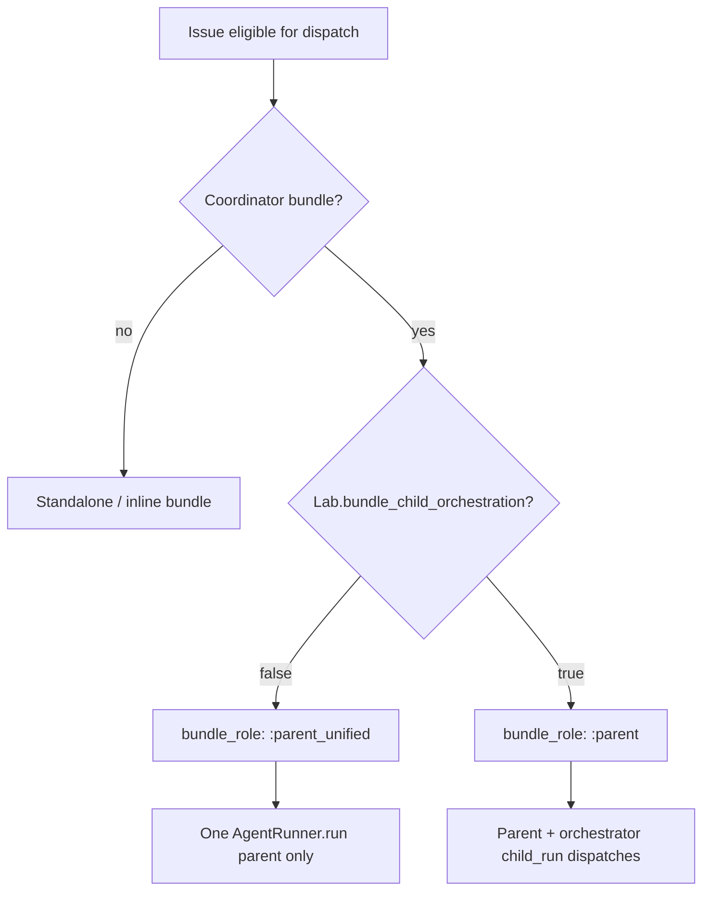

# Lab Bundle Orchestration Flag Implementation Plan

**Goal:** Add an instance-level Lab toggle (`lab.bundle_child_orchestration`, default OFF) that hard-switches parent/subtask execution between unified parent + native subagents (one PR per repo) and the existing bundle child orchestration model (510 / MAC-12..15).

**Architecture:** Register a new `Settings.Lab` group and Settings → Lab UI. At orchestrator dispatch, when a parent owns a coordinator bundle, `Lab.bundle_child_orchestration?/0` selects `:parent_unified` (single parent run, no orchestrator `child_run` dispatches, unit plan from board+bundle join) vs `:parent` (current lab coordinator). Unified mode injects a resolved unit plan into parent `run_opts`, uses `unified_parent_section/2` in prompts, registers native subagent rows for observability, and finalizes one PR per repo without integration branches.

**Tech Stack:** Elixir/Phoenix (Settings, Orchestrator, PromptBuilder, SubagentRegistry), ExUnit; React/TypeScript + Vitest (Settings Lab page, Observability `bundleRole`); existing execution bundle / workpad tooling.

**Spec:** `docs/superpowers/specs/2026-07-01-lab-bundle-orchestration-flag-design.md`

---

## Execution environment

Work on a feature branch in an isolated worktree (recommended):

- Branch: `feat/lab-bundle-orchestration-flag`
- Worktree: `.worktrees/lab-bundle-orchestration-flag`

During development, keep **Lab ON** on the dev instance when validating existing 510 bundle behavior (slices 1–9). Slice 10 explicitly switches to **Lab OFF** for the macro-markets proof run.

---

## File map

| Area | Create | Modify |
| --- | --- | --- |
| Settings backend | `elixir/lib/symphony_elixir/settings/lab.ex` | `elixir/lib/symphony_elixir/settings.ex` |
| Settings tests | — | `elixir/test/symphony_elixir/settings_test.exs`, `elixir/test/symphony_elixir_web/controllers/tracker/settings_controller_test.exs` |
| Mode switch | — | `elixir/lib/symphony_elixir/orchestrator.ex`, `elixir/lib/symphony_elixir/orchestrator/bundle_coordinator.ex` |
| Unit plan | `elixir/lib/symphony_elixir/workpad/unified_unit_plan.ex` | `orchestrator.ex` (`bundle_run_context/2`) |
| Prompts | — | `elixir/lib/symphony_elixir/prompt_builder.ex` |
| Observability backend | — | `elixir/lib/symphony_elixir/subagent_registry.ex`, `elixir/lib/symphony_elixir_web/presenters/tracker_presenter.ex` |
| Finalizer | — | `orchestrator.ex` (publish / PR base for `:parent_unified`) |
| Settings UI | `tracker/src/pages/LabSettingsPage.tsx`, `tracker/src/components/settings/LabOrchestrationCard.tsx` | `SettingsLayout.tsx`, `App.tsx`, `settingsRoutes.ts`, `services/settings.ts`, i18n |
| Observability UI | — | `tracker/src/types/observability.ts`, `tracker/src/types/agent-execution.ts`, `ObservabilityPage.tsx` |
| Docs/skills | — | `docs/superpowers/specs/2026-06-29-symphony-orchestrated-subagents-design.md` header, `.claude/skills/subtask-orchestration/SKILL.md`, `.claude/skills/subagent-driven-development/SKILL.md` |

---

## Flowchart (decision point)



---

### Task 1: Settings.Lab backend

**Files:**
- Create: `elixir/lib/symphony_elixir/settings/lab.ex`
- Modify: `elixir/lib/symphony_elixir/settings.ex` (add `"lab" => Settings.Lab` to `@groups`)
- Test: `elixir/test/symphony_elixir/settings_test.exs`
- Test: `elixir/test/symphony_elixir_web/controllers/tracker/settings_controller_test.exs`

- [ ] **Step 1: Write the failing settings group test**

Add to `settings_test.exs`:

```elixir
test "Lab defaults bundle_child_orchestration to false" do
  assert Settings.Lab.defaults() == %{"bundle_child_orchestration" => false}
  refute Settings.Lab.bundle_child_orchestration?()
end

test "Lab casts bundle_child_orchestration boolean" do
  assert {:ok, true} = Settings.Lab.cast("bundle_child_orchestration", true)
  assert {:ok, false} = Settings.Lab.cast("bundle_child_orchestration", "false")
  assert :error = Settings.Lab.cast("bundle_child_orchestration", "maybe")
end
```

- [ ] **Step 2: Run test — expect FAIL**

Run: `cd elixir && mix test test/symphony_elixir/settings_test.exs --only line:LINE`

- [ ] **Step 3: Implement `Settings.Lab`**

Mirror `Settings.Orchestration`:

```elixir
defmodule SymphonyElixir.Settings.Lab do
  @behaviour SymphonyElixir.Settings.Group
  alias SymphonyElixir.Settings

  @group "lab"
  @bundle_child_orchestration "bundle_child_orchestration"

  @impl true
  def group, do: @group

  @impl true
  def defaults, do: %{@bundle_child_orchestration => false}

  @impl true
  def cast(@bundle_child_orchestration, value), do: normalize_boolean(value)
  def cast(_name, _value), do: :error

  @spec bundle_child_orchestration?() :: boolean()
  def bundle_child_orchestration?, do: boolean_setting(@bundle_child_orchestration)

  # ... same normalize_boolean / boolean_setting helpers as Orchestration
end
```

Register in `settings.ex` `@groups`.

- [ ] **Step 4: Write failing controller test**

Add to `settings_controller_test.exs`:

```elixir
test "GET /api/tracker/v1/settings includes lab defaults" do
  conn = get(authed_conn(), "/api/tracker/v1/settings")
  assert %{"data" => %{"lab" => %{"bundle_child_orchestration" => false}}} = json_response(conn, 200)
end

test "PUT /api/tracker/v1/settings/lab toggles bundle_child_orchestration" do
  conn = put(authed_conn(), "/api/tracker/v1/settings/lab", %{"bundle_child_orchestration" => true})
  assert %{"data" => %{"bundle_child_orchestration" => true}} = json_response(conn, 200)
end
```

- [ ] **Step 5: Run tests — expect PASS**

Run: `cd elixir && mix test test/symphony_elixir/settings_test.exs test/symphony_elixir_web/controllers/tracker/settings_controller_test.exs`

- [ ] **Step 6: Commit**

```bash
git add elixir/lib/symphony_elixir/settings/lab.ex elixir/lib/symphony_elixir/settings.ex elixir/test/symphony_elixir/settings_test.exs elixir/test/symphony_elixir_web/controllers/tracker/settings_controller_test.exs
git commit -m "$(cat <<'EOF'
Add Settings.Lab group with bundle_child_orchestration flag (default false).

EOF
)"
```

---

### Task 2: Lab settings page (nav + toggle + i18n)

**Files:**
- Create: `tracker/src/pages/LabSettingsPage.tsx`
- Create: `tracker/src/components/settings/LabOrchestrationCard.tsx`
- Modify: `tracker/src/components/settings/SettingsLayout.tsx`
- Modify: `tracker/src/lib/settingsRoutes.ts`
- Modify: `tracker/src/App.tsx`
- Modify: `tracker/src/services/settings.ts`
- Modify: `tracker/src/locales/en.json`, `tracker/src/locales/pt-BR.json`
- Test: `tracker/src/components/settings/__tests__/SettingsLayout.test.tsx`
- Test: new `tracker/src/components/settings/__tests__/LabOrchestrationCard.test.tsx`

- [ ] **Step 1: Extend `AllSettings` type and API helpers**

In `services/settings.ts`:

```typescript
export interface LabSettings {
  bundle_child_orchestration: boolean;
}

export interface AllSettings {
  // ...existing...
  lab: LabSettings;
}

export async function updateLabSettings(input: Partial<LabSettings>): Promise<LabSettings> {
  const response = await http.put(trackerPath("/settings/lab"), input);
  return response.data.data;
}
```

- [ ] **Step 2: Write failing SettingsLayout test**

```typescript
it("shows Lab in settings nav", () => {
  renderSettingsLayout("/settings/lab");
  expect(screen.getByRole("link", { name: /lab/i })).toHaveAttribute("href", "/settings/lab");
});
```

- [ ] **Step 3: Implement UI**

- `settingsLabPath()` in `settingsRoutes.ts` → `/settings/lab`
- `SettingsLayout.tsx`: add nav item with flask/beaker icon (match existing nav pattern)
- `LabOrchestrationCard.tsx`: copy toggle pattern from `OrchestrationRulesCard.tsx`; single rule `bundle_child_orchestration`
- `LabSettingsPage.tsx`: load `settings.lab` from parent layout context or fetch; render card
- `App.tsx`: nested route `path="lab" element={<LabSettingsPage />}`

i18n keys (en):

```json
"settings.sections.lab.label": "Lab",
"settings.lab.title": "Experimental features",
"settings.lab.bundleChildOrchestration.title": "Bundle child orchestration",
"settings.lab.bundleChildOrchestration.description": "When on, parent tasks dispatch separate orchestrator runs per child_run unit (worktrees, integration branches). When off (default), one parent run uses native subagents and one PR per repo."
```

- [ ] **Step 4: Run frontend tests**

Run: `cd tracker && npm test -- SettingsLayout LabOrchestrationCard`

- [ ] **Step 5: Manual smoke**

1. Open Settings → Lab
2. Toggle ON → reload → still ON
3. Toggle OFF → matches backend default

- [ ] **Step 6: Commit**

---

### Task 3: Orchestrator mode switch (`:parent_unified`)

**Files:**
- Modify: `elixir/lib/symphony_elixir/orchestrator.ex`
- Modify: `elixir/lib/symphony_elixir/orchestrator/bundle_coordinator.ex` (optional helper)
- Test: `elixir/test/symphony_elixir/orchestrator/bundle_run_context_test.exs`
- Create: `elixir/test/symphony_elixir/orchestrator/unified_mode_dispatch_test.exs`

- [ ] **Step 1: Write failing `bundle_run_context` test (flag OFF)**

```elixir
@tag :capture_log
test "coordinator bundle with lab flag off runs as :parent_unified" do
  on_exit(fn -> restore_lab_flag() end)
  Settings.put_group("lab", %{"bundle_child_orchestration" => false})

  issue = %Issue{identifier: "510"}
  bundle = coordinator_bundle() # mode bundle + child_run units MAC-12..15

  ctx = Orchestrator.bundle_run_context(issue, bundle_resolver: fn "510" -> {:ok, bundle} end)

  assert ctx.role == :parent_unified
  assert Keyword.get(ctx.run_opts, :bundle) == bundle
  refute ctx.role == :parent
end

test "coordinator bundle with lab flag on runs as :parent (unchanged)" do
  on_exit(fn -> restore_lab_flag() end)
  Settings.put_group("lab", %{"bundle_child_orchestration" => true})

  ctx = Orchestrator.bundle_run_context(%Issue{identifier: "510"}, ...)
  assert ctx.role == :parent
end
```

- [ ] **Step 2: Run test — expect FAIL**

- [ ] **Step 3: Implement mode branch in `bundle_run_context/2`**

Replace the coordinator branch (~line 1092):

```elixir
if BundleCoordinator.coordinator?(bundle) do
  if Settings.Lab.bundle_child_orchestration?() do
    %{role: :parent, ..., run_opts: [bundle: bundle]}
  else
    %{
      role: :parent_unified,
      parent_identifier: nil,
      unit_id: nil,
      repo: nil,
      child_identifiers: coordinator_child_identifiers(bundle),
      run_opts: [bundle: bundle] # unit_plan added in Task 4
    }
  end
else
  standalone_run_context()
end
```

- [ ] **Step 4: Write failing child-hold test (flag OFF)**

In `unified_mode_dispatch_test.exs`:

```elixir
test "child_run issues are held from orchestrator dispatch when parent is unified" do
  Settings.put_group("lab", %{"bundle_child_orchestration" => false})

  parent = %Issue{identifier: "510", id: "p1"}
  child = %Issue{identifier: "MAC-12", id: "c1", parent_identifier: "510"}

  held = Orchestrator.held_child_issue_ids_for_test([child], bundle_loader: fn "510" -> {:ok, coordinator_bundle()} end)
  assert MapSet.member?(held, "c1")
end

test "child_run issues are NOT blanket-held when lab flag is on" do
  Settings.put_group("lab", %{"bundle_child_orchestration" => true})
  # only BundleGate-held children remain held, not all children
end
```

- [ ] **Step 5: Implement hold filter**

In `held_child_issue_ids/2`, before `BundleGate.held?/4`:

```elixir
cond do
  not Settings.Lab.bundle_child_orchestration?() and BundleCoordinator.coordinator?(bundle) ->
    Logger.info("Holding child dispatch (unified parent): #{issue_context(child)} parent=#{parent_identifier}")
    MapSet.put(inner, child.id)

  BundleGate.held?(bundle, child.identifier, done_units, contract_status) ->
    # existing log + put

  true ->
    inner
end
```

- [ ] **Step 6: Skip coordinator-only parent dispatch hold for unified mode**

Update `parent_completion_held?/2` and `coordinator_parent_dispatch_held?/2`:

```elixir
BundleCoordinator.coordinator?(bundle) and
  Settings.Lab.bundle_child_orchestration?() and
  not BundleCoordinator.children_all_done?(bundle, done_resolver.(bundle))
```

Unified parent completes in one run — no "wait for children then re-dispatch parent" cycle.

- [ ] **Step 7: Budget guard — unified parent is NOT exempt**

Confirm `coordinator_parent_run?/1` matches only `bundle_role: :parent`, not `:parent_unified`. Extend `budget_guard_test.exs`:

```elixir
test "parent_unified is subject to budget guard like standalone" do
  entry = %{agent_total_tokens: 5_000_000, retry_attempt: 0, bundle_role: :parent_unified}
  assert Orchestrator.budget_overrun_action(entry, 4_000_000, max_retries: 0) == :park
end
```

- [ ] **Step 8: Run orchestrator tests**

Run: `cd elixir && mix test test/symphony_elixir/orchestrator/bundle_run_context_test.exs test/symphony_elixir/orchestrator/unified_mode_dispatch_test.exs test/symphony_elixir/orchestrator/budget_guard_test.exs`

- [ ] **Step 9: Commit**

---

### Task 4: Unified unit plan (board + bundle join)

**Files:**
- Create: `elixir/lib/symphony_elixir/workpad/unified_unit_plan.ex`
- Create: `elixir/test/symphony_elixir/workpad/unified_unit_plan_test.exs`
- Modify: `elixir/lib/symphony_elixir/orchestrator.ex` (`bundle_run_context/2` for `:parent_unified`)

- [ ] **Step 1: Write failing unit plan tests**

```elixir
defmodule SymphonyElixir.Workpad.UnifiedUnitPlanTest do
  use ExUnit.Case, async: true
  alias SymphonyElixir.Workpad.UnifiedUnitPlan

  test "joins bundle units to gated board sub-issues" do
    bundle = %ExecutionBundle{
      mode: "bundle",
      units: [
        %{id: "MAC-12", type: :child_run, issue: "MAC-12", repo: "clouapp/front", depends_on: [], produces: ["theme"], consumes: []},
        %{id: "MAC-13", type: :child_run, issue: "MAC-13", repo: "clouapp/back", depends_on: ["MAC-12"], produces: [], consumes: ["theme"]}
      ],
      shared_contracts: [%{id: "theme", owner_unit: "MAC-12"}]
    }

    sub_issues = [
      %{identifier: "MAC-12", status: "Human Review", labels: ["symphony"], assignee_id: "me"},
      %{identifier: "MAC-13", status: "Todo", labels: ["symphony"], assignee_id: "me"}
    ]

    assert {:ok, plan} = UnifiedUnitPlan.build(bundle, sub_issues,
      require_symphony_label: true,
      require_assignee_match: true,
      connected_assignee_id: "me"
    )

    assert length(plan.units) == 2
    mac12 = Enum.find(plan.units, &(&1.issue == "MAC-12"))
    assert mac12.eligible
    assert mac12.board_status == "Human Review"
  end

  test "bundle unit without board match is skipped with reason" do
    # unit MAC-99 in bundle, not in sub_issues → eligible: false, skip_reason set
  end

  test "board sub-issue without bundle unit is included as ad-hoc with warning" do
    # MAC-15 on board only → ad_hoc: true, warning logged
  end
end
```

- [ ] **Step 2: Run test — expect FAIL**

- [ ] **Step 3: Implement pure module**

```elixir
defmodule SymphonyElixir.Workpad.UnifiedUnitPlan do
  @moduledoc "Board + execution bundle join for unified parent runs."

  defstruct [:units, :warnings]

  @type unit_entry :: %{
          id: String.t() | nil,
          issue: String.t(),
          type: atom(),
          repo: String.t() | nil,
          depends_on: [String.t()],
          consumes: [String.t()],
          produces: [String.t()],
          deliverable: String.t() | nil,
          board_status: String.t() | nil,
          eligible: boolean(),
          skip_reason: String.t() | nil,
          ad_hoc: boolean()
        }

  @spec build(ExecutionBundle.t(), [map()], keyword()) :: {:ok, t()} | {:error, term()}
  def build(%ExecutionBundle{} = bundle, sub_issues, opts \\ []) do
    gated = filter_sub_issues(sub_issues, opts)
    # match bundle units → entries; append unmatched board children as ad_hoc
    # preserve dependency order from bundle.topo sort or depends_on
  end
end
```

Wire sub-issue listing via existing tracker context (same gates as orchestrator auto-dispatch):

- `Settings.Orchestration.require_symphony_label?/0`
- `Settings.Orchestration.require_assignee_match?/0`

- [ ] **Step 4: Inject into `bundle_run_context`**

For `:parent_unified`, resolve sub-issues and attach:

```elixir
with {:ok, plan} <- UnifiedUnitPlan.build(bundle, list_sub_issues(identifier), plan_opts) do
  run_opts = [bundle: bundle, unit_plan: plan]
end
```

Handle `{:error, reason}` in dispatch prep (surface to operator, do not dispatch broken parent).

- [ ] **Step 5: Run tests**

Run: `cd elixir && mix test test/symphony_elixir/workpad/unified_unit_plan_test.exs test/symphony_elixir/orchestrator/bundle_run_context_test.exs`

- [ ] **Step 6: Commit**

---

### Task 5: Unified parent prompt

**Files:**
- Modify: `elixir/lib/symphony_elixir/prompt_builder.ex`
- Create: `elixir/test/symphony_elixir/prompt_builder_unified_test.exs`

- [ ] **Step 1: Write failing prompt test**

```elixir
test "unified_parent_section lists unit plan and one-PR rules" do
  plan = %UnifiedUnitPlan{units: [%{issue: "MAC-12", eligible: true, board_status: "Todo"}]}
  bundle = coordinator_bundle()

  text = PromptBuilder.unified_parent_section(bundle, plan)

  assert text =~ "MAC-12"
  assert text =~ "subagent-driven-development"
  assert text =~ "one PR per repo"
  assert text =~ "feat/"
  refute text =~ "integration branch"
end

test "build/2 uses unified section when run_opts has unit_plan" do
  opts = [bundle: bundle(), unit_plan: plan()]
  prompt = PromptBuilder.build(issue(), opts)
  assert prompt =~ "Unified parent execution"
  refute prompt =~ "Bundle coordinator"
end
```

- [ ] **Step 2: Implement `unified_parent_section/2`**

Sections to include (per spec §6):

1. Mode explanation (native subagents, not orchestrator child runs)
2. Ordered unit plan table (issue, repo, deps, contracts, board status, eligible)
3. Cadence: predecessor at Human Review or terminal before starting next unit; use `query_bundle_status`
4. Per-unit: move board status, scoped tests, evidence with `task_id`, `report_unit_status`
5. Git: single branch `feat/<parent-slug>` per repo; no child branches; no integration branch
6. Skills: load `subagent-driven-development`, read `subtask-orchestration`

In `build/2`, branch on presence of `unit_plan` in opts (or `bundle_role: :parent_unified` passed through):

```elixir
bundle_section =
  case Keyword.get(opts, :unit_plan) do
    %UnifiedUnitPlan{} = plan -> unified_parent_section(Keyword.get(opts, :bundle), plan)
    _ -> bundle_coordinator_section(Keyword.get(opts, :bundle))
  end
```

- [ ] **Step 3: Run tests**

Run: `cd elixir && mix test test/symphony_elixir/prompt_builder_unified_test.exs test/symphony_elixir/prompt_builder_bundle_test.exs`

- [ ] **Step 4: Commit**

---

### Task 6: Native subagent registry (observability)

**Files:**
- Modify: `elixir/lib/symphony_elixir/subagent_registry.ex`
- Modify: `elixir/lib/symphony_elixir_web/presenters/tracker_presenter.ex`
- Modify: `tracker/src/types/observability.ts`, `tracker/src/types/agent-execution.ts`
- Modify: `tracker/src/pages/ObservabilityPage.tsx`
- Test: `elixir/test/symphony_elixir/subagent_registry_test.exs`
- Test: `tracker/src/pages/__tests__/ObservabilityPage.test.tsx`

- [ ] **Step 1: Write failing registry test**

When parent has `bundle_role: :parent_unified` and agent reports a native subagent start (existing tool hook or new metadata event):

```elixir
test "registers native subagent row under unified parent" do
  SubagentRegistry.register(%{
    parent_identifier: "510",
    subagent_identifier: "MAC-13",
    bundle_role: :subagent
  })

  rows = SubagentRegistry.list_for_parent("510")
  assert [%{identifier: "MAC-13", bundle_role: :subagent}] = rows
end
```

- [ ] **Step 2: Extend registry**

- Accept `:subagent` role linked to `:parent_unified` parent session
- Do NOT create separate AgentRunner processes — registry is observability-only
- Expose via existing agent execution / observability API (`bundle_role: "subagent"`, `parent_identifier: "510"`)

- [ ] **Step 3: Frontend types**

```typescript
export type BundleRole = "parent" | "parent_unified" | "child" | "subagent" | "standalone";
```

Update `ObservabilityPage.groupRunningRows()`:

- `:parent_unified` acts as tree root (like `:parent`)
- `:subagent` nests under parent (like `:child` but distinct label)
- No `:waiting` rows in unified mode

- [ ] **Step 4: Add ObservabilityPage test**

Parent `:parent_unified` + child `:subagent` nested; no orchestrator `:child` rows.

- [ ] **Step 5: Run tests**

Run: `cd elixir && mix test test/symphony_elixir/subagent_registry_test.exs`
Run: `cd tracker && npm test -- ObservabilityPage`

- [ ] **Step 6: Commit**

---

### Task 7: Finalize path — one PR per repo (unified)

**Files:**
- Modify: `elixir/lib/symphony_elixir/orchestrator.ex` (publish contract / PR base resolution)
- Test: `elixir/test/symphony_elixir/orchestrator/unified_finalize_test.exs`

- [ ] **Step 1: Write failing finalize test**

```elixir
test "parent_unified publish targets repo default branch not integration branch" do
  issue = %Issue{identifier: "510", repository_full_name: "org/clouapp-front"}
  running = %{bundle_role: :parent_unified, issue: issue}

  pr_base = Orchestrator.pr_base_for_running_entry(running, workspace: "/tmp/ws/510")

  assert pr_base == "main" # or project default — NOT "symphony/510/clouapp-front"
end

test "parent_unified does not create integration branch on dispatch prep" do
  # assert no call to integration_branch_name/2 when role is :parent_unified
end
```

- [ ] **Step 2: Implement PR base branch logic**

Locate where lab mode sets `pr_base: "symphony/{parent}/{repo}"` and `worktree_base_branch` for `:parent` / `:child`. For `:parent_unified`:

| Field | Value |
| --- | --- |
| Branch | `feat/<parent-slug>` (reuse existing slug helper) |
| PR base | repo default branch |
| Integration branch | not created |

Ensure publish contract opens **one PR per touched repo** from parent workspace commits.

- [ ] **Step 3: Run tests + existing publish tests**

Run: `cd elixir && mix test test/symphony_elixir/orchestrator/unified_finalize_test.exs`

- [ ] **Step 4: Commit**

---

### Task 8: Regression tests (flag OFF vs ON)

**Files:**
- Modify: `elixir/test/symphony_elixir/orchestrator/bundle_run_context_test.exs`
- Modify: `elixir/test/symphony_elixir/orchestrator/bundle_dispatch_test.exs`
- Modify: `elixir/test/symphony_elixir/local_tracker/context_cascade_drag_test.exs`
- Modify: `elixir/test/symphony_elixir_web/channels/session_log_channel_workspace_test.exs`

- [ ] **Step 1: Flag OFF regression suite**

| Test | Assertion |
| --- | --- |
| Dispatch candidates | MAC-* never selected when parent 510 is unified |
| Parent move cascade | MAC-12 at Human Review stays put when parent dispatched (existing cascade guard) |
| Session log | Parent workspace path used (not child worktree) |
| Budget | `:parent_unified` guarded; no coordinator exemption |

- [ ] **Step 2: Flag ON regression suite**

Set `Settings.put_group("lab", %{"bundle_child_orchestration" => true})` in setup; run **all existing** bundle tests unchanged:

- `bundle_run_context_test.exs` (child fork, integration branch, coordinator role)
- `bundle_dispatch_test.exs`
- `budget_guard_test.exs` (coordinator exempt)
- `session_log_channel_workspace_test.exs` (child worktree)

- [ ] **Step 3: Full orchestrator test run**

Run: `cd elixir && mix test test/symphony_elixir/orchestrator/`

- [ ] **Step 4: Commit**

---

### Task 9: Docs and skills

**Files:**
- Modify: `docs/superpowers/specs/2026-06-29-symphony-orchestrated-subagents-design.md` (header: "Lab mode — enable via Settings → Lab")
- Modify: `.claude/skills/subtask-orchestration/SKILL.md`
- Modify: `.claude/skills/subagent-driven-development/SKILL.md`

- [ ] **Step 1: Update 2026-06-29 spec header**

Add note at top:

> **Scope:** Applies when `lab.bundle_child_orchestration` is **true**. Default instances use unified parent mode (see `2026-07-01-lab-bundle-orchestration-flag-design.md`).

- [ ] **Step 2: Update subtask-orchestration skill**

Document both modes:

- Flag OFF: `child_run` in YAML = subagent scope (one PR per repo)
- Flag ON: `child_run` = orchestrator dispatch (current behavior)

- [ ] **Step 3: Update subagent-driven-development skill**

Default mode: primary execution pattern for parent-coordinated work.

- [ ] **Step 4: Commit**

---

### Task 10: Live validation — task 510 (final slice)

**Prerequisites:** Tasks 1–9 merged or loaded on main daemon. **Lab flag OFF.**

**Files:**
- Workpad comment on issue 510 (operator record)

- [ ] **Step 1: Confirm Lab OFF**

```bash
curl -s -H "Authorization: Bearer $SYMPHONY_TRACKER_TOKEN" \
  http://127.0.0.1:4000/api/tracker/v1/settings | jq '.data.lab'
# expect bundle_child_orchestration: false
```

Or via Settings → Lab UI.

- [ ] **Step 2: Clean-slate board state**

Reset for monitored run (preserve git branches/PRs as reference only):

| Issue | Target status |
| --- | --- |
| 510 | Todo (or project's dispatch state) |
| MAC-12 | Todo |
| MAC-13 | Todo |
| MAC-14 | Todo |
| MAC-15 | Todo |

Clear stale running sessions / dispatch locks if any (`mix symphony.orchestrator.reset` or equivalent project command).

Workpad: keep execution bundle YAML (units, deps, contracts); add note that this run is **unified mode validation**.

- [ ] **Step 3: Cold-boot daemon**

```bash
# kill existing symphony@127.0.0.1, relaunch with latest code
cd elixir && mix compile && mix symphony.server
```

Do not hot-load for this validation slice.

- [ ] **Step 4: Dispatch 510**

Manual or orchestrator auto-dispatch from Todo → In Progress.

- [ ] **Step 5: Monitor (30–60 min)**

| Signal | Expected (unified) |
| --- | --- |
| Running sessions | **One** parent session for 510 only — no MAC-* orchestrator runs |
| Observability tree | Parent `:parent_unified` + `:subagent` rows as units start |
| Board | Each MAC-* moves In Progress → Human Review per unit (parent/subagent tools) |
| Evidence | Per-unit `.symphony/evidence/manifest.json` keyed to MAC-* id |
| PRs | **One open PR per repo** (`feat/510` or slug); no child PRs; no `symphony/510/*` integration |
| Token budget | Parent subject to normal guard (not coordinator-exempt) |
| Cascade | MAC-12 not dragged when parent re-dispatched if already at Human Review |

- [ ] **Step 6: Document in 510 workpad**

Add `## Unified mode validation (YYYY-MM-DD)` section:

- Lab flag state
- Unit execution order observed
- Contract updates (`theme` etc.)
- PR URLs per repo
- Deviations / follow-ups

- [ ] **Step 7: Acceptance checklist (spec §13)**

Verify all boxes in spec §13 "Default mode" and "Live validation — task 510".

---

## Verification commands (full suite)

```bash
# Backend
cd elixir && mix test test/symphony_elixir/settings_test.exs \
  test/symphony_elixir_web/controllers/tracker/settings_controller_test.exs \
  test/symphony_elixir/workpad/unified_unit_plan_test.exs \
  test/symphony_elixir/orchestrator/ \
  test/symphony_elixir/prompt_builder_unified_test.exs \
  test/symphony_elixir/subagent_registry_test.exs

# Frontend
cd tracker && npm test -- SettingsLayout LabOrchestrationCard ObservabilityPage
```

---

## Risk notes

| Risk | Mitigation |
| --- | --- |
| Accidentally dispatching children when flag OFF | Blanket hold in `held_child_issue_ids/2` + dispatch candidate filter; covered by Task 8 |
| Unified parent hits 4M token ceiling on large bundles | No exemption by design; monitor in slice 10 |
| Ad-hoc board sub-issues without bundle units | Included with warning (spec §14); log in `UnifiedUnitPlan.build/3` |
| Lab regression | Task 8 runs full bundle suite with flag ON |
| Slice 10 before code complete | Spec orders slice 10 **last** intentionally |

---

## Handoff

Plan saved at: `docs/superpowers/plans/2026-07-01-510-lab-bundle-orchestration-flag-plan.md`

Execute tasks 1→10 in order. Each task should leave the repo in a test-passing state before moving on. Slice 10 is the macro-markets end-to-end proof under **Lab OFF**.

Recommended next step: **Task 1 (Settings.Lab backend)** — smallest vertical slice, unblocks UI and orchestrator gating.
