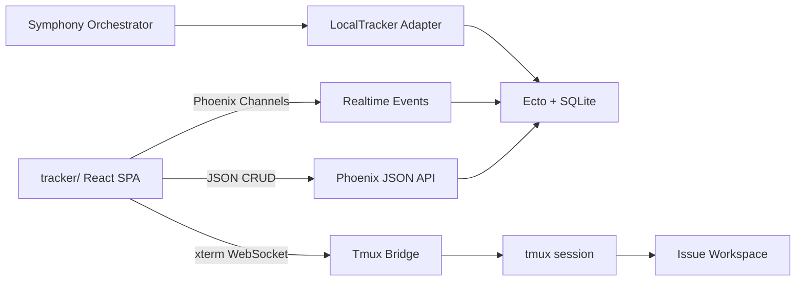

# Local Tracker — React Kanban + Symphony Tracker Design

**Status:** Approved  
**Date:** 2026-05-27  
**Scope:** Add a local-first project manager for Symphony using React + shadcn UI, Phoenix JSON/Channel APIs, SQLite persistence, and a local tracker adapter that can replace Linear/GitHub for orchestration.

---

## 1. Problem

Symphony can currently use remote trackers such as Linear and GitHub Projects, but there is no first-class local project manager. When the user does not want to rely on Linear or GitHub, Symphony lacks a local source of truth for:

- Multiple projects
- Issues/cards
- Workflow status
- Blockers
- Comments/workpad
- Agent execution visibility
- Human review handoff

The current web surface is a minimal Phoenix observability dashboard. It is not a product UI and does not provide issue management.

---

## 2. Goal

Build a local Linear-like tracker that can act as Symphony's project-management surface and tracker source.

The MVP must:

1. Provide a React + shadcn UI for multiple local projects.
2. Support board and list views for issues.
3. Persist local project data in SQLite.
4. Expose JSON APIs from Phoenix for the React UI.
5. Push realtime updates through Phoenix Channels.
6. Implement `SymphonyElixir.Tracker` through a local tracker adapter.
7. Allow the orchestrator to consume local issues according to `WORKFLOW.md`.
8. Provide an issue-level terminal using tmux + xterm for human review and operational intervention.

---

## 3. Non-goals

Out of scope for the MVP:

- Linear/GitHub import or sync
- Bidirectional remote tracker synchronization
- Cycles/sprints
- Automations
- Analytics/reporting
- Multi-user SaaS-style permissions
- Full auth/login
- Shared component package extraction

The frontend should be copied/adapted from proven `seomachine` patterns first. Shared package extraction can happen later once component boundaries stabilize.

---

## 4. Decisions

| Topic | Choice |
|---|---|
| Frontend location | `tracker/` at repository root |
| Frontend stack | React + TypeScript + Vite + shadcn + Tailwind |
| UI reference | `../seomachine/admin` setup and kanban patterns |
| Kanban DnD | `@dnd-kit` |
| Backend | Existing Phoenix server in `elixir/` |
| API style | JSON API for CRUD, Phoenix Channels for realtime |
| Persistence | Ecto + SQLite |
| Tracker adapter | New local adapter implementing `SymphonyElixir.Tracker` |
| Product mode | Local-only MVP |
| Default workflow | Symphony workflow from `WORKFLOW.md` |
| Execution eligibility | Config-driven via `tracker.active_states` / `tracker.terminal_states` |
| Main layout | Linear-like: sidebar, board/list center, issue drawer |
| Terminal | xterm.js UI connected to tmux sessions per issue workspace |
| Access control | Local token protects API, WebSocket, and terminal |

---

## 5. Architecture



Phoenix remains the local backend and runtime integration point. React owns the product UI. SQLite is the source of truth. The local tracker adapter reads from the same database as the UI so board changes directly affect orchestrator eligibility.

---

## 6. Frontend

Create a new root-level `tracker/` SPA.

Use the `seomachine` admin app as the implementation reference:

- Vite React SPA
- shadcn component layout
- Tailwind tokens
- React Router
- `@dnd-kit` board interactions
- `xterm.js` terminal component pattern

Use TypeScript instead of the JavaScript setup from `seomachine`, because the tracker domain will include issues, projects, blockers, realtime events, terminal sessions, and API DTOs.

### 6.1 Main screens

- Project sidebar
- Project board view
- Project list/backlog view
- Issue detail drawer
- Issue create/edit dialog
- Issue terminal view or embedded terminal panel

### 6.2 Issue detail sections

- Summary
- Description
- Comments/workpad
- Blockers
- Agent execution/logs
- Activity
- Terminal action for issue workspace

### 6.3 Kanban behavior

The board uses the Symphony workflow by default:

1. Backlog
2. Todo
3. In Progress
4. Human Review
5. Merging
6. Rework
7. Done

Drag-and-drop updates are optimistic in React. The API persists the move. If persistence fails, the UI reverts and shows an error.

---

## 7. Domain Model

### 7.1 Project

Represents a local project board.

Core fields:

- `id`
- `name`
- `slug`
- `description`
- `default_workflow_id`
- `created_at`
- `updated_at`

### 7.2 WorkflowStatus

Represents a project workflow state/column.

Core fields:

- `id`
- `project_id`
- `name`
- `category`
- `position`
- `is_terminal`
- `created_at`
- `updated_at`

The default statuses are seeded from the Symphony workflow. Runtime execution eligibility remains config-driven through `WORKFLOW.md`.

### 7.3 Issue

Represents the local equivalent of a Linear issue.

Core fields:

- `id`
- `project_id`
- `status_id`
- `identifier`
- `title`
- `description`
- `priority`
- `position`
- `assignee_id`
- `worker_id`
- `branch_name`
- `url`
- `created_at`
- `updated_at`
- `started_at`
- `completed_at`

The local tracker adapter maps this record to `%SymphonyElixir.Issue{}` for orchestrator consumption.

### 7.4 Comment

Supports normal discussion and the persistent workpad pattern.

Core fields:

- `id`
- `issue_id`
- `kind`
- `body`
- `author`
- `created_at`
- `updated_at`

### 7.5 Label

Supports filtering and issue categorization.

Core fields:

- `id`
- `project_id`
- `name`
- `color`
- `created_at`
- `updated_at`

### 7.6 IssueRelation

Supports blockers.

Core fields:

- `id`
- `source_issue_id`
- `target_issue_id`
- `type`
- `created_at`

For `type = "blocked_by"`, `source_issue_id` cannot be dispatched while `target_issue_id` is non-terminal.

### 7.7 ActivityEvent

Records important issue changes for audit/history.

Core fields:

- `id`
- `issue_id`
- `event_type`
- `metadata`
- `created_at`

---

## 8. Local Tracker Adapter

Add a local tracker adapter implementing `SymphonyElixir.Tracker`.

Responsibilities:

- Fetch candidate issues from SQLite.
- Respect `tracker.active_states`.
- Treat `tracker.terminal_states` as terminal.
- Return blockers in the same shape expected by the orchestrator.
- Update issue state when Symphony transitions work.
- Create comments/workpad updates.
- Expose project identity from the active local project.

The adapter must not invent a second state system. The project workflow provides UI columns; `WORKFLOW.md` controls orchestration semantics.

---

## 9. Realtime

Use Phoenix Channels for realtime updates between backend and React.

Events:

- Project created/updated
- Issue created/updated/deleted
- Issue moved
- Comment created/updated
- Blocker changed
- Agent execution state changed
- Terminal session state changed

The React UI auto-patches visible cards and issue details when events arrive. If a user is actively editing a field, later implementation may add conflict handling; the MVP defaults to applying updates automatically.

---

## 10. Terminal / Tmux

Add issue-level terminal support inspired by `seomachine`:

- React uses `xterm.js`.
- Phoenix exposes a WebSocket/Channel-backed bridge.
- Backend creates or opens a tmux session per issue workspace.
- The tmux session starts in the issue workspace.
- The UI can open the terminal from the issue drawer, especially in states such as `Human Review`.
- Terminal sessions are tied to issue lifecycle.
- Sessions are terminated and cleaned when the issue reaches a terminal state.
- Cast/log output is associated with the issue for review.

The implementation should port the pattern, not the Python code:

- tmux client wrapper
- session registry
- bridge between browser terminal and tmux
- issue/workspace lifecycle cleanup
- concurrency limits

Security must be stricter than `seomachine` if multi-user access is added later. The MVP uses a local token for API, channels, and terminal access.

---

## 11. Phoenix API

Add JSON endpoints for:

- Projects
- Workflow statuses
- Issues
- Issue moves/reordering
- Comments/workpad
- Labels
- Blockers
- Terminal sessions

The API should validate inputs at the boundary and return clear errors. Ecto changesets are the primary validation mechanism.

---

## 12. Configuration

Add local tracker configuration to `WORKFLOW.md`.

Example shape:

```yaml
tracker:
  kind: local
  active_states:
    - Todo
    - Rework
  terminal_states:
    - Done
    - Closed

local_tracker:
  database_path: .symphony/tracker.sqlite3
  project_slug: macro-markets
  api_token_env: SYMPHONY_TRACKER_TOKEN
```

Implementation should expose these values through the existing `SymphonyElixir.Config` pattern instead of reading environment variables ad hoc.

---

## 13. Testing

### Backend

- Ecto schema validation tests
- Migration tests for clean database creation and required indexes
- API controller tests for CRUD and validation errors
- Local tracker adapter tests for candidate selection, blockers, comments, and state updates
- Orchestrator integration tests using local tracker fixtures
- Terminal registry/bridge unit tests with tmux mocked

### Frontend

- TypeScript type checks
- Unit tests for board reducers/helpers
- Component tests for board movement and issue detail
- API client tests with mocked responses
- Realtime event handling tests

### End-to-end

- Create project
- Create issue
- Move issue through workflow
- Add blocker
- Verify blocked issue is not dispatchable
- Move blocker to terminal state
- Verify issue becomes dispatchable
- Open issue terminal

---

## 14. Success Criteria

1. A user can run Symphony locally and open the React tracker UI.
2. A user can create multiple projects.
3. A user can create, edit, label, and comment on issues.
4. A user can move issues across the Symphony workflow board.
5. Board changes persist to SQLite.
6. Realtime updates patch the React UI without manual refresh.
7. `tracker.kind: local` lets the orchestrator fetch issues from SQLite.
8. Blockers prevent dispatch while dependencies are non-terminal.
9. Issues in configured active states are eligible for orchestration.
10. Issues in terminal states are cleaned up according to existing workspace lifecycle rules.
11. A user can open an issue-level tmux terminal from the UI.
12. The implementation can later add Linear/GitHub import/sync without replacing the core model.
