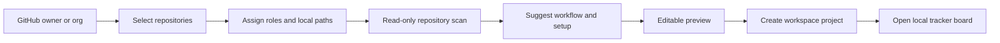

# Local Tracker Workspace Wizard Design

**Status:** Approved  
**Date:** 2026-05-27  
**Scope:** Replace simplistic local tracker project creation with a deterministic workspace wizard that discovers GitHub repositories, scans selected local repositories, suggests workflow/project setup, and creates a multi-repository local tracker project.

---

## 1. Problem

The current local tracker project creation flow only collects `name`, `slug`, and `description`. That is too shallow for Symphony's real operating model.

In practice, a Symphony "project" is the workspace an agent needs to understand and modify a product. For complex systems, that workspace can include a frontend repository, backend repository, shared packages, infrastructure repositories, and microservices. The project creation flow must capture that shape so generated issues, prompts, hooks, and per-issue workspaces are useful from the first run.

---

## 2. Goal

Create a next-phase workspace wizard where a local tracker `Project` represents an operational Cursor workspace:

1. Discover GitHub owners/organizations and repositories.
2. Let the user select one or more repositories.
3. Assign each repository a role and workspace folder name.
4. Optionally point each repository to an existing local path.
5. Scan selected local paths without executing arbitrary project code.
6. Suggest workflow statuses, active/wait/terminal groups, validation commands, hooks, and prompt instructions.
7. Show an editable preview before creating the project.
8. Persist the project, repositories, workflow statuses, and generated setup metadata.

---

## 3. Non-goals

Out of scope for this phase:

- AI-generated workflow suggestions.
- Executing package manager commands during scan.
- Importing existing GitHub issues.
- Bidirectional sync with GitHub Projects.
- Multi-user permissions.
- Full visual workflow editor beyond the creation wizard.

The design must keep clear extension points for agent-assisted suggestions later.

---

## 4. Decisions

| Topic | Choice |
|---|---|
| Top-level concept | Local tracker `Project` means operational workspace |
| Repository source | GitHub owner/org repository discovery |
| Suggestion style | Deterministic scan, no AI in this phase |
| Workflow source | Wizard-generated, editable before create |
| Multi-repo support | First-class project repositories |
| Scan safety | Read known metadata files only; do not execute commands |
| Workspace setup | Persist generated hook/setup metadata |
| Frontend board statuses | Render project-provided statuses, not hardcoded defaults |

---

## 5. User Flow



Wizard steps:

1. **Source:** Enter or choose GitHub owner/organization.
2. **Repositories:** Fetch and select repositories from that owner.
3. **Composition:** Set repo role, workspace folder, branch, clone URL, and optional local path.
4. **Scan:** Detect stack, package manager, scripts, branch hints, agent instruction files, and validation commands.
5. **Workflow:** Edit statuses and execution eligibility groups.
6. **Prompt/Hooks:** Review generated `after_create` hook, validation guidance, and prompt instructions.
7. **Review:** Create project and open the board.

---

## 6. Backend Design

### 6.1 Data Model

Keep `local_tracker_projects` as the top-level record, but treat it as the operational workspace.

Add `local_tracker_repositories`:

- `id`
- `project_id`
- `github_full_name`
- `clone_url`
- `default_branch`
- `selected_branch`
- `local_path`
- `workspace_path`
- `role`
- `scan_summary`
- timestamps

Add `local_tracker_project_setups`:

- `id`
- `project_id`
- `workflow_config`
- `after_create_hook`
- `prompt_template`
- `validation_commands`
- `scan_summary`
- timestamps

Keep `local_tracker_workflow_statuses`, but create statuses from wizard output when provided. Fall back to defaults only for legacy/simple project creation.

### 6.2 Services

Add a local tracker setup boundary:

- `SymphonyElixir.LocalTracker.GitHubDiscovery` lists repositories for an owner/org through GitHub GraphQL.
- `SymphonyElixir.LocalTracker.RepositoryScanner` reads known files from local paths and returns deterministic facts.
- `SymphonyElixir.LocalTracker.WorkflowSuggester` converts selected repositories and scan facts into project setup suggestions.
- `SymphonyElixir.LocalTracker.Context.create_workspace_project/1` persists project, repositories, statuses, and setup metadata in one transaction.

GitHub discovery should reuse the existing token/header/GraphQL patterns but remain separate from the GitHub tracker adapter. A local tracker workspace wizard is not the same responsibility as polling a GitHub Project board.

### 6.3 API

Add protected tracker API endpoints:

- `GET /api/tracker/v1/github/owners/:owner/repositories`
- `POST /api/tracker/v1/project_setup/scan`
- `POST /api/tracker/v1/project_setup/suggest`
- `POST /api/tracker/v1/projects/workspace`

Existing `POST /api/tracker/v1/projects` remains for simple/manual creation.

### 6.4 Workspace Hooks

Generated setup metadata should include an editable `after_create` hook that clones or prepares all selected repositories into stable subdirectories.

Example generated layout:

```text
issue-workspace/
  frontend/
  backend/
  services/pricing/
```

The prompt should explain the repository roles and paths so agents know where to inspect and edit.

---

## 7. Frontend Design

Replace the simple project modal entry point with a richer wizard.

Primary components:

- `ProjectWorkspaceWizard`
- `RepositorySourceStep`
- `RepositorySelectionStep`
- `RepositoryCompositionStep`
- `RepositoryScanStep`
- `WorkflowSuggestionStep`
- `ProjectSetupReviewStep`

The first implementation can use one dialog/page component with small internal subcomponents if that is simpler, but the state model should stay explicit and testable.

The project list page should expose `New workspace project` instead of only `New project`.

Board/list rendering must use project-provided workflow statuses. Hardcoded defaults can remain as fallback for loading/error states, but should not be the source of truth for project boards.

---

## 8. Suggestion Rules

Repository scan reads only known metadata files:

- `package.json`
- `pnpm-lock.yaml`
- `yarn.lock`
- `package-lock.json`
- `mix.exs`
- `pyproject.toml`
- `composer.json`
- `Makefile`
- `docker-compose.yml`
- `README.md`
- `AGENTS.md`
- `.cursor/rules/*`

Suggested workflow defaults:

- Field states: `Backlog`, `Todo`, `In Progress`, `Human Review`, `Rework`, `Merging`, `Done`, `Cancelled`, `Duplicate`
- Active states: `Todo`, `In Progress`, `Rework`, `Merging`
- Wait states: `Human Review`
- Terminal states: `Done`, `Cancelled`, `Duplicate`

Suggested validation commands come from detected scripts and files:

- Node repos: prefer `npm test`, `npm run test`, `npm run lint`, or matching package manager command.
- Elixir repos: `mix test`, optionally `mix format --check-formatted`.
- Makefile repos: expose safe named targets as suggestions, but do not run them.

---

## 9. Error Handling

- Missing GitHub token returns an actionable API error.
- Owner/org not found returns a clear not-found message.
- GitHub pagination failures include the owner and page cursor in logs, but not tokens.
- Local path scan failures are non-fatal per repository and surfaced as warnings.
- Invalid workflow must fail before persistence: at least one status, unique status names, unique positions, and terminal states included in field states.
- Repository workspace paths must be relative safe folder names, not absolute paths or parent traversal.

---

## 10. Testing

Backend:

- GitHub discovery unit tests with mocked GraphQL responses and pagination.
- Repository scanner tests with fixture directories.
- Workflow suggester tests for multi-repo frontend/backend scenarios.
- Context transaction tests for creating project, repositories, statuses, and setup metadata.
- Controller tests for auth, validation, and happy paths.

Frontend:

- Service tests for discovery, scan, suggest, and workspace project creation.
- Wizard state tests for selecting repos, editing roles, applying scan suggestions, and submitting.
- Page tests that verify project list updates after wizard creation.
- Board utility tests for dynamic workflow statuses.

---

## 11. Success Criteria

1. A user can create a local tracker project from a GitHub organization and multiple repositories.
2. The created project stores selected repositories, roles, branches, local paths, and scan summaries.
3. The created project uses editable wizard workflow statuses instead of only static seed defaults.
4. Generated setup metadata includes prompt instructions, validation command suggestions, and a multi-repo `after_create` hook.
5. The frontend board renders statuses from the project.
6. No repository scan executes arbitrary project code.
7. Existing simple project creation still works.

