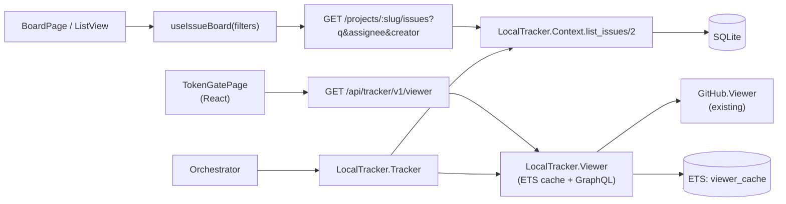

# Viewer Identity & Board Filters (MVP Slice A)

**Status:** Draft
**Date:** 2026-05-28
**Scope:** Resolve the GitHub login of the local Symphony operator, propagate it through the API and UI, gate the app on a valid `GITHUB_TOKEN`, persist the creator of every local tracker issue, and add Linear‑style board filters (keyword / assignee / creator) with a command palette and hotkeys.

**Part of:** MVP decomposition — Slice A of 4 (A: Viewer Identity, B: Per‑Project Tracker Adapter, C: Workspace Templates, D: Dev Environment Discovery).

---

## 1. Problem

Symphony's local tracker UI authenticates the API with a Bearer `tracker_token` that says nothing about *who* the operator is. The Elixir backend already resolves the GitHub viewer login (`viewer { login }`) inside `SymphonyElixir.GitHub.Viewer`, but that identity is not exposed to the React app, not stored next to issues, and not reused by the local tracker adapter or the orchestrator.

That gap blocks the next MVP slices:

- The board cannot show "assigned to me" or "created by me" without a viewer identity.
- The local tracker orchestrator cannot honour `tracker.assignee: me` (GitHub already does).
- Per‑project tracker adapters (Slice B) need a stable viewer identity that is independent of the configured GitHub project metadata.
- New issues created from the UI do not record who created them, preventing creator filters and audit traceability.

---

## 2. Goal

Deliver a single, single‑user viewer identity for the local Symphony deployment, and expose practical filters on the board:

1. Resolve the viewer's GitHub login from the server‑side `GITHUB_TOKEN`.
2. Cache the viewer in‑memory with a short TTL, owned by a supervised process.
3. Expose `GET /api/tracker/v1/viewer` for the React app.
4. Block the app at the token gate when `GITHUB_TOKEN` is missing or invalid.
5. Persist `creator` on every `local_tracker_issues` row.
6. Add backend filters `q`, `assignee`, `creator` to `GET /projects/:slug/issues`, resolving `me` server‑side.
7. Add a Linear‑style filter bar plus `/` (focus search) and `Cmd+K` (filter palette) on the board.
8. Honour `tracker.assignee: me` in the local tracker adapter for orchestrator dispatch.

Auto‑assignment of `assignee` is **not** part of this slice: when the operator creates an issue through the UI, only `creator` is set server‑side; `assignee` remains whatever the request provides (typically `nil`).

---

## 3. Non‑goals

Out of scope for this slice:

- Multi‑user authentication, OAuth, or per‑user tracker tokens.
- Saved views / shared filter presets persisted on the backend.
- Filters by labels, priority ranges, blockers, or full‑text indexing.
- Linear/GitHub creator filtering (handled by Slice B's DTOs).
- Making the GitHub integration optional for projects (Slice B).
- Workspace template ergonomics (Slice C).
- Repository scan instructions surfaced in the UI (Slice D).

---

## 4. Decisions

| Topic | Choice |
|---|---|
| Identity source | Server‑side `GITHUB_TOKEN` only; `viewer { login }` GraphQL call |
| Single‑user assumption | One Symphony deployment serves one operator |
| Viewer cache | ETS, TTL 5 minutes, owned by `LocalTracker.Viewer.Server` |
| Token gate | Hard‑block the app if viewer cannot resolve |
| Creator field | New nullable `creator` column on `local_tracker_issues` |
| `me` resolution | Backend translates `me` → `viewer.login` per request |
| Filter persistence | URL query string only (`?q&assignee&creator`) |
| Filter UX | Header filter bar + `Cmd+K` palette + `/` to focus search |
| Local adapter assignee filter | `LocalTracker.Tracker` honours `tracker.assignee: me` |

---

## 5. Architecture



The viewer is a global singleton (single user). All controllers and the orchestrator read it through `LocalTracker.Viewer.current/0`. The new filter pipeline is purely additive: existing endpoints stay backward compatible.

---

## 6. Backend Design

### 6.1 `SymphonyElixir.LocalTracker.Viewer`

New module under `elixir/lib/symphony_elixir/local_tracker/viewer.ex`.

Public surface:

```elixir
@type t :: %{login: String.t(), name: String.t() | nil, avatar_url: String.t() | nil}

@spec current() :: {:ok, t()} | {:error, viewer_error()}
@spec current!() :: t()
@spec invalidate_cache() :: :ok

@type viewer_error ::
  :missing_github_token
  | :unauthorized
  | {:network_error, term()}
  | {:malformed_response, term()}
```

Behaviour:

- Tries ETS table `:symphony_viewer_cache` (key `:current`).
  - Hit + not expired → returns cached value.
  - Miss / expired → calls `resolve!/0` and re‑caches.
- `resolve!/0` issues one combined GraphQL query:

  ```graphql
  query SymphonyViewer { viewer { login name avatarUrl } }
  ```

  Uses `SymphonyElixir.GitHub.Client.graphql/3`. Trims `login`; rejects empty.
- Errors are surfaced typed; only successes update the cache. Network errors do not poison the cache.

Companion `SymphonyElixir.LocalTracker.Viewer.Server` (GenServer):

- Owns ETS creation in `init/1` (`:named_table, :public, read_concurrency: true`).
- Provides `invalidate/0` to clear cache (used by tests).
- Started under `SymphonyElixir.Application` before the orchestrator, after the `Repo`.

### 6.2 `SymphonyElixirWeb.Tracker.ViewerController`

New controller at `elixir/lib/symphony_elixir_web/controllers/tracker/viewer_controller.ex`.

Route (add to `pipe_through(:tracker_api)` scope):

```elixir
get("/viewer", ViewerController, :show)
```

Response shape (success, 200):

```json
{
  "data": {
    "github_login": "raphaelcangucu",
    "name": "Raphael Cangucu",
    "avatar_url": "https://avatars.githubusercontent.com/u/..."
  }
}
```

Error mapping:

| Internal error | HTTP | `error.code` |
|---|---|---|
| `:missing_github_token` | 503 | `github_token_missing` |
| `:unauthorized` | 401 | `github_unauthorized` |
| `{:network_error, _}` | 503 | `github_network_error` |
| `{:malformed_response, _}` | 502 | `github_malformed_response` |

All errors follow the existing tracker error envelope `{ "error": { "code": ..., "message": ... } }` already used by `TrackerAuth`.

### 6.3 Migration: `creator` on `local_tracker_issues`

New Ecto migration:

- `add :creator, :string, null: true`.
- No index in this slice; revisit when filtering becomes hot.

Schema changes in `SymphonyElixir.LocalTracker.IssueRecord`:

- Add `field(:creator, :string)`.
- Add `:creator` to `cast/2` allowed fields.
- No `validate_required` (legacy rows remain nullable).

Context changes in `SymphonyElixir.LocalTracker.Context.create_issue/2` (or whichever path inserts records via the API):

- Accept `:creator` in attrs.
- Caller (the controller) injects `Viewer.current!().login` so all *new* issues created through the API are attributed to the viewer.
- Internal callers that create issues without a viewer (seeds, agent‑side flows) can omit `:creator`, leaving it `nil`.

### 6.4 Filters in `Context.list_issues/2`

Update signature:

```elixir
@spec list_issues(String.t(), keyword()) :: [IssueRecord.t()]
def list_issues(project_slug, opts \\ [])
# opts keys: :search, :assignee, :creator
```

Query composition (Ecto, SQLite‑compatible):

- `:search` → case‑insensitive `LIKE` against `title`, `description`, `identifier`. SQLite's `LIKE` is case‑insensitive for ASCII by default; the implementation must:
  1. Trim the term; treat empty as no filter.
  2. Escape SQL `%`, `_`, `\` characters in the term (e.g. `String.replace(term, ~w(\\ % _), &"\\#{&1}")`) and use the `ESCAPE '\\'` clause to avoid wildcard injection.
  3. Combine the three columns with `OR`, lifted into a single `where` fragment.
- `:assignee` → `where: i.assignee_id == ^value` (exact match against the existing `assignee_id` column).
- `:creator` → `where: i.creator == ^value` (exact match against the new column).
- No combined `OR` between distinct filters; the three filter categories AND together.

`Context` never sees `me`; that is resolved in the controller.

### 6.5 `IssueController.index`

Update to accept query params and forward to `Context.list_issues/2`:

- `q` → `:search`.
- `assignee` → `:assignee`. If value is `"me"`, replace with the viewer login via `Viewer.current/0`.
- `creator` → `:creator`. Same `me` substitution.
- If any filter is `"me"` and `Viewer.current/0` returns an error, respond using the same HTTP status / `error.code` mapping defined in section 6.2 (503 `github_token_missing`, 401 `github_unauthorized`, 503 `github_network_error`, 502 `github_malformed_response`).
- Unknown/empty params are ignored.

Backward compat: when no params are passed, behaviour matches today.

### 6.6 Local tracker orchestrator (`SymphonyElixir.LocalTracker.Tracker`)

Add an assignee filter mirroring the GitHub adapter:

- Introduce `SymphonyElixir.Config.local_assignee/0` reading the `local.assignee` key from `WORKFLOW.md` front matter via `Config.section("local")`. Returns `nil`, `"me"`, or a literal login string. This mirrors the pattern used by `Config.local_database_path/0` / `Config.local_project_slug/0`, and matches how `GitHub.Config.assignee/0` already reads `github.assignee`.
- If the value is `"me"`, resolve via `Viewer.current/0`.
- Build the query so `fetch_candidate_issues/0` only returns rows whose `assignee_id` matches.
- If the viewer cannot resolve while `assignee: me` is configured, log a warning with code `:viewer_unavailable_for_local_assignee_filter` and return `{:ok, []}` (do not crash the orchestrator).

Specs and behaviour conformance for `@behaviour SymphonyElixir.Tracker` remain unchanged.

### 6.7 Public OpenAPI / DTO updates

- `IssueDto` (response): add `creator: String.t() | nil`.
- New `ViewerDto`: `{ github_login, name, avatar_url }`.
- Update the JSON view module used by the issue controller to emit `creator`.

---

## 7. Frontend Design

### 7.1 New service `tracker/src/services/viewer.ts`

```ts
export interface Viewer {
  githubLogin: string;
  name: string | null;
  avatarUrl: string | null;
}

export class ViewerNotConfiguredError extends Error {
  constructor(public code: string) { super(code); this.name = "ViewerNotConfiguredError"; }
}

export async function fetchViewer(): Promise<Viewer> { /* GET /viewer */ }
```

- 200 → normalize to `Viewer`.
- 503 `github_token_missing` / 401 `github_unauthorized` → throw `ViewerNotConfiguredError(code)`.
- Other errors → throw generic `Error` with HTTP message.

Add a mapper `normalizeViewer/1` for snake_case → camelCase consistency with the existing `mappers.ts` pattern.

### 7.2 `ViewerProvider` + `useViewer()`

`tracker/src/components/auth/ViewerProvider.tsx`:

- Holds `{ viewer, status }` where `status ∈ {"loading","ready","error"}`.
- On mount, calls `fetchViewer()`. On `ViewerNotConfiguredError`, sets status `"error"` with the code.
- Exposes `useViewer()` hook returning `{ viewer, status, error }`.
- `useViewerLogin()` convenience hook for places that only need the login.

### 7.3 Token gate flow update

In `TokenGatePage.tsx`:

- After `validateTrackerToken(token)` succeeds, call `fetchViewer()` *before* persisting the token and navigating.
- If `fetchViewer()` throws `ViewerNotConfiguredError`, show an inline error block with a clear message:

  > Symphony cannot identify the operator. Make sure `GITHUB_TOKEN` is exported in the server environment and restart Symphony.

- The token is *not* persisted in localStorage on viewer failure. The user stays on the gate.
- Add a small "Retry" button that re‑runs the gate flow.

### 7.4 Board filters

New component `tracker/src/components/board/BoardFilters.tsx`:

- Layout: left → search input; right → assignee and creator dropdowns, plus a "Clear" link when any filter is active.
- Search input debounced 250ms before pushing into the URL.
- Assignee/creator dropdowns:
  - Top option: "Me" (resolves to viewer login, shown as `@viewer.githubLogin`).
  - Below: distinct logins observed on the currently loaded issues (deduped, alphabetical).
  - "Any" clears that filter.
- Renders nothing assignee/creator‑related when `useViewer().status !== "ready"`.

URL contract (single source of truth):

| Param | Meaning |
|---|---|
| `q` | Free‑text search; empty = no filter |
| `assignee` | Login literal or `me` |
| `creator` | Login literal or `me` |

Reading: `const [params, setParams] = useSearchParams();` from `react-router-dom`. Local component state mirrors the URL for the debounced search input.

### 7.5 `useIssueBoard` refactor

- New signature: `useIssueBoard(projectSlug, filters)`.
- `filters` is `{ search?: string; assignee?: string; creator?: string }`.
- Effect dependency includes the filter keys; on change, calls `listIssues(projectSlug, filters)`.
- Realtime channel updates remain in place but are post‑filtered client‑side by the same predicate (so a websocket‑pushed issue that doesn't match the current filter does not pop in).

### 7.6 `services/issues.ts`

Extend `listIssues`:

```ts
export interface IssueListFilters {
  search?: string;
  assignee?: string;
  creator?: string;
}

export async function listIssues(projectSlug: string, filters?: IssueListFilters): Promise<Issue[]>
```

- Builds `URLSearchParams`, omitting empty values.
- No behaviour change when called with no filters.

### 7.7 Command palette and hotkeys

Install `cmdk` (already idiomatic with shadcn) if absent. Wire into `BoardPage`:

- Global keydown listener (scoped to the project routes):
  - `/` (when not in an input) → focus the search input.
  - `Cmd+K` / `Ctrl+K` → open `<CommandDialog>`.
- Palette items (Slice A):
  - "Search issues…" (focus input).
  - "Filter: Assigned to me" (sets `assignee=me`).
  - "Filter: Created by me" (sets `creator=me`).
  - "Clear filters" (drops all three params from URL).

The palette is intentionally minimal; expansion (priority, labels, blockers) is future work, not part of any later MVP slice in this plan.

### 7.8 Issue creation UI

When issues are created from the UI (`IssueDrawer` / `ProjectHeader`), continue posting only the existing fields. The backend attaches `creator` automatically from the viewer. The frontend reads `creator` from the response and renders it where needed (Slice A: limited to filter dropdowns; full display lives outside this slice).

---

## 8. Data Model

### 8.1 Schema changes

| Table | Change |
|---|---|
| `local_tracker_issues` | `+ creator :string (nullable)` |

### 8.2 DTO changes

| DTO | Change |
|---|---|
| `IssueDto` (response) | `+ creator: String.t() \| nil` |
| `ViewerDto` (new) | `{ github_login, name, avatar_url }` |

### 8.3 Frontend types

| Type | Change |
|---|---|
| `Issue` (`tracker/src/types/issue.ts`) | `+ creator: string \| null` |
| `Viewer` (`tracker/src/types/viewer.ts`, new) | `{ githubLogin, name, avatarUrl }` |

---

## 9. Error Handling

| Scenario | Behaviour |
|---|---|
| `GITHUB_TOKEN` missing | `/viewer` → 503 `github_token_missing`. Token gate blocks. Orchestrator with `assignee: me` returns no candidates and logs warning. |
| `GITHUB_TOKEN` invalid (401 from GitHub) | `/viewer` → 401 `github_unauthorized`. Token gate blocks with a clear retry path. |
| Transient network error talking to GitHub | `/viewer` → 503 `github_network_error`. UI offers retry. Cache is not poisoned. |
| `assignee=me` (or `creator=me`) on `/issues` when viewer fails | Same status/`error.code` mapping as `/viewer` (section 6.2). UI hides the "Me" chip when `useViewer().status !== "ready"` (defensive guard; in practice the token gate prevents reaching the board in this state). |
| Legacy issues with `creator = NULL` | Filter `creator=X` excludes them silently. Empty result is a valid state. |
| Search term containing `%` / `_` | Escape via Ecto fragment / repo helper to avoid SQL wildcard injection. |
| Filter value of unexpected type (non‑string param) | Ignored; logged at debug level. |

---

## 10. Testing

### 10.1 Backend

Files:

- `elixir/test/symphony_elixir/local_tracker/viewer_test.exs`
  - Cache hit/miss, TTL expiry, invalidation, error propagation per error tuple.
- `elixir/test/symphony_elixir_web/controllers/tracker/viewer_controller_test.exs`
  - 200, 401, 503 paths with mocked `Viewer` module.
- `elixir/test/symphony_elixir_web/controllers/tracker/issue_controller_test.exs`
  - `index` with each filter alone (`q`, `assignee`, `creator`), combined filters, and `me` substitution. Including 503 path when viewer fails with `assignee=me`.
- `elixir/test/symphony_elixir/local_tracker/context_test.exs`
  - `list_issues/2` filter combinations.
  - `create_issue/2` accepts and stores `creator`.
- `elixir/test/symphony_elixir/local_tracker/tracker_test.exs`
  - `fetch_candidate_issues/0` with `assignee: me` and resolved viewer.
  - Same with viewer unavailable → `{:ok, []}` and warning log.

Quality gate: `make all` green (format, credo, dialyzer, coverage).

### 10.2 Frontend

Files:

- `tracker/src/services/__tests__/viewer.test.ts`
- `tracker/src/components/auth/__tests__/ViewerProvider.test.tsx`
- `tracker/src/pages/__tests__/TokenGatePage.test.tsx`
  - Block on viewer failure; do not persist token; show retry.
- `tracker/src/components/board/__tests__/BoardFilters.test.tsx`
  - URL sync, debounce, dropdown options, "Me" injection, palette interactions.
- `tracker/src/services/__tests__/issues.test.ts`
  - `listIssues` URL params, backward compatible no‑filter call.
- `tracker/src/hooks/__tests__/useIssueBoard.test.ts`
  - Filter‑aware fetch + websocket post‑filtering.

---

## 11. Success Criteria

1. `GET /api/tracker/v1/viewer` returns the operator's GitHub login, name, and avatar URL when `GITHUB_TOKEN` is valid.
2. The token gate blocks the application when `GITHUB_TOKEN` is missing or invalid and shows an actionable message.
3. `local_tracker_issues.creator` is populated for every issue created through the tracker API.
4. The board exposes a filter bar with search, assignee, and creator; filters reflect into the URL and survive copy/paste.
5. `Cmd+K` opens a command palette with at least the four Slice A actions; `/` focuses the search input.
6. The local tracker adapter honours `tracker.assignee: me` for orchestrator dispatch.
7. `make all` is green on the slice branch; frontend tests pass.
8. Existing simple/wizard project flows continue to work unchanged.

---

## 12. Open follow‑ups (out of scope here)

- Linear / GitHub creator filtering arrives with Slice B's DTO normalization.
- Saved filter views (server‑side) are a candidate for a later UX slice.
- Labels / priority / blocker filters are deferred.
- Surface `creator` in the issue card UI (this slice only needs it for filtering).
