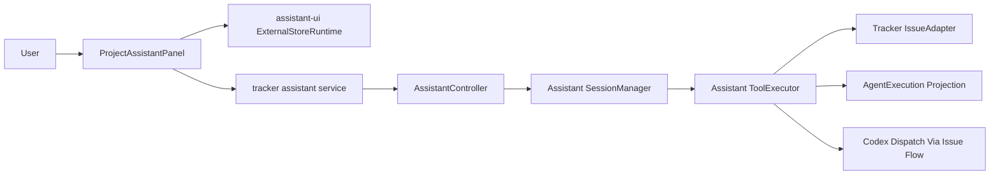

# Tracker Global Assistant With assistant-ui

## Summary

Add a project-scoped assistant to the tracker using `assistant-ui` as the React runtime layer and Symphony's existing Elixir tracker/orchestrator APIs as the action boundary. The first implementation is intentionally conservative: the assistant can inspect and mutate tracker data, and it can request Codex work through the existing issue workflow, but it does not directly edit arbitrary workspaces.

## Goals

- Provide a global assistant entry point from project board/list views.
- Use `assistant-ui` in the tracker frontend without coupling the UI to Codex JSON-RPC internals.
- Centralize all tracker mutations in Elixir so auth, validation, and audit behavior stay server-side.
- Support an initial tool set: list issues, create issue, update issue, move issue, add comment, read agent executions, and dispatch Codex work.
- Dispatch Codex by adding assistant-authored issue context and moving the issue into an active workflow state.

## Non-Goals

- No direct workspace editing from the global chat in the MVP.
- No browser-side execution of tracker mutations.
- No replacement of the existing orchestrator, terminal, issue drawer, or Codex app-server adapter.
- No durable multi-user chat history in the first slice.

## Architecture

## Frontend Design

`ProjectAssistantPanel` is mounted in `ProjectWorkspaceLayout` beside the existing board filters trigger. It opens as a sheet from the project header, uses `assistant-ui`'s `ExternalStoreRuntime` over local React message state, and calls `sendAssistantMessage` for each submitted message.

The current UI renders messages and tracker tool summaries locally so it can stay compatible with the existing tracker styling. The runtime choice keeps the panel ready for a future streaming transport without committing the MVP to Phoenix Channel or SSE semantics prematurely.

## Backend Design

`AssistantController` exposes `POST /api/tracker/v1/projects/:project_slug/assistant/messages` under the existing tracker bearer-token auth pipeline.

`Assistant.SessionManager` owns a chat turn. For the first implementation it performs narrow intent routing:

- `create issue: <title>` maps to `create_issue`.
- `start codex on <IDENTIFIER>: <instructions>` maps to `dispatch_codex`.
- Any other message maps to `list_issues` with the message as search text.

`Assistant.ToolExecutor` is the server-side tool registry. It validates required arguments, resolves the project by slug, dispatches through `Tracker.IssueAdapter`, and returns normalized tool results for the UI.

## Codex Dispatch

The global assistant does not start a raw Codex app-server session. Instead, `dispatch_codex`:

- Adds an assistant-authored comment to the target issue containing the requested instructions.
- Moves the issue to `In Progress`.
- Relies on the existing orchestrator polling flow to pick up the active issue and run Codex according to project/workflow configuration.

This preserves workspace safety and keeps code-changing actions inside the same path used by the tracker today.

## Safety

- Blank project slugs and messages fail fast.
- Unsupported tools return explicit validation errors.
- Tool arguments are normalized before dispatch.
- All project mutations go through `IssueAdapter`, preserving local/GitHub/Linear boundaries.
- Code changes remain mediated by issue state and orchestrator behavior.

## Testing

Coverage added for:

- Backend tool execution for issue creation, unsupported tools, and Codex dispatch.
- Assistant controller validation and successful message routing.
- Frontend service normalization of assistant responses and issue tool results.
- Project assistant sheet behavior and workspace header entry point.
