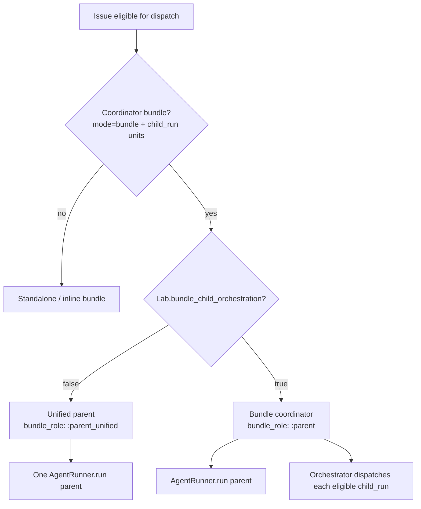

# Lab Flag: Unified Parent vs Bundle Child Orchestration — Design

> Introduces an **instance-level Lab toggle** that selects between two parent/subtask
> execution models. **Default (Lab OFF)** keeps a single parent agent run per task,
> uses **native tool subagents** (`subagent-driven-development`) for board sub-issues,
> and lands **one PR per repo**. **Lab ON** enables the **bundle child orchestration**
> model shipped in the 2026-06-30 parent/child rework (separate orchestrator
> dispatches, worktrees, child PRs → integration branch → umbrella PR).

Status: **approved for implementation planning** (2026-07-01).

Related:

- `docs/superpowers/specs/2026-06-29-symphony-orchestrated-subagents-design.md` — implemented lab mode
- `docs/superpowers/specs/2026-06-23-subtask-orchestration-design.md` — execution bundle schema
- `docs/superpowers/specs/2026-06-26-parent-coordinator-execution-design.md` — passive coordinator (partially superseded by lab mode fixes)

---

## 1. Problem

The **bundle child orchestration** model (parent coordinator + orchestrator-dispatched
`child_run` units) is powerful for cross-repo work and hard dependency chains, but it
is **heavy for the common case**:

- Multiple agent runs, worktrees, and PRs per repo (child PR + integration + umbrella).
- Coordinator parent token burn and operational complexity (gates, cascade, session logs).
- Operators must understand integration branches, release cadence, and merge ownership.

Most same-repo parent tasks with board sub-issues want a **simpler default**:

- **One parent run**, native subagents inside that run.
- **One branch and one PR per repo**.
- Sub-issues still move on the board, still run scoped tests, still produce per-issue evidence.

Today there is **no switch** — any parent with a `child_run` bundle always enters lab
orchestration. Operators cannot opt into the simpler path without removing `child_run`
units from the workpad.

---

## 2. Goals

1. **Lab settings menu** with a single feature flag, default **OFF**.
2. **Hard mode switch** at orchestrator dispatch: flag OFF never spawns separate
   orchestrator runs for `child_run` units; flag ON preserves current behavior.
3. **Default mode (OFF)**:
   - Dispatch **only the parent** issue.
   - Discover sub-issues from **board** (`sub_issue_of`) filtered by existing orchestrator
     gates (`require_symphony_label`, `require_assignee_match`).
   - Use workpad **execution bundle** for `depends_on`, shared contracts, and unit metadata
     — but units execute as **native subagents inside the parent**, not as orchestrator
     child runs.
   - **One PR per repo** (parent branch → repo default).
   - Each sub-issue: board status updates, scoped TDD, per-issue evidence manifest.
4. **Lab mode (ON)**: unchanged bundle child orchestration (510 / MAC-12..15 model).
5. **Observability** reflects the active mode (native subagent rows vs orchestrator child rows).

## 3. Non-goals

- Per-project flag (instance Lab only in v1).
- Removing execution bundle YAML in default mode (still required for deps/contracts).
- Auto-generating a bundle from board children without a workpad.
- Changing lab-mode git/PR topology beyond the existing 2026-06-30 implementation.
- Replacing native subagents inside a single `child_run` unit (both modes allow
  `subagent-driven-development` for *internal* decomposition of one unit).

---

## 4. Feature flag

### 4.1 Settings storage

New settings group **`lab`**, registered in `SymphonyElixir.Settings`:

| Name | Type | Default | Description |
| --- | --- | --- | --- |
| `bundle_child_orchestration` | boolean | **`false`** | When true, orchestrator dispatches `child_run` units as separate runs (lab model). |

Module: `SymphonyElixir.Settings.Lab` (mirrors `Settings.Orchestration`).

Accessor: `Lab.bundle_child_orchestration?/0`.

API:

- Included in `GET /tracker/settings` → `data.lab.bundle_child_orchestration`
- Updated via `PUT /tracker/settings/lab` with `{ "bundle_child_orchestration": true|false }`

### 4.2 Settings UI

New nav item under Settings:

- Route: `/tracker/settings/lab`
- Label: **Lab** (flask/beaker icon)
- Card: toggle + short explanation of both modes and that lab is experimental

i18n: `settings.sections.lab.label`, `settings.lab.bundleChildOrchestration.*` (en + pt-BR).

Manual UI dispatch is **never** blocked by the flag; it only changes how a **parent
with a coordinator bundle** is run.

---

## 5. Hard mode switch (orchestrator)

Single decision point when building run context for an issue that owns a coordinator
bundle (`BundleCoordinator.coordinator?/1`).

### 5.1 When flag is OFF (`:parent_unified`)

| Behavior | Value |
| --- | --- |
| Parent dispatched | Yes, once |
| `child_run` issues dispatched by orchestrator | **Never** |
| `held_child_issue_ids` / bundle gate for separate runs | **Disabled** |
| Parent `run_opts` | Includes parsed bundle + resolved **unit plan** (see §6) |
| Parent token budget | Normal implementer guard (not coordinator-exempt) |
| Child issues on board | Moved by **parent/subagent tools**, not cascade from parent dispatch |

### 5.2 When flag is ON (`:parent`)

Preserves current implementation:

- Parent coordinator run + orchestrator `child_run` dispatches.
- Worktrees, integration branch, child PRs, release at Human Review, cascade guard,
  coordinator budget exemption, worktree session logs.

### 5.3 Candidate selection

Child **issues** must not appear as orchestrator poll candidates when flag is OFF,
even if their board status is Todo/In Progress. Only the parent enters the dispatch
queue for bundle work.

Implementation hook: extend `held_child_issue_ids/2` or dispatch candidate filter with
`parent_has_unified_bundle?(child_issue)` → treat as held with reason logged, **or**
equivalent filter in `dispatch_candidates/2` that skips children whose parent is a
unified-bundle parent.

---

## 6. Default mode — unified parent plan

### 6.1 Discovery: board + bundle join

When preparing a unified parent run:

1. **Parse** parent workpad → `ExecutionBundle` (required when subtasks exist; validation
   errors surface in dispatch prep).
2. **List** direct board sub-issues: `sub_issue_of` → parent.
3. **Filter** sub-issues with the same gates as auto-dispatch:
   - `Settings.Orchestration.require_symphony_label?/0`
   - `Settings.Orchestration.require_assignee_match?/0`
4. **Join** bundle units to filtered sub-issues by `unit.issue` identifier.
5. **Unit plan** = ordered list of matched units with:
   - `id`, `issue`, `type`, `repo`, `depends_on`, `consumes`, `produces`, `deliverable`
   - Board status snapshot at dispatch time
   - `eligible: true|false` + `skip_reason` when bundle lists an issue not on board or failing gates

Units in the bundle with no matching board issue are **skipped** (logged + workpad note).
Board sub-issues with no bundle unit are **included** as ad-hoc units (inferred `workpad_task`
semantics, parent decides order unless `sub_issue_of` + manual ordering is added later).

### 6.2 Execution inside the parent

The parent agent:

- Loads `subagent-driven-development` (and `subtask-orchestration` read-only guidance).
- Runs **one native subagent per unit** in dependency order (parent enforces cadence).
- Before starting unit B, checks predecessors via **`query_bundle_status`** and board
  status (predecessor at Human Review or terminal = released for default-mode purposes).
- Each subagent scope:
  - **One sub-issue** (prompt names identifier, repo slice, contracts).
  - **Move that issue** on the board (In Progress while working → Human Review when slice done).
  - **Scoped tests** + **evidence manifest** with `task_id` = sub-issue identifier.
  - **`report_unit_status`** → parent's workpad `### Unit status: <issue>` blocks.

No orchestrator `:waiting` rows for dependents — cadence is **in-session** (parent does not
spawn the next subagent until released).

### 6.3 Git / PR model (default)

| Concern | Behavior |
| --- | --- |
| Workspaces | One parent workspace per repo under `Workspace.path_for_issue(parent)` |
| Branches | One feature branch per repo: `feat/<parent-slug>` (or project convention) |
| Child units | Commit to **same branch** — no `feat/MAC-*` child branches |
| PRs | **Exactly one open PR per repo** when parent finalizes: `feat/<parent>` → default |
| Integration branch | **Not used** in default mode |
| Cross-repo | Parent workspace holds multiple repo checkouts; one PR per repo touched |

Finalizer / publish path for unified parent must target repo default, not
`symphony/{parent}/{repo}`.

### 6.4 Quality gates (per sub-issue)

Unchanged bar from lab mode, scoped per unit:

| Gate | Requirement |
| --- | --- |
| TDD | Subagent runs tests for its deliverable before handoff |
| Evidence | `.symphony/evidence/manifest.json` (or per-issue path) keyed to sub-issue id |
| Board | Sub-issue reaches Human Review when unit slice is ready |
| Contracts | Producer calls `update_shared_contract` when scoped validation passes |
| Workpad | `report_unit_status` at phase boundaries |

Parent run completes when all units in the plan are done **and** one PR per repo is open/green.

---

## 7. Lab mode — bundle child orchestration (reference)

When `lab.bundle_child_orchestration` is **true**, behavior is defined by the
**implemented** sections of `2026-06-29-symphony-orchestrated-subagents-design.md`
(header), including:

- Two shapes: `workpad_task` (inline) + `child_run` (orchestrator dispatch).
- Per-repo integration branch `symphony/{parent}/{repo}`.
- Dependent child worktree forks from predecessor branch; PR base = integration branch.
- Release cadence: Human Review releases dependents.
- Parent coordinator merges child PRs; one umbrella PR per repo.
- Bundle gate, cascade guard, coordinator budget exemption, observability tree.

No behavioral changes to lab mode in this spec — only gating behind the flag.

---

## 8. Parent ↔ child communication tools

Both modes expose the same **coding-agent tools** (already specified / partially implemented):

| Tool | Default mode | Lab mode |
| --- | --- | --- |
| `query_bundle_status` | Parent sequences native subagents | Coordinator + children |
| `report_unit_status` | Subagent → parent workpad | Child run → parent workpad |
| `update_shared_contract` | Producer subagent | Producer child run |

Default mode additionally requires **board mutation tools** (or existing tracker tools)
so subagents can move **their** sub-issue status without the orchestrator dispatching them.

Lab mode: child runs move their own issues via agent handoff / finalizer as today.

---

## 9. Observability

| Surface | Default OFF | Lab ON |
| --- | --- | --- |
| `/observability` tree | Parent + **native subagent** children (`bundle_role: :subagent` or `:parent_unified`) | Parent + **orchestrator child** rows (`:child`) |
| Waiting dependents | No separate row; parent session idle between units | `:waiting` row, 0 tokens |
| Session log drill-in | Parent workspace (+ subagent thread ids) | Child worktree paths |
| Token display | Parent session tokens | Coordinator exempt; children guarded |

Frontend: extend `RunningSession.bundleRole` with `:parent_unified` (and optional
`:subagent` for native subagent rows). Group under parent by `parentIdentifier`.

---

## 10. Prompts & skills

| Artifact | Change |
| --- | --- |
| `prompt_builder.ex` | New `unified_parent_section/2` when flag OFF; existing `bundle_coordinator_section` when ON |
| `subtask-orchestration/SKILL.md` | Document both modes; flag determines orchestrator vs native subagents |
| `subagent-driven-development/SKILL.md` | Default mode: primary execution pattern for parent |
| Workpad template | Note: `child_run` type in YAML means "unit with own PR" **only when lab ON**; default mode treats units as subagent scopes |

---

## 11. Rollout

| Audience | Action |
| --- | --- |
| Fresh instances | Flag defaults OFF → simpler path |
| macro-markets / 510 | **Final validation task** — reset and re-dispatch under default (unified) mode (see §12 slice 10) |
| Docs | Settings Lab page + subtask-orchestration skill |

During development, 510 may remain on **Lab ON** for bundle-orchestration regression until slice 9 is complete. The **last implementation slice** explicitly switches 510 to default mode and runs a monitored live dispatch.

---

## 12. Implementation slices

Ordered for incremental delivery:

1. **Settings.Lab** — backend group, API, tests.
2. **Lab settings page** — nav, toggle, i18n.
3. **Mode switch** — `Lab.bundle_child_orchestration?/0` gates `coordinator?` child dispatch; introduce `:parent_unified` role; filter child issues from orchestrator candidates when OFF.
4. **Unified unit plan** — pure function: board + bundle join + gate filter; inject into parent `run_opts`.
5. **Unified parent prompt** — plan section, subagent-driven-development, cadence + one-PR rules.
6. **Subagent registry** — register native subagent sessions under parent for observability.
7. **Finalize path** — one PR per repo for unified parent (no integration branch).
8. **Tests** — flag OFF: children never dispatched; MAC-12 stays HR on parent move; one PR; flag ON: regression suite for existing bundle tests.
9. **Docs** — update 2026-06-29 spec header to reference this flag.
10. **Live validation — task 510 (final slice)** — reset task 510 and its sub-issues (MAC-12..15) to run in **default unified mode** (Lab OFF / no orchestrator child execution), then dispatch and monitor:
    - Ensure `lab.bundle_child_orchestration` is **false** (instance default).
    - Clean-slate 510 + children: workpad/comments/session state as needed; board statuses reset for a fresh run (preserve git branches/PRs only as reference if useful).
    - Confirm workpad execution bundle still defines units/deps/contracts, but **no `child_run` orchestrator dispatches** — only the parent run with native subagents.
    - Dispatch 510; monitor observability (single parent session, subagent rows), board moves per sub-issue, evidence per unit, and **one PR per repo** outcome.
    - Document observed cadence (unit order, Human Review handoffs, contract updates) in the 510 workpad for operator review.

This slice is intentionally **last** so all prior slices are in place before the macro-markets end-to-end proof.

---

## 13. Acceptance criteria

### Lab settings

- [ ] Settings → Lab visible in nav; toggle persists across reload.
- [ ] Default `bundle_child_orchestration: false` on fresh DB.

### Default mode (flag OFF)

- [ ] Parent with `child_run` bundle: only parent appears in running sessions (no MAC-* orchestrator runs).
- [ ] Parent prompt includes unit plan from board + bundle join.
- [ ] Sub-issues filtered by symphony label + assignee when those gates are on.
- [ ] Subagent work updates sub-issue board status and evidence per unit.
- [ ] Final output: **one PR per repo**, no child PRs, no integration branch.
- [ ] Parent dispatch does **not** drag Human Review / terminal children (cascade guard).

### Lab mode (flag ON)

- [ ] Existing 510 / bundle orchestration tests pass unchanged.
- [ ] Coordinator budget exemption and bundle gate active.

### Live validation — task 510 (final slice)

- [ ] `lab.bundle_child_orchestration` is **false**; 510 runs in unified parent mode (no orchestrator child execution).
- [ ] 510 + MAC-12..15 reset for a clean monitored run; dispatch succeeds with **one parent session** only.
- [ ] Observability shows parent + native subagent activity (not orchestrator `child_run` rows).
- [ ] Sub-issues move on the board, produce per-unit evidence, and land **one PR per repo**.
- [ ] Results captured in 510 workpad for operator review.

---

## 14. Resolved decisions

| Question | Decision |
| --- | --- |
| Mode switch style | **A — Hard switch** (not gradual / per-unit reinterpretation) |
| Sub-issue discovery (default) | **Board + workpad bundle** (bundle for deps/contracts; board for membership + gates) |
| Flag scope | Instance Lab settings |
| Default | OFF (unified parent + native subagents) |
| PR model (default) | One PR per repo |

---

## 15. Open items (implementation plan)

1. Exact branch naming for unified parent (`feat/510` vs `symphony/510/{repo}`) — recommend `feat/<parent-slug>` for simplicity.
2. Whether unified parent gets coordinator budget exemption — **no** (single implementer run; normal guard applies).
3. Ad-hoc board sub-issues without bundle units — include with inferred ordering (parent discretion) vs reject — **include with warning** in v1.
