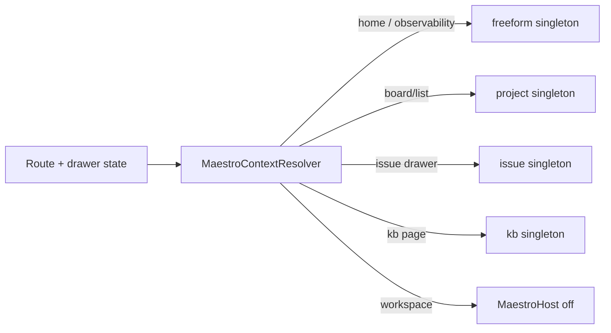

# Maestro contextual surfaces (home, board, issue drawer, observability, KB)

**Date:** 2026-07-16  
**Status:** Implemented (2026-07-16) — see [plan](../plans/2026-07-16-maestro-contextual-surfaces-plan.md)  
**Primary surfaces:** Tracker layout (`MaestroHost`), home / project list, project board & list, issue drawer, Observability, Knowledge Base  
**Related:**  
[`2026-06-27-telegram-project-topics-design.md`](./2026-06-27-telegram-project-topics-design.md)
(Telegram “maestro mode” / module map — precedent, out of scope for this ship),  
[`2026-05-30-tracker-global-assistant-design.md`](./2026-05-30-tracker-global-assistant-design.md)
(project assistant),  
[`2026-05-31-issue-authoring-assistant-design.md`](./2026-05-31-issue-authoring-assistant-design.md)
(issue singleton),  
[`2026-06-25-knowledge-base-design.md`](./2026-06-25-knowledge-base-design.md)
(KB docked Maestro),  
[`2026-07-14-assistant-session-shell-design.md`](./2026-07-14-assistant-session-shell-design.md)
(shared chat chrome)

## 1. Problem

Maestro is product language for the Symphony assistant, but today it is mostly
visible in the Knowledge Base (floating launcher + docked panel). Elsewhere,
capability already exists as scoped assistant threads (`freeform`, `project`,
`issue`, `kb`, plus session scopes in workspaces), yet operators must leave the
current screen — or know obscure routes — to use it.

Desired experience:

1. **Home** — manage projects, personal KB, issues, and settings from chat.
2. **Project board/list** — explore project scope and manage issues in context.
3. **Issue drawer open** — converse in that issue’s singleton context (not a Workspaces session).
4. **Observability** — discuss and act on runtimes / active sessions.
5. **KB** — keep today’s Maestro behavior, under one host.

Heavy session work (`project_session`, `issue_session`, execution) must remain
in workspaces unchanged.

## 2. Goals

1. **Docked Maestro** on home, Observability, project board/list, issue drawer,
   and KB — same launcher pattern as KB today.
2. **Automatic context switch** when the user navigates between those places,
   binding to the existing singleton threads (no new thread types).
3. **Home / Observability as global operator** on the shared `freeform` thread,
   with expanded tools (personal KB, observability, settings).
4. **Workspaces out of MaestroHost** — existing workspace session UI unchanged.
5. **Reuse** `ProjectAssistantPanel` + Phoenix `AssistantChannel` +
   `AgentSession` turn pipeline.

## 3. Non-goals

- Changing workspace UX, `project_session`, `issue_session`, or orchestrator
  execution panels.
- New thread scopes such as `maestro_home` or `maestro_surface`.
- Telegram / gateway mode selector changes (may align later).
- App-wide rename of every “Assistant” string to “Maestro” outside MaestroHost
  surfaces.
- Embedding chat inside the issue drawer body (docked panel beside the page is
  enough; drawer only drives context).
- Forcing explore-only mode on the board (`project_explore` stays a separate
  route/menu; docked board Maestro uses the `project` singleton).

## 4. Decisions

| Topic | Choice |
|-------|--------|
| Presence | **Hybrid** — docked Maestro for quick contextual chat; workspaces keep heavy sessions |
| Context switch | **Automatic** from route + issue-drawer state |
| Thread identity | **Reuse singletons** — `freeform`, `project`, `issue`, `kb` |
| Home capabilities | **Full global operator** (projects, cross-project issues, personal KB, settings) |
| “Issue open” | **Board/list issue drawer only** (not workspaces, not standalone authoring pages in v1) |
| Observability | **Same `freeform` thread as home**, with `surface: "observability"` + page extra context |
| Architecture | **App-level `MaestroHost` + `MaestroContextResolver`** |
| KB launcher | **Migrate into MaestroHost** (no duplicate floating button) |
| Full-page assistants | Optional deep-link to existing routes; same underlying thread |

## 5. Surface → context → thread

| Where the user is | Maestro context | Thread / channel |
|-------------------|-----------------|------------------|
| Home / project list | Global operator (`surface: "home"`) | `freeform` |
| Observability (`/observability`) | Global operator (`surface: "observability"`) | `freeform` (same conversation as home) |
| Project board or list, drawer closed | Project | `project` → `assistant:{slug}` |
| Project board or list, issue drawer open | Issue | `issue` → `assistant:issue:{slug}:{identifier}` |
| KB page (project or `@user`) | KB page | `kb` → `assistant:kb:{slug}:{repo}:{path}` |
| Workspaces / session routes | — | **MaestroHost off** |

## 6. Architecture

### 6.1 Frontend

**`MaestroContextResolver`** — pure function of router location + issue-drawer
store. Evaluation order:

1. Workspace / session routes → `null`
2. KB page → `{ kind: "kb", projectSlug, repoSlug, pagePath }`
3. Board/list **and** open issue drawer → `{ kind: "issue", projectSlug, issueIdentifier }`
4. Board/list without drawer → `{ kind: "project", projectSlug }`
5. Home or Observability → `{ kind: "home", surface: "home" | "observability", extra }`

**`MaestroHost`** — mounted in the authenticated app layout when the resolver
returns a non-null context:

- Floating launcher (`MaestroIcon`), pulse when the **visible** thread is running
- Docked panel wrapping `ProjectAssistantPanel` in `embedded` mode
- Panel header shows current context label (`Home`, `Observability`,
  `Project {slug}`, `Issue {id}`, `KB`)
- Context change → leave previous channel, join new singleton, show that
  history (no manual mode selector in v1)
- Open/closed panel preference in localStorage (KB pattern)
- Optional “open full page” deep-link to `/assistant`,
  `/projects/:slug/assistant`, or issue authoring — same thread

**KB migration:** remove `KbAssistantLauncher` / private dock wiring from
`KbWorkspace`; KB becomes another host context that still injects live
`{ repoSlug, pagePath, title, body, selection }` via `getExtraContext`.

**Issue drawer:** does not embed chat. Opening/closing the drawer only updates
resolver inputs so the host switches `project` ↔ `issue`.

### 6.2 Backend

No new thread scopes. Changes are additive:

1. **`freeform` tools** — extend `ToolExecutor.freeform_tool_specs/0` (and
   executor) to cover:
   - Personal KB (`@user` / `symphony-kb`) read/write/search/sync tools
   - Observability tools (list runtimes / active sessions; navigate/open
     session or issue identifiers already used by the page)
   - Settings tools (read/update instance-level configuration the product
     already exposes; otherwise return a typed remediation with UI deep-link)
2. **`build_freeform_prompt`** — branch on `context.surface`
   (`home` | `observability`) and describe the global operator role.
3. **`project` / `issue` / `kb` prompts** — short “where the user is” block
   from message context (board/list view, drawer-open issue, KB page). Tool
   sets for these scopes stay as today.
4. **Channels** — existing topics and `History.ensure_*` paths; freeform may
   need a stable singleton or “current freeform” resolution if the product
   today allows many freeform threads — **v1 rule:** MaestroHost binds to the
   most recently active freeform thread, or creates one if none exists (same
   behavior as opening `/assistant` with no id). Document the exact helper in
   the implementation plan from current `History` / sidebar behavior.

### 6.3 Data flow

1. Layout mounts `MaestroHost` → resolver produces context or `null`.
2. Host joins the channel for that singleton.
3. Each send includes `context` + `getExtraContext()` (surface, observability
   filter / focused runtime, drawer issue, KB body/selection, board vs list).
4. `AgentSession` runs the existing turn pipeline with scope-appropriate tools.
5. Context switch: leave old channel → join new → UI shows new history. An
   in-flight turn on the previous thread continues server-side; launcher pulse
   reflects only the **visible** thread.

### 6.4 Errors and edges

| Case | Behavior |
|------|----------|
| Missing slug / issue id | Do not join; launcher disabled with hint |
| Drawer closes | Immediately resolve back to `project` |
| Channel join failure | Toast + retry; panel error state (no stale transcript) |
| Tool / permission failure | Typed tool error in transcript (existing pattern) |
| Enter workspace route | Unmount host cleanly (no launcher flash) |
| Observability with project filter | Pass filter in `extraContext`; still `freeform` thread |

## 7. Capabilities by surface (v1)

| Context | Existing | Add / tighten |
|---------|----------|---------------|
| Home / Observability (`freeform`) | Discovery, cross-project board tools, GitHub, templates | Personal KB; observability session/runtime tools; settings read/update or deep-link remediation; surface-aware prompt |
| Project (`project`) | Board + project KB + combined tools | Location prompt: “on project board/list” |
| Issue drawer (`issue`) | Issue-bound authoring tools | Location prompt: “issue open in drawer”; must not create `issue_session` |
| KB (`kb`) | Live page context + KB tools | Host migration only |

Destructive settings or KB deletes keep existing confirmation patterns
(confirm target with the user before delete tools).

## 8. Testing

### Frontend

- Unit: resolver matrix (home, observability, board, drawer open/close, KB,
  workspace → `null`)
- Component: host mount/unmount; context change rebinds channel/props; panel
  open state persists; no duplicate KB launcher
- Regression: workspace routes never show docked Maestro

### Backend

- `freeform_tool_specs` includes personal KB, observability, and settings tools
- Freeform prompt differs for `surface: "home"` vs `"observability"`
- Project/issue turns accept location context without tool-set changes
- One narrowly targeted test file/case per new area (WSL: no full suite)

### Manual acceptance

- Home: create/open project, edit personal KB, discuss settings
- Observability: ask about active sessions / open an issue
- Board → open drawer → close drawer: Maestro context follows
- Workspace: no docked Maestro; sessions unchanged

## 9. Rollout notes

- Ship host + resolver first with existing tools, then freeform tool expansion,
  if sequencing helps review — behaviorally one feature.
- Telegram mode map can later point at the same surface vocabulary; not required
  for tracker v1.
- Full-page `/assistant` and `/projects/:slug/assistant` remain valid; they
  share history with the docked panel for the same singleton.

## 10. Open implementation details (resolve in plan, not product decisions)

1. Exact helper to pick/create the freeform thread for MaestroHost (align with
   sidebar / `/assistant` empty state).
2. Concrete settings tool surface (which instance settings fields are writable
   vs deep-link-only).
3. Observability tool names and payload shape (mirror
   `listObservability` / PR monitor fields already used by the page).

## 11. Implementation notes (2026-07-16)

Resolutions to §10 and deviations from the plan, decided during implementation:

1. **Freeform thread helper (split).** Instead of a single
   `History.ensure_active_freeform_thread/0`, the query lives in
   `History.latest_freeform_thread/0` (pure, DB only) and the create/reuse
   orchestration lives in the controller action `ensure_active_freeform`
   (`POST /assistant/threads/freeform/active`), reusing the existing two-step
   freeform create (seed root workspace → rewrite to per-thread path). This keeps
   the persistence layer independent of `AgentSession` (no lower→higher dep).
2. **Settings tools.** `get_settings` (optional `group`) reads the same
   `Settings.all/0` config the Settings page shows; `update_setting`
   (`group`/`name`/`value`) applies a single guarded, cast-validated change via
   `Settings.put/3`. Unknown groups/names and invalid values are rejected before
   any write. Identities/tokens are not exposed (they live outside `Settings`).
3. **Observability tool.** `list_observability_runtimes` returns
   `Observability.Registry.list/0` (the page's live aggregate) with an optional
   `project_slug` filter.
4. **KB migration.** The KB editor's in-toolbar “Ask AI” button now only opens
   the global docked host (open-only; the host owns open state, so the button no
   longer reflects a close state). The floating launcher, docked panel, and
   live-page snapshot moved to `MaestroHost` + `MaestroExtraContext`
   (`buildKbExtraContext`). `KbAssistantPanel`/`KbAssistantLauncher` were deleted.
5. **Full-page deep link.** Header link opens `/assistant/:threadId` (home /
   observability) or `/projects/:slug/assistant` (project). The issue drawer and
   KB omit it — they are already their full surface.

### Manual acceptance (verify in a running app — not covered by unit tests)

- [ ] Home: launcher opens; freeform thread binds; create/open project, edit
      personal KB (`@user`), read/update a setting via chat.
- [ ] Observability: filter a project; ask about active runtimes.
- [ ] Board → open issue drawer → close drawer: docked context follows
      (project → issue → project) and history persists per singleton.
- [ ] KB page: “Ask AI” opens the docked host bound to the page; assistant edits
      reload the editor.
- [ ] Workspaces / full-page `/assistant`: no docked Maestro (host stays off).
